## Bbiblioteki

```r
library(dplyr)
library(knitr)
library(corrplot)
library(ggplot2)
library(plotly)
library(e1071)
```

## Ustawienie ziarna

```r
 set.seed(1); 
```

##Wczytanie wstepnie przetworzonych danych

Csv zosta³ przygotowany w 'Raport-czytanie i czyszczenie'


```r
#Data <- read.csv("MyData.csv",  sep=',', comment.char="", na.strings='nan', header=TRUE)
Data <- read.csv("MyData.csv",nrow=3000,  sep=',', comment.char="", na.strings='nan', header=TRUE)
```
Za³adowano 3000 wierszy, które maj¹ 343 zmiennych.

## Ograniczenie danych do najczêstszych

Wyselekcjonowanie 50 najczêstszych grup

```r
Data[!duplicated(select(Data, pdb_code, res_name)),] %>% group_by(res_name) %>%summarise(count = n()) %>% arrange(desc(count)) %>% head(50) ->unikalne
Data%>%filter(res_name %in% unikalne$res_name ) -> Data

Data[, c(3:length(Data))] <- sapply(Data[, c(3:length(Data))], as.numeric)
print.data.frame(unikalne)
```

```
##    res_name count
## 1       SO4    70
## 2       GOL    69
## 3        ZN    44
## 4        CL    36
## 5        CA    33
## 6       EDO    30
## 7       NAG    28
## 8        MG    24
## 9       HEM    23
## 10      PO4    23
## 11       NA    21
## 12      ACT    16
## 13        K    10
## 14      PEG     9
## 15       CD     8
## 16      FAD     8
## 17       MN     8
## 18      NAD     8
## 19      ACY     7
## 20      EPE     7
## 21      NAP     7
## 22      PG4     7
## 23      FMN     6
## 24      MES     6
## 25       NI     6
## 26      ADP     5
## 27      DMS     5
## 28      PGE     5
## 29      SAM     5
## 30       CU     4
## 31       FE     4
## 32      FMT     4
## 33      GDP     4
## 34      GLC     4
## 35      MPD     4
## 36      TPO     4
## 37      ATP     3
## 38      BGC     3
## 39      BMA     3
## 40      BME     3
## 41      CIT     3
## 42       CO     3
## 43      FES     3
## 44      FUC     3
## 45      GSH     3
## 46      GTP     3
## 47      H4B     3
## 48      IMD     3
## 49      IOD     3
## 50      KCX     3
```


##Podsumowanie danych

```r
kable(summary(Data))
```

        pdb_code       res_name   local_res_atom_non_h_count   local_res_atom_non_h_electron_sum   dict_atom_non_h_count   dict_atom_non_h_electron_sum    local_volume      local_electrons      local_mean         local_std         local_min     local_max       local_max_over_std   local_skewness    local_cut_by_mainchain_volume   local_near_cut_count_C   local_near_cut_count_other   local_near_cut_count_S   local_near_cut_count_O   local_near_cut_count_N   part_00_shape_segments_count   part_00_density_segments_count   part_00_volume    part_00_electrons    part_00_mean      part_00_std        part_00_max      part_00_max_over_std   part_00_skewness   part_00_parts   part_00_shape_O3   part_00_shape_O4    part_00_shape_O5    part_00_shape_FL    part_00_shape_O3_norm   part_00_shape_O4_norm   part_00_shape_O5_norm   part_00_shape_FL_norm   part_00_shape_I1    part_00_shape_I2    part_00_shape_I3    part_00_shape_I4    part_00_shape_I5    part_00_shape_I6    part_00_shape_I1_norm   part_00_shape_I2_norm   part_00_shape_I3_norm   part_00_shape_I4_norm   part_00_shape_I5_norm   part_00_shape_I6_norm   part_00_shape_M000   part_00_shape_CI    part_00_shape_E3_E1   part_00_shape_E2_E1   part_00_shape_E3_E2   part_00_shape_sqrt_E1   part_00_shape_sqrt_E2   part_00_shape_sqrt_E3   part_00_density_O3   part_00_density_O4   part_00_density_O5   part_00_density_FL   part_00_density_O3_norm   part_00_density_O4_norm   part_00_density_O5_norm   part_00_density_FL_norm   part_00_density_I1   part_00_density_I2   part_00_density_I3   part_00_density_I4   part_00_density_I5   part_00_density_I6   part_00_density_I1_norm   part_00_density_I2_norm   part_00_density_I3_norm   part_00_density_I4_norm   part_00_density_I5_norm   part_00_density_I6_norm   part_00_density_M000   part_00_density_CI   part_00_density_E3_E1   part_00_density_E2_E1   part_00_density_E3_E2   part_00_density_sqrt_E1   part_00_density_sqrt_E2   part_00_density_sqrt_E3   part_00_shape_Z_7_3   part_00_shape_Z_0_0   part_00_shape_Z_7_0   part_00_shape_Z_7_1   part_00_shape_Z_3_0   part_00_shape_Z_5_2   part_00_shape_Z_6_1   part_00_shape_Z_3_1   part_00_shape_Z_6_0   part_00_shape_Z_2_1   part_00_shape_Z_6_3   part_00_shape_Z_2_0   part_00_shape_Z_6_2   part_00_shape_Z_5_0   part_00_shape_Z_5_1   part_00_shape_Z_4_2   part_00_shape_Z_1_0   part_00_shape_Z_4_1   part_00_shape_Z_7_2   part_00_shape_Z_4_0   part_00_density_Z_7_3   part_00_density_Z_0_0   part_00_density_Z_7_0   part_00_density_Z_7_1   part_00_density_Z_3_0   part_00_density_Z_5_2   part_00_density_Z_6_1   part_00_density_Z_3_1   part_00_density_Z_6_0   part_00_density_Z_2_1   part_00_density_Z_6_3   part_00_density_Z_2_0   part_00_density_Z_6_2   part_00_density_Z_5_0   part_00_density_Z_5_1   part_00_density_Z_4_2   part_00_density_Z_1_0   part_00_density_Z_4_1   part_00_density_Z_7_2   part_00_density_Z_4_0   part_01_shape_segments_count   part_01_density_segments_count   part_01_volume    part_01_electrons    part_01_mean     part_01_std       part_01_max      part_01_max_over_std   part_01_skewness   part_01_parts    part_01_shape_O3   part_01_shape_O4   part_01_shape_O5   part_01_shape_FL   part_01_shape_O3_norm   part_01_shape_O4_norm   part_01_shape_O5_norm   part_01_shape_FL_norm   part_01_shape_I1   part_01_shape_I2   part_01_shape_I3   part_01_shape_I4   part_01_shape_I5   part_01_shape_I6   part_01_shape_I1_norm   part_01_shape_I2_norm   part_01_shape_I3_norm   part_01_shape_I4_norm   part_01_shape_I5_norm   part_01_shape_I6_norm   part_01_shape_M000   part_01_shape_CI   part_01_shape_E3_E1   part_01_shape_E2_E1   part_01_shape_E3_E2   part_01_shape_sqrt_E1   part_01_shape_sqrt_E2   part_01_shape_sqrt_E3   part_01_density_O3   part_01_density_O4   part_01_density_O5   part_01_density_FL   part_01_density_O3_norm   part_01_density_O4_norm   part_01_density_O5_norm   part_01_density_FL_norm   part_01_density_I1   part_01_density_I2   part_01_density_I3   part_01_density_I4   part_01_density_I5   part_01_density_I6   part_01_density_I1_norm   part_01_density_I2_norm   part_01_density_I3_norm   part_01_density_I4_norm   part_01_density_I5_norm   part_01_density_I6_norm   part_01_density_M000   part_01_density_CI   part_01_density_E3_E1   part_01_density_E2_E1   part_01_density_E3_E2   part_01_density_sqrt_E1   part_01_density_sqrt_E2   part_01_density_sqrt_E3   part_01_shape_Z_7_3   part_01_shape_Z_0_0   part_01_shape_Z_7_0   part_01_shape_Z_7_1   part_01_shape_Z_3_0   part_01_shape_Z_5_2   part_01_shape_Z_6_1   part_01_shape_Z_3_1   part_01_shape_Z_6_0   part_01_shape_Z_2_1   part_01_shape_Z_6_3   part_01_shape_Z_2_0   part_01_shape_Z_6_2   part_01_shape_Z_5_0   part_01_shape_Z_5_1   part_01_shape_Z_4_2   part_01_shape_Z_1_0   part_01_shape_Z_4_1   part_01_shape_Z_7_2   part_01_shape_Z_4_0   part_01_density_Z_7_3   part_01_density_Z_0_0   part_01_density_Z_7_0   part_01_density_Z_7_1   part_01_density_Z_3_0   part_01_density_Z_5_2   part_01_density_Z_6_1   part_01_density_Z_3_1   part_01_density_Z_6_0   part_01_density_Z_2_1   part_01_density_Z_6_3   part_01_density_Z_2_0   part_01_density_Z_6_2   part_01_density_Z_5_0   part_01_density_Z_5_1   part_01_density_Z_4_2   part_01_density_Z_1_0   part_01_density_Z_4_1   part_01_density_Z_7_2   part_01_density_Z_4_0   part_02_shape_segments_count   part_02_density_segments_count   part_02_volume    part_02_electrons    part_02_mean     part_02_std       part_02_max      part_02_max_over_std   part_02_skewness   part_02_parts    part_02_shape_O3   part_02_shape_O4   part_02_shape_O5   part_02_shape_FL   part_02_shape_O3_norm   part_02_shape_O4_norm   part_02_shape_O5_norm   part_02_shape_FL_norm   part_02_shape_I1   part_02_shape_I2   part_02_shape_I3   part_02_shape_I4   part_02_shape_I5   part_02_shape_I6   part_02_shape_I1_norm   part_02_shape_I2_norm   part_02_shape_I3_norm   part_02_shape_I4_norm   part_02_shape_I5_norm   part_02_shape_I6_norm   part_02_shape_M000   part_02_shape_CI   part_02_shape_E3_E1   part_02_shape_E2_E1   part_02_shape_E3_E2   part_02_shape_sqrt_E1   part_02_shape_sqrt_E2   part_02_shape_sqrt_E3   part_02_density_O3   part_02_density_O4   part_02_density_O5   part_02_density_FL   part_02_density_O3_norm   part_02_density_O4_norm   part_02_density_O5_norm   part_02_density_FL_norm   part_02_density_I1   part_02_density_I2   part_02_density_I3   part_02_density_I4   part_02_density_I5   part_02_density_I6   part_02_density_I1_norm   part_02_density_I2_norm   part_02_density_I3_norm   part_02_density_I4_norm   part_02_density_I5_norm   part_02_density_I6_norm   part_02_density_M000   part_02_density_CI   part_02_density_E3_E1   part_02_density_E2_E1   part_02_density_E3_E2   part_02_density_sqrt_E1   part_02_density_sqrt_E2   part_02_density_sqrt_E3   part_02_shape_Z_7_3   part_02_shape_Z_0_0   part_02_shape_Z_7_0   part_02_shape_Z_7_1   part_02_shape_Z_3_0   part_02_shape_Z_5_2   part_02_shape_Z_6_1   part_02_shape_Z_3_1   part_02_shape_Z_6_0   part_02_shape_Z_2_1   part_02_shape_Z_6_3   part_02_shape_Z_2_0   part_02_shape_Z_6_2   part_02_shape_Z_5_0   part_02_shape_Z_5_1   part_02_shape_Z_4_2   part_02_shape_Z_1_0   part_02_shape_Z_4_1   part_02_shape_Z_7_2   part_02_shape_Z_4_0   part_02_density_Z_7_3   part_02_density_Z_0_0   part_02_density_Z_7_0   part_02_density_Z_7_1   part_02_density_Z_3_0   part_02_density_Z_5_2   part_02_density_Z_6_1   part_02_density_Z_3_1   part_02_density_Z_6_0   part_02_density_Z_2_1   part_02_density_Z_6_3   part_02_density_Z_2_0   part_02_density_Z_6_2   part_02_density_Z_5_0   part_02_density_Z_5_1   part_02_density_Z_4_2   part_02_density_Z_1_0   part_02_density_Z_4_1   part_02_density_Z_7_2   part_02_density_Z_4_0     resolution       FoFc_mean          FoFc_square_std       FoFc_min          FoFc_max     
---  -------------  ------------  ---------------------------  ----------------------------------  ----------------------  -----------------------------  -----------------  -----------------  -----------------  ----------------  ------------  ----------------  -------------------  ----------------  ------------------------------  -----------------------  ---------------------------  -----------------------  -----------------------  -----------------------  -----------------------------  -------------------------------  ----------------  ------------------  ----------------  -----------------  ----------------  ---------------------  -----------------  --------------  -----------------  ------------------  ------------------  ------------------  ----------------------  ----------------------  ----------------------  ----------------------  ------------------  ------------------  ------------------  ------------------  ------------------  ------------------  ----------------------  ----------------------  ----------------------  ----------------------  ----------------------  ----------------------  -------------------  ------------------  --------------------  --------------------  --------------------  ----------------------  ----------------------  ----------------------  -------------------  -------------------  -------------------  -------------------  ------------------------  ------------------------  ------------------------  ------------------------  -------------------  -------------------  -------------------  -------------------  -------------------  -------------------  ------------------------  ------------------------  ------------------------  ------------------------  ------------------------  ------------------------  ---------------------  -------------------  ----------------------  ----------------------  ----------------------  ------------------------  ------------------------  ------------------------  --------------------  --------------------  --------------------  --------------------  --------------------  --------------------  --------------------  --------------------  --------------------  --------------------  --------------------  --------------------  --------------------  --------------------  --------------------  --------------------  --------------------  --------------------  --------------------  --------------------  ----------------------  ----------------------  ----------------------  ----------------------  ----------------------  ----------------------  ----------------------  ----------------------  ----------------------  ----------------------  ----------------------  ----------------------  ----------------------  ----------------------  ----------------------  ----------------------  ----------------------  ----------------------  ----------------------  ----------------------  -----------------------------  -------------------------------  ----------------  ------------------  ---------------  ----------------  ----------------  ---------------------  -----------------  ---------------  -----------------  -----------------  -----------------  -----------------  ----------------------  ----------------------  ----------------------  ----------------------  -----------------  -----------------  -----------------  -----------------  -----------------  -----------------  ----------------------  ----------------------  ----------------------  ----------------------  ----------------------  ----------------------  -------------------  -----------------  --------------------  --------------------  --------------------  ----------------------  ----------------------  ----------------------  -------------------  -------------------  -------------------  -------------------  ------------------------  ------------------------  ------------------------  ------------------------  -------------------  -------------------  -------------------  -------------------  -------------------  -------------------  ------------------------  ------------------------  ------------------------  ------------------------  ------------------------  ------------------------  ---------------------  -------------------  ----------------------  ----------------------  ----------------------  ------------------------  ------------------------  ------------------------  --------------------  --------------------  --------------------  --------------------  --------------------  --------------------  --------------------  --------------------  --------------------  --------------------  --------------------  --------------------  --------------------  --------------------  --------------------  --------------------  --------------------  --------------------  --------------------  --------------------  ----------------------  ----------------------  ----------------------  ----------------------  ----------------------  ----------------------  ----------------------  ----------------------  ----------------------  ----------------------  ----------------------  ----------------------  ----------------------  ----------------------  ----------------------  ----------------------  ----------------------  ----------------------  ----------------------  ----------------------  -----------------------------  -------------------------------  ----------------  ------------------  ---------------  ----------------  ----------------  ---------------------  -----------------  ---------------  -----------------  -----------------  -----------------  -----------------  ----------------------  ----------------------  ----------------------  ----------------------  -----------------  -----------------  -----------------  -----------------  -----------------  -----------------  ----------------------  ----------------------  ----------------------  ----------------------  ----------------------  ----------------------  -------------------  -----------------  --------------------  --------------------  --------------------  ----------------------  ----------------------  ----------------------  -------------------  -------------------  -------------------  -------------------  ------------------------  ------------------------  ------------------------  ------------------------  -------------------  -------------------  -------------------  -------------------  -------------------  -------------------  ------------------------  ------------------------  ------------------------  ------------------------  ------------------------  ------------------------  ---------------------  -------------------  ----------------------  ----------------------  ----------------------  ------------------------  ------------------------  ------------------------  --------------------  --------------------  --------------------  --------------------  --------------------  --------------------  --------------------  --------------------  --------------------  --------------------  --------------------  --------------------  --------------------  --------------------  --------------------  --------------------  --------------------  --------------------  --------------------  --------------------  ----------------------  ----------------------  ----------------------  ----------------------  ----------------------  ----------------------  ----------------------  ----------------------  ----------------------  ----------------------  ----------------------  ----------------------  ----------------------  ----------------------  ----------------------  ----------------------  ----------------------  ----------------------  ----------------------  ----------------------  ---------------  -------------------  -----------------  ----------------  ----------------
     4n4o   :  49   SO4    :351   Min.   : 1.00                Min.   : 11.00                      Min.   : 1.00           Min.   :  3.0                  Min.   :   97.34   Min.   :  0.3359   Min.   :0.002257   Min.   :0.01679   Min.   :0     Min.   : 0.1087   Min.   :  3.145      Min.   :0.02982   Min.   : 0.0000                 Min.   : 0               Min.   :0.00000              Min.   :0.0000           Min.   : 0.000           Min.   : 0.00            Min.   :    1.0                Min.   :    1.0                  Min.   :  2.048   Min.   :  0.3359    Min.   :0.09946   Min.   :0.003911   Min.   : 0.1087   Min.   :  3.145        Min.   :0.00297    Min.   :1.000   Min.   :    2507   Min.   :2.028e+06   Min.   :5.290e+08   Min.   :1.422e+05   Min.   :0.2311          Min.   :0.01780         Min.   :0.0004538       Min.   :0.000003        Min.   :3.031e+04   Min.   :2.302e+08   Min.   :2.145e+08   Min.   :5.834e+04   Min.   :8.760e+02   Min.   :2.698e+07   Min.   : 0.06365        Min.   :0.001080        Min.   :  0.00081       Min.   :0.000001        Min.   :0.000000        Min.   : 0.004909       Min.   :  256        Min.   :-36.83657   Min.   :0.0159        Min.   :0.04293       Min.   :0.0328        Min.   : 1.948          Min.   : 1.234          Min.   :0.9936          Min.   :     438     Min.   :6.287e+04    Min.   :2.775e+06    Min.   :6.341e+03    Min.   :0.05486           Min.   :0.0009705         Min.   :5.570e-06         Min.   : 0.000000         Min.   :5.581e+03    Min.   :8.129e+06    Min.   :6.765e+06    Min.   :2.562e+03    Min.   :4.300e+01    Min.   :8.342e+05    Min.   : 0.00527          Min.   : 0.00001          Min.   :  0.0000          Min.   : 0.000000         Min.   : 0.000000         Min.   : 0.0001           Min.   :   41.98       Min.   :-43.45620    Min.   :0.01639         Min.   :0.04165         Min.   :0.04059         Min.   : 1.801            Min.   : 1.223            Min.   :0.9859            Min.   :  8.044       Min.   :  7.818       Min.   :  1.970       Min.   :  5.773       Min.   : 1.533        Min.   :  5.994       Min.   :  3.01        Min.   :  4.163       Min.   : 0.08336      Min.   :  6.703       Min.   :  6.003       Min.   :  4.133       Min.   :  4.718       Min.   : 1.59         Min.   :  5.02        Min.   :  5.704       Min.   :0.9021        Min.   :  4.086       Min.   :  7.096       Min.   : 0.1763       Min.   :  5.981         Min.   : 3.166          Min.   : 2.147          Min.   :  4.493         Min.   : 1.408          Min.   :  4.511         Min.   :  1.308         Min.   : 2.900          Min.   : 0.2357         Min.   :  2.902         Min.   :  2.348         Min.   : 2.067          Min.   :  1.902         Min.   : 2.054          Min.   :  3.783         Min.   :  2.282         Min.   :0.8848          Min.   :  1.811         Min.   :  5.110         Min.   : 0.1512         Min.   :    0.0                Min.   :    0.0                  Min.   :  0.000   Min.   :  0.000     Min.   :0.0000   Min.   :0.00000   Min.   : 0.0000   Min.   :  0.000        Min.   :0.00000    Min.   : 0.000   Min.   :   1.0     Min.   :   4.0     Min.   :   2.0     Min.   :   1.0     Min.   :   1.0          Min.   :   1.0          Min.   :   3.0          Min.   :   1.0          Min.   :   2.0     Min.   :   3.0     Min.   :   1.0     Min.   :   1       Min.   :   2.0     Min.   :   1       Min.   :   1.0          Min.   :   1.0          Min.   :   1.0          Min.   :   1.0          Min.   :   3.0          Min.   :   1.0          Min.   :   1.0       Min.   :   1.0     Min.   :   2.0        Min.   :   2.0        Min.   :   2.0        Min.   :   1            Min.   :   1.0          Min.   :   2.0          Min.   :   3.0       Min.   :   1.0       Min.   :   3.0       Min.   :   1.0       Min.   :   1              Min.   :   1.0            Min.   :   1.0            Min.   :   1.0            Min.   :   2.0       Min.   :   1.0       Min.   :   1.0       Min.   :   1.0       Min.   :   1.0       Min.   :   2.0       Min.   :   1.0            Min.   :   1.0            Min.   :   1.0            Min.   :   1.0            Min.   :   1.0            Min.   :   1.0            Min.   :   1           Min.   :   1.0       Min.   :   2.0          Min.   :   2.0          Min.   :   2            Min.   :   1.0            Min.   :   1              Min.   :   2.0            Min.   :   1.0        Min.   :   1          Min.   :   1          Min.   :   1          Min.   :   2          Min.   :   2          Min.   :   1          Min.   :   1.0        Min.   :   4.0        Min.   :   1.0        Min.   :   1.0        Min.   :   1.0        Min.   :   2          Min.   :   1.0        Min.   :   2.0        Min.   :   1.0        Min.   :   1          Min.   :   2.0        Min.   :   1.0        Min.   :   1          Min.   :   1.0          Min.   :   4.0          Min.   :   1.0          Min.   :   1.0          Min.   :   1.0          Min.   :   1.0          Min.   :   1.0          Min.   :   2.0          Min.   :   1.0          Min.   :   1.0          Min.   :   2.0          Min.   :   1.0          Min.   :   1.0          Min.   :   1.0          Min.   :   1.0          Min.   :   1            Min.   :   1.0          Min.   :   2            Min.   :   1.0          Min.   :   1.0          Min.   :   0.0                 Min.   :   0.0                   Min.   :  0.000   Min.   :  0.000     Min.   :0.0000   Min.   :0.00000   Min.   : 0.0000   Min.   :  0.000        Min.   :0.00000    Min.   : 0.000   Min.   :   2.0     Min.   :   1       Min.   :   1.0     Min.   :   2.0     Min.   :   1.0          Min.   :   1            Min.   :   3.0          Min.   :   2.0          Min.   :   1       Min.   :   2.0     Min.   :   1.0     Min.   :   4.0     Min.   :   4.0     Min.   :   3.0     Min.   :   1.0          Min.   :   1.0          Min.   :   1.0          Min.   :   2.0          Min.   :   2.0          Min.   :   1.0          Min.   :   1         Min.   :   1       Min.   :   2.0        Min.   :   2.0        Min.   :   1.0        Min.   :   2            Min.   :   2            Min.   :   2            Min.   :   1.0       Min.   :   2.0       Min.   :   1.0       Min.   :   3.0       Min.   :   1.0            Min.   :   1.0            Min.   :   2.0            Min.   :   2              Min.   :   1         Min.   :   1.0       Min.   :   1.0       Min.   :   6.0       Min.   :   2.0       Min.   :   5.0       Min.   :   1              Min.   :   1.0            Min.   :   1.0            Min.   :   2.0            Min.   :   1.0            Min.   :   1.0            Min.   :   2.0         Min.   :   2.0       Min.   :   2.0          Min.   :   2.0          Min.   :   1.0          Min.   :   3.0            Min.   :   2.0            Min.   :   2.0            Min.   :   1.0        Min.   :   1.0        Min.   :   1          Min.   :   2.0        Min.   :   1.0        Min.   :   2.0        Min.   :   1.0        Min.   :   1.0        Min.   :   3.0        Min.   :   2.0        Min.   :   1.0        Min.   :   6.0        Min.   :   1.0        Min.   :   1.0        Min.   :   1.0        Min.   :   1.0        Min.   :   1.0        Min.   :   1.0        Min.   :   1.0        Min.   :   4.0        Min.   :   1.0          Min.   :   1.0          Min.   :   1.0          Min.   :   1.0          Min.   :   2.0          Min.   :   2.0          Min.   :   1.0          Min.   :   2            Min.   :   2.0          Min.   :   2.0          Min.   :   1.0          Min.   :   4.0          Min.   :   1.0          Min.   :   1            Min.   :   1.0          Min.   :   1.0          Min.   :   2.0          Min.   :   1.0          Min.   :   1.0          Min.   :   1.0          Min.   :0.9859   Min.   :-6.051e-08   Min.   :0.001109   Min.   :-2.4216   Min.   : 0.2261 
     5gmh   :  46   GOL    :218   1st Qu.: 1.00                1st Qu.: 28.00                      1st Qu.: 1.00           1st Qu.: 76.0                  1st Qu.:  209.38   1st Qu.:  3.2519   1st Qu.:0.012563   1st Qu.:0.07011   1st Qu.:0     1st Qu.: 0.5732   1st Qu.:  5.382      1st Qu.:0.12338   1st Qu.: 0.0000                 1st Qu.: 0               1st Qu.:0.00000              1st Qu.:0.0000           1st Qu.: 0.000           1st Qu.: 0.00            1st Qu.:    3.5                1st Qu.:    3.5                  1st Qu.:  6.840   1st Qu.:  3.2332    1st Qu.:0.37168   1st Qu.:0.064465   1st Qu.: 0.5732   1st Qu.:  5.382        1st Qu.:0.05575    1st Qu.:1.000   1st Qu.:   26456   1st Qu.:1.747e+08   1st Qu.:3.045e+11   1st Qu.:8.794e+08   1st Qu.:0.2613          1st Qu.:0.02090         1st Qu.:0.0005034       1st Qu.:0.000479        1st Qu.:1.208e+06   1st Qu.:2.049e+11   1st Qu.:5.120e+11   1st Qu.:4.622e+08   1st Qu.:5.215e+07   1st Qu.:1.495e+10   1st Qu.: 0.09012        1st Qu.:0.001739        1st Qu.:  0.00233       1st Qu.:0.000213        1st Qu.:0.000024        1st Qu.: 0.008957       1st Qu.:  855        1st Qu.: -0.64298   1st Qu.:0.1001        1st Qu.:0.23742       1st Qu.:0.3957        1st Qu.: 3.979          1st Qu.: 2.562          1st Qu.:1.9946          1st Qu.:   12014     1st Qu.:3.438e+07    1st Qu.:2.905e+10    1st Qu.:1.309e+08    1st Qu.:0.35704           1st Qu.:0.0376304         1st Qu.:1.155e-03         1st Qu.: 0.001333         1st Qu.:4.895e+05    1st Qu.:3.636e+10    1st Qu.:9.274e+10    1st Qu.:6.820e+07    1st Qu.:1.211e+07    1st Qu.:2.526e+09    1st Qu.: 0.18583          1st Qu.: 0.00706          1st Qu.:  0.0103          1st Qu.: 0.000672         1st Qu.: 0.000107         1st Qu.: 0.0260           1st Qu.:  404.15       1st Qu.: -0.71447    1st Qu.:0.09733         1st Qu.:0.23991         1st Qu.:0.39640         1st Qu.: 3.695            1st Qu.: 2.418            1st Qu.:1.8985            1st Qu.: 15.183       1st Qu.: 14.287       1st Qu.:  6.398       1st Qu.:  9.692       1st Qu.: 5.833        1st Qu.: 14.307       1st Qu.: 11.76        1st Qu.: 11.248       1st Qu.: 5.65074      1st Qu.: 19.402       1st Qu.: 18.413       1st Qu.: 14.460       1st Qu.: 16.001       1st Qu.: 5.37         1st Qu.: 11.05        1st Qu.: 18.736       1st Qu.:1.2951        1st Qu.: 15.316       1st Qu.: 12.797       1st Qu.: 8.0283       1st Qu.: 10.029         1st Qu.: 9.823          1st Qu.: 5.818          1st Qu.:  7.238         1st Qu.: 4.157          1st Qu.:  9.348         1st Qu.:  6.824         1st Qu.: 7.243          1st Qu.: 3.4245         1st Qu.: 13.659         1st Qu.: 11.324         1st Qu.:10.579          1st Qu.:  9.715         1st Qu.: 4.934          1st Qu.:  7.734         1st Qu.: 13.346         1st Qu.:1.2825          1st Qu.: 11.746         1st Qu.:  8.804         1st Qu.: 6.7571         1st Qu.:    3.0                1st Qu.:    3.0                  1st Qu.:  4.184   1st Qu.:  2.157     1st Qu.:0.4082   1st Qu.:0.05245   1st Qu.: 0.5732   1st Qu.:  5.382        1st Qu.:0.04463    1st Qu.: 1.000   1st Qu.: 739.5     1st Qu.: 726.5     1st Qu.: 748.5     1st Qu.: 768.5     1st Qu.: 631.5          1st Qu.: 642.5          1st Qu.: 673.5          1st Qu.: 665.5          1st Qu.: 732.5     1st Qu.: 759.5     1st Qu.: 728.5     1st Qu.: 746       1st Qu.: 761.5     1st Qu.: 728       1st Qu.: 632.5          1st Qu.: 646.5          1st Qu.: 632.5          1st Qu.: 668.5          1st Qu.: 738.5          1st Qu.: 631.5          1st Qu.: 553.5       1st Qu.: 657.5     1st Qu.: 897.5        1st Qu.: 848.5        1st Qu.: 879.5        1st Qu.: 910            1st Qu.: 757.5          1st Qu.: 761.5          1st Qu.: 774.5       1st Qu.: 770.5       1st Qu.: 771.5       1st Qu.: 739.5       1st Qu.: 634              1st Qu.: 641.5            1st Qu.: 647.5            1st Qu.: 636.5            1st Qu.: 746.5       1st Qu.: 762.5       1st Qu.: 722.5       1st Qu.: 769.5       1st Qu.: 752.5       1st Qu.: 746.5       1st Qu.: 629.5            1st Qu.: 629.5            1st Qu.: 616.5            1st Qu.: 634.5            1st Qu.: 708.5            1st Qu.: 623.5            1st Qu.: 739           1st Qu.: 669.5       1st Qu.: 906.5          1st Qu.: 867.5          1st Qu.: 883            1st Qu.: 917.5            1st Qu.: 747              1st Qu.: 759.5            1st Qu.: 719.5        1st Qu.: 443          1st Qu.: 782          1st Qu.: 638          1st Qu.: 780          1st Qu.: 684          1st Qu.: 661          1st Qu.: 668.5        1st Qu.: 718.5        1st Qu.: 704.5        1st Qu.: 754.5        1st Qu.: 670.5        1st Qu.: 697          1st Qu.: 751.5        1st Qu.: 668.5        1st Qu.: 699.5        1st Qu.: 923          1st Qu.: 700.5        1st Qu.: 690.5        1st Qu.: 686          1st Qu.: 695.5          1st Qu.: 672.5          1st Qu.: 826.5          1st Qu.: 692.5          1st Qu.: 817.5          1st Qu.: 672.5          1st Qu.: 727.5          1st Qu.: 681.5          1st Qu.: 734.5          1st Qu.: 655.5          1st Qu.: 684.5          1st Qu.: 694.5          1st Qu.: 686.5          1st Qu.: 800.5          1st Qu.: 687.5          1st Qu.: 660            1st Qu.: 916.5          1st Qu.: 667            1st Qu.: 679.5          1st Qu.: 706.5          1st Qu.:   1.0                 1st Qu.:   1.0                   1st Qu.:  2.440   1st Qu.:  1.329     1st Qu.:0.4239   1st Qu.:0.04147   1st Qu.: 0.5625   1st Qu.:  5.382        1st Qu.:0.03371    1st Qu.: 1.000   1st Qu.: 763.5     1st Qu.: 776       1st Qu.: 777.5     1st Qu.: 790.5     1st Qu.: 631.5          1st Qu.: 638            1st Qu.: 680.5          1st Qu.: 643.5          1st Qu.: 746       1st Qu.: 761.5     1st Qu.: 749.5     1st Qu.: 772.5     1st Qu.: 765.5     1st Qu.: 761.5     1st Qu.: 631.5          1st Qu.: 641.5          1st Qu.: 626.5          1st Qu.: 657.5          1st Qu.: 787.5          1st Qu.: 625.5          1st Qu.: 497         1st Qu.: 673       1st Qu.: 913.5        1st Qu.: 870.5        1st Qu.: 900.5        1st Qu.: 922            1st Qu.: 723            1st Qu.: 753            1st Qu.: 730.5       1st Qu.: 799.5       1st Qu.: 741.5       1st Qu.: 755.5       1st Qu.: 633.5            1st Qu.: 642.5            1st Qu.: 657.5            1st Qu.: 631              1st Qu.: 761         1st Qu.: 735.5       1st Qu.: 759.5       1st Qu.: 785.5       1st Qu.: 751.5       1st Qu.: 787.5       1st Qu.: 635              1st Qu.: 634.5            1st Qu.: 621.5            1st Qu.: 636.5            1st Qu.: 730.5            1st Qu.: 629.5            1st Qu.: 717.5         1st Qu.: 673.5       1st Qu.: 920.5          1st Qu.: 880.5          1st Qu.: 901.5          1st Qu.: 926.5            1st Qu.: 716.5            1st Qu.: 754.5            1st Qu.: 695.5        1st Qu.: 448.5        1st Qu.: 808          1st Qu.: 641.5        1st Qu.: 778.5        1st Qu.: 683.5        1st Qu.: 660.5        1st Qu.: 663.5        1st Qu.: 760.5        1st Qu.: 672.5        1st Qu.: 695.5        1st Qu.: 659.5        1st Qu.: 667.5        1st Qu.: 800.5        1st Qu.: 680.5        1st Qu.: 670.5        1st Qu.: 927.5        1st Qu.: 675.5        1st Qu.: 684.5        1st Qu.: 725.5        1st Qu.: 700.5          1st Qu.: 659.5          1st Qu.: 859.5          1st Qu.: 722.5          1st Qu.: 857.5          1st Qu.: 678.5          1st Qu.: 747.5          1st Qu.: 713            1st Qu.: 736.5          1st Qu.: 671.5          1st Qu.: 684.5          1st Qu.: 684.5          1st Qu.: 702.5          1st Qu.: 830            1st Qu.: 694.5          1st Qu.: 680.5          1st Qu.: 923.5          1st Qu.: 690.5          1st Qu.: 690.5          1st Qu.: 700.5          1st Qu.:1.8876   1st Qu.:-6.771e-11   1st Qu.:0.008378   1st Qu.:-0.8208   1st Qu.: 1.1449 
     3c8o   :  43   NAG    :172   Median : 5.00                Median : 48.00                      Median :35.00           Median :122.0                  Median :  319.23   Median :  7.4162   Median :0.019295   Median :0.09885   Median :0     Median : 0.8618   Median :  7.408      Median :0.17258   Median : 0.0000                 Median : 2               Median :0.00000              Median :0.0000           Median : 1.000           Median : 1.00            Median :   16.0                Median :   16.0                  Median : 14.416   Median :  7.3902    Median :0.49678   Median :0.122217   Median : 0.8618   Median :  7.408        Median :0.11342    Median :1.000   Median :   87921   Median :2.056e+09   Median :1.369e+13   Median :2.353e+10   Median :0.3422          Median :0.02945         Median :0.0006714       Median :0.003713        Median :5.970e+06   Median :5.992e+12   Median :1.397e+13   Median :1.240e+10   Median :3.372e+09   Median :2.227e+11   Median : 0.18558        Median :0.004715        Median :  0.01430       Median :0.002115        Median :0.000664        Median : 0.028646       Median : 1802        Median : -0.00081   Median :0.2121        Median :0.43568       Median :0.6035        Median : 5.410          Median : 3.436          Median :2.6146          Median :   40340     Median :4.497e+08    Median :1.478e+12    Median :4.382e+09    Median :0.53562           Median :0.0730192         Median :2.670e-03         Median : 0.012727         Median :2.653e+06    Median :1.199e+12    Median :2.482e+12    Median :2.623e+09    Median :8.331e+08    Median :4.724e+10    Median : 0.46449          Median : 0.03206          Median :  0.0839          Median : 0.007483         Median : 0.003047         Median : 0.1080           Median :  923.78       Median : -0.00159    Median :0.21746         Median :0.44486         Median :0.61135         Median : 4.999            Median : 3.211            Median :2.4564            Median : 24.767       Median : 20.741       Median :  8.944       Median : 15.957       Median : 9.862        Median : 23.107       Median : 18.68        Median : 17.334       Median : 9.84362      Median : 28.121       Median : 28.257       Median : 21.740       Median : 24.917       Median :10.76         Median : 18.79        Median : 29.187       Median :1.4309        Median : 25.016       Median : 21.523       Median :14.4267       Median : 17.338         Median :14.850          Median : 7.322          Median : 12.515         Median : 6.970          Median : 16.430         Median : 15.346         Median :11.725          Median : 7.5544         Median : 20.643         Median : 20.848         Median :16.727          Median : 19.436         Median : 8.388          Median : 14.141         Median : 21.722         Median :1.4207          Median : 19.379         Median : 15.654         Median :12.5673         Median :   10.0                Median :   10.0                  Median : 10.720   Median :  5.883     Median :0.5437   Median :0.10946   Median : 0.8618   Median :  7.408        Median :0.09916    Median : 1.000   Median :1525.0     Median :1491.0     Median :1497.0     Median :1506.0     Median :1309.0          Median :1330.0          Median :1340.0          Median :1354.0          Median :1477.0     Median :1502.0     Median :1483.0     Median :1485       Median :1494.0     Median :1460       Median :1315.0          Median :1322.0          Median :1318.0          Median :1420.0          Median :1577.0          Median :1315.0          Median :1073.0       Median :1456.0     Median :1687.0        Median :1629.0        Median :1656.0        Median :1586            Median :1426.0          Median :1457.0          Median :1526.0       Median :1529.0       Median :1496.0       Median :1464.0       Median :1271              Median :1295.0            Median :1320.0            Median :1337.0            Median :1485.0       Median :1517.0       Median :1457.0       Median :1510.0       Median :1522.0       Median :1501.0       Median :1282.0            Median :1293.0            Median :1289.0            Median :1354.0            Median :1521.0            Median :1281.0            Median :1450           Median :1458.0       Median :1703.0          Median :1633.0          Median :1661            Median :1584.0            Median :1420              Median :1462.0            Median :1377.0        Median : 926          Median :1586          Median :1408          Median :1560          Median :1353          Median :1363          Median :1369.0        Median :1510.0        Median :1348.0        Median :1413.0        Median :1320.0        Median :1364          Median :1553.0        Median :1391.0        Median :1378.0        Median :1665          Median :1374.0        Median :1359.0        Median :1464          Median :1400.0          Median :1363.0          Median :1608.0          Median :1579.0          Median :1573.0          Median :1411.0          Median :1453.0          Median :1563.0          Median :1519.0          Median :1337.0          Median :1407.0          Median :1379.0          Median :1408.0          Median :1547.0          Median :1521.0          Median :1375            Median :1666.0          Median :1366            Median :1435.0          Median :1488.0          Median :   5.0                 Median :   5.0                   Median :  8.144   Median :  4.713     Median :0.5866   Median :0.09747   Median : 0.8615   Median :  7.408        Median :0.08659    Median : 1.000   Median :1531.0     Median :1546       Median :1516.0     Median :1548.0     Median :1307.0          Median :1318            Median :1328.0          Median :1362.0          Median :1477       Median :1498.0     Median :1500.0     Median :1502.0     Median :1508.0     Median :1506.0     Median :1310.0          Median :1316.0          Median :1304.0          Median :1476.0          Median :1641.0          Median :1301.0          Median :1019         Median :1475       Median :1691.0        Median :1647.0        Median :1658.0        Median :1583            Median :1405            Median :1454            Median :1516.0       Median :1537.0       Median :1478.0       Median :1533.0       Median :1271.0            Median :1297.0            Median :1321.0            Median :1323              Median :1512         Median :1496.0       Median :1534.0       Median :1550.0       Median :1510.0       Median :1539.0       Median :1284              Median :1286.0            Median :1289.0            Median :1389.0            Median :1591.0            Median :1276.0            Median :1472.0         Median :1471.0       Median :1691.0          Median :1655.0          Median :1654.0          Median :1574.0            Median :1400.0            Median :1452.0            Median :1352.0        Median : 963.0        Median :1597          Median :1538.0        Median :1581.0        Median :1399.0        Median :1411.0        Median :1453.0        Median :1543.0        Median :1327.0        Median :1369.0        Median :1360.0        Median :1360.0        Median :1584.0        Median :1502.0        Median :1354.0        Median :1643.0        Median :1377.0        Median :1390.0        Median :1527.0        Median :1453.0          Median :1407.0          Median :1619.0          Median :1570.0          Median :1590.0          Median :1511.0          Median :1521.0          Median :1573            Median :1514.0          Median :1352.0          Median :1432.0          Median :1452.0          Median :1443.0          Median :1591            Median :1525.0          Median :1401.0          Median :1642.0          Median :1404.0          Median :1528.0          Median :1505.0          Median :2.0896   Median :-1.150e-12   Median :0.013971   Median :-0.6392   Median : 2.0003 
     1oao   :  38   HEM    :145   Mean   :10.26                Mean   : 78.97                      Mean   :24.36           Mean   :110.2                  Mean   :  701.55   Mean   : 15.6019   Mean   :0.024309   Mean   :0.12388   Mean   :0     Mean   : 1.3426   Mean   : 10.147      Mean   :0.22400   Mean   : 0.4512                 Mean   : 4               Mean   :0.01214              Mean   :0.1438           Mean   : 2.065           Mean   : 2.07            Mean   :  275.5                Mean   :  275.5                  Mean   : 27.555   Mean   : 15.3416    Mean   :0.58637   Mean   :0.216421   Mean   : 1.3426   Mean   : 10.147        Mean   :0.22317    Mean   :1.052   Mean   : 1232787   Mean   :3.384e+12   Mean   :2.975e+18   Mean   :2.577e+15   Mean   :0.4399          Mean   :0.05035         Mean   :0.0014865       Mean   :0.036297        Mean   :1.531e+09   Mean   :5.500e+18   Mean   :6.783e+19   Mean   :1.559e+15   Mean   :8.812e+14   Mean   :2.795e+16   Mean   : 0.42211        Mean   :0.054289        Mean   :  0.52873       Mean   :0.025318        Mean   :0.017999        Mean   : 0.220056       Mean   : 3444        Mean   : -0.03142   Mean   :0.2716        Mean   :0.45774       Mean   :0.5757        Mean   : 7.153          Mean   : 4.147          Mean   :2.8145          Mean   :  634635     Mean   :8.967e+11    Mean   :3.576e+17    Mean   :7.225e+14    Mean   :0.65578           Mean   :0.1162503         Mean   :5.588e-03         Mean   : 0.153350         Mean   :7.967e+08    Mean   :1.283e+18    Mean   :1.696e+19    Mean   :4.735e+14    Mean   :3.075e+14    Mean   :7.488e+15    Mean   : 1.03961          Mean   : 0.29040          Mean   :  2.6761          Mean   : 0.117832         Mean   : 0.094154         Mean   : 0.7982           Mean   : 1917.70       Mean   : -0.00961    Mean   :0.27836         Mean   :0.46244         Mean   :0.58030         Mean   : 6.760            Mean   : 3.897            Mean   :2.6453            Mean   : 35.986       Mean   : 24.480       Mean   : 15.241       Mean   : 24.657       Mean   :13.502        Mean   : 31.243       Mean   : 28.27        Mean   : 22.166       Mean   :14.05210      Mean   : 35.119       Mean   : 41.359       Mean   : 26.359       Mean   : 37.281       Mean   :16.08         Mean   : 25.80        Mean   : 39.345       Mean   :1.4437        Mean   : 33.822       Mean   : 31.830       Mean   :19.2135       Mean   : 26.505         Mean   :17.964          Mean   :13.579          Mean   : 19.652         Mean   :10.029          Mean   : 22.719         Mean   : 22.375         Mean   :15.511          Mean   :12.6384         Mean   : 25.980         Mean   : 30.507         Mean   :20.656          Mean   : 28.127         Mean   :13.310          Mean   : 19.517         Mean   : 29.314         Mean   :1.4340          Mean   : 26.080         Mean   : 24.122         Mean   :16.7655         Mean   :  228.2                Mean   :  228.2                  Mean   : 21.175   Mean   : 13.217     Mean   :0.6387   Mean   :0.20700   Mean   : 1.3406   Mean   : 10.120        Mean   :0.21009    Mean   : 1.224   Mean   :1507.1     Mean   :1494.9     Mean   :1498.4     Mean   :1508.4     Mean   :1362.6          Mean   :1366.2          Mean   :1383.5          Mean   :1428.2          Mean   :1477.9     Mean   :1504.3     Mean   :1487.2     Mean   :1498       Mean   :1504.4     Mean   :1485       Mean   :1368.5          Mean   :1372.4          Mean   :1369.7          Mean   :1466.9          Mean   :1537.3          Mean   :1366.3          Mean   :1096.5       Mean   :1428.2     Mean   :1622.7        Mean   :1587.4        Mean   :1598.6        Mean   :1562            Mean   :1423.6          Mean   :1451.2          Mean   :1515.5       Mean   :1523.1       Mean   :1505.8       Mean   :1484.8       Mean   :1359              Mean   :1365.3            Mean   :1388.5            Mean   :1406.1            Mean   :1493.8       Mean   :1506.9       Mean   :1468.1       Mean   :1513.4       Mean   :1514.7       Mean   :1500.6       Mean   :1367.7            Mean   :1367.6            Mean   :1369.6            Mean   :1426.5            Mean   :1512.6            Mean   :1363.2            Mean   :1483           Mean   :1429.5       Mean   :1629.3          Mean   :1592.5          Mean   :1602            Mean   :1558.4            Mean   :1419              Mean   :1448.1            Mean   :1427.5        Mean   :1041          Mean   :1547          Mean   :1454          Mean   :1544          Mean   :1425          Mean   :1431          Mean   :1445.6        Mean   :1510.7        Mean   :1406.5        Mean   :1450.9        Mean   :1410.7        Mean   :1415          Mean   :1522.2        Mean   :1444.8        Mean   :1414.3        Mean   :1604          Mean   :1423.9        Mean   :1433.2        Mean   :1473          Mean   :1466.8          Mean   :1451.9          Mean   :1561.1          Mean   :1507.1          Mean   :1554.6          Mean   :1465.2          Mean   :1482.7          Mean   :1503.7          Mean   :1498.8          Mean   :1406.6          Mean   :1439.4          Mean   :1460.3          Mean   :1441.1          Mean   :1536.4          Mean   :1490.4          Mean   :1413            Mean   :1602.3          Mean   :1428            Mean   :1464.7          Mean   :1486.1          Mean   : 182.4                 Mean   : 182.4                   Mean   : 16.351   Mean   : 11.327     Mean   :0.6628   Mean   :0.19677   Mean   : 1.3123   Mean   :  9.874        Mean   :0.19683    Mean   : 1.239   Mean   :1502.5     Mean   :1524       Mean   :1509.3     Mean   :1524.9     Mean   :1368.5          Mean   :1372            Mean   :1390.6          Mean   :1427.9          Mean   :1487       Mean   :1493.9     Mean   :1492.4     Mean   :1507.4     Mean   :1504.9     Mean   :1497.2     Mean   :1373.9          Mean   :1376.8          Mean   :1373.3          Mean   :1471.6          Mean   :1547.8          Mean   :1371.8          Mean   :1039         Mean   :1441       Mean   :1609.3        Mean   :1580.8        Mean   :1586.6        Mean   :1549            Mean   :1423            Mean   :1453            Mean   :1489.9       Mean   :1533.9       Mean   :1487.9       Mean   :1513.6       Mean   :1365.9            Mean   :1371.6            Mean   :1396.5            Mean   :1407              Mean   :1498         Mean   :1491.5       Mean   :1506.5       Mean   :1526.0       Mean   :1499.7       Mean   :1522.2       Mean   :1372              Mean   :1373.4            Mean   :1372.2            Mean   :1438.5            Mean   :1522.1            Mean   :1368.6            Mean   :1487.5         Mean   :1438.9       Mean   :1614.5          Mean   :1585.5          Mean   :1588.7          Mean   :1541.1            Mean   :1421.9            Mean   :1450.7            Mean   :1425.4        Mean   :1036.5        Mean   :1537          Mean   :1471.6        Mean   :1527.3        Mean   :1459.1        Mean   :1448.3        Mean   :1461.1        Mean   :1517.7        Mean   :1405.9        Mean   :1426.3        Mean   :1433.9        Mean   :1412.2        Mean   :1522.2        Mean   :1470.7        Mean   :1409.1        Mean   :1585.4        Mean   :1435.5        Mean   :1453.8        Mean   :1507.0        Mean   :1482.9          Mean   :1460.6          Mean   :1557.0          Mean   :1515.6          Mean   :1546.3          Mean   :1473.8          Mean   :1496.0          Mean   :1515            Mean   :1489.2          Mean   :1432.3          Mean   :1449.1          Mean   :1476.5          Mean   :1450.5          Mean   :1538            Mean   :1488.2          Mean   :1439.9          Mean   :1584.5          Mean   :1450.7          Mean   :1476.1          Mean   :1481.3          Mean   :2.1426   Mean   :-1.507e-10   Mean   :0.017026   Mean   :-0.6712   Mean   : 2.6050 
     1w8q   :  37   ZN     :104   3rd Qu.:13.00                3rd Qu.: 88.00                      3rd Qu.:43.00           3rd Qu.:153.0                  3rd Qu.:  585.80   3rd Qu.: 17.0015   3rd Qu.:0.029895   3rd Qu.:0.14473   3rd Qu.:0     3rd Qu.: 1.5044   3rd Qu.: 12.038      3rd Qu.:0.25710   3rd Qu.: 0.1360                 3rd Qu.: 6               3rd Qu.:0.00000              3rd Qu.:0.0000           3rd Qu.: 3.000           3rd Qu.: 3.00            3rd Qu.:   70.0                3rd Qu.:   70.0                  3rd Qu.: 28.008   3rd Qu.: 16.3339    3rd Qu.:0.67907   3rd Qu.:0.247901   3rd Qu.: 1.5044   3rd Qu.: 12.038        3rd Qu.:0.24952    3rd Qu.:1.000   3rd Qu.:  316763   3rd Qu.:2.325e+10   3rd Qu.:4.747e+14   3rd Qu.:1.186e+12   3rd Qu.:0.5178          3rd Qu.:0.05382         3rd Qu.:0.0013144       3rd Qu.:0.021814        3rd Qu.:4.702e+07   3rd Qu.:2.851e+14   3rd Qu.:1.091e+15   3rd Qu.:6.478e+11   3rd Qu.:3.012e+11   3rd Qu.:7.316e+12   3rd Qu.: 0.44114        3rd Qu.:0.020274        3rd Qu.:  0.10533       3rd Qu.:0.013232        3rd Qu.:0.006450        3rd Qu.: 0.118899       3rd Qu.: 3501        3rd Qu.:  0.55791   3rd Qu.:0.4009        3rd Qu.:0.66660       3rd Qu.:0.7566        3rd Qu.: 8.174          3rd Qu.: 4.654          3rd Qu.:3.2893          3rd Qu.:  133903     3rd Qu.:4.657e+09    3rd Qu.:4.546e+13    3rd Qu.:2.466e+11    3rd Qu.:0.83324           3rd Qu.:0.1472746         3rd Qu.:6.254e-03         3rd Qu.: 0.089729         3rd Qu.:1.862e+07    3rd Qu.:5.063e+13    3rd Qu.:1.746e+14    3rd Qu.:1.644e+11    3rd Qu.:8.961e+10    3rd Qu.:1.182e+12    3rd Qu.: 1.18476          3rd Qu.: 0.16024          3rd Qu.:  0.7633          3rd Qu.: 0.058969         3rd Qu.: 0.032623         3rd Qu.: 0.4937           3rd Qu.: 2041.74       3rd Qu.:  0.58752    3rd Qu.:0.41478         3rd Qu.:0.67184         3rd Qu.:0.76866         3rd Qu.: 7.746            3rd Qu.: 4.290            3rd Qu.:3.0546            3rd Qu.: 44.421       3rd Qu.: 28.910       3rd Qu.: 18.545       3rd Qu.: 30.596       3rd Qu.:17.437        3rd Qu.: 39.597       3rd Qu.: 34.75        3rd Qu.: 27.684       3rd Qu.:17.74406      3rd Qu.: 41.229       3rd Qu.: 49.807       3rd Qu.: 31.911       3rd Qu.: 44.889       3rd Qu.:21.40         3rd Qu.: 33.38        3rd Qu.: 47.600       3rd Qu.:1.5787        3rd Qu.: 41.971       3rd Qu.: 39.679       3rd Qu.:24.9844       3rd Qu.: 32.588         3rd Qu.:22.078          3rd Qu.:16.556          3rd Qu.: 24.127         3rd Qu.:12.338          3rd Qu.: 28.630         3rd Qu.: 29.104         3rd Qu.:19.308          3rd Qu.:17.0075         3rd Qu.: 30.898         3rd Qu.: 38.558         3rd Qu.:25.940          3rd Qu.: 35.916         3rd Qu.:17.130          3rd Qu.: 24.893         3rd Qu.: 35.997         3rd Qu.:1.5746          3rd Qu.: 32.063         3rd Qu.: 29.979         3rd Qu.:22.0093         3rd Qu.:   47.0                3rd Qu.:   47.0                  3rd Qu.: 21.424   3rd Qu.: 14.534     3rd Qu.:0.7458   3rd Qu.:0.23875   3rd Qu.: 1.5044   3rd Qu.: 12.038        3rd Qu.:0.23568    3rd Qu.: 1.000   3rd Qu.:2269.0     3rd Qu.:2241.0     3rd Qu.:2244.5     3rd Qu.:2243.5     3rd Qu.:2038.0          3rd Qu.:2051.5          3rd Qu.:2053.5          3rd Qu.:2173.5          3rd Qu.:2213.5     3rd Qu.:2239.0     3rd Qu.:2245.5     3rd Qu.:2239       3rd Qu.:2238.0     3rd Qu.:2243       3rd Qu.:2044.5          3rd Qu.:2058.5          3rd Qu.:2058.5          3rd Qu.:2280.5          3rd Qu.:2327.5          3rd Qu.:2048.5          3rd Qu.:1624.5       3rd Qu.:2130.5     3rd Qu.:2363.5        3rd Qu.:2344.5        3rd Qu.:2326.5        3rd Qu.:2242            3rd Qu.:2066.5          3rd Qu.:2117.5          3rd Qu.:2261.5       3rd Qu.:2270.5       3rd Qu.:2243.5       3rd Qu.:2221.5       3rd Qu.:2060              3rd Qu.:2068.5            3rd Qu.:2115.0            3rd Qu.:2160.0            3rd Qu.:2241.5       3rd Qu.:2249.0       3rd Qu.:2225.5       3rd Qu.:2259.5       3rd Qu.:2257.0       3rd Qu.:2247.5       3rd Qu.:2077.5            3rd Qu.:2085.0            3rd Qu.:2087.0            3rd Qu.:2198.5            3rd Qu.:2311.5            3rd Qu.:2074.5            3rd Qu.:2240           3rd Qu.:2134.5       3rd Qu.:2366.5          3rd Qu.:2342.5          3rd Qu.:2332            3rd Qu.:2227.5            3rd Qu.:2055              3rd Qu.:2116.5            3rd Qu.:2125.5        3rd Qu.:1671          3rd Qu.:2302          3rd Qu.:2254          3rd Qu.:2320          3rd Qu.:2198          3rd Qu.:2210          3rd Qu.:2237.5        3rd Qu.:2302.5        3rd Qu.:2082.5        3rd Qu.:2140.5        3rd Qu.:2174.5        3rd Qu.:2126          3rd Qu.:2263.5        3rd Qu.:2217.5        3rd Qu.:2091.5        3rd Qu.:2302          3rd Qu.:2137.5        3rd Qu.:2217.0        3rd Qu.:2270          3rd Qu.:2284.0          3rd Qu.:2268.5          3rd Qu.:2302.0          3rd Qu.:2277.5          3rd Qu.:2306.5          3rd Qu.:2237.5          3rd Qu.:2259.0          3rd Qu.:2317.5          3rd Qu.:2252.5          3rd Qu.:2122.0          3rd Qu.:2171.5          3rd Qu.:2269.5          3rd Qu.:2180.5          3rd Qu.:2282.5          3rd Qu.:2283.5          3rd Qu.:2122            3rd Qu.:2300.0          3rd Qu.:2152            3rd Qu.:2238.5          3rd Qu.:2282.5          3rd Qu.:  32.5                 3rd Qu.:  32.5                   3rd Qu.: 16.920   3rd Qu.: 12.678     3rd Qu.:0.8118   3rd Qu.:0.22947   3rd Qu.: 1.5044   3rd Qu.: 12.038        3rd Qu.:0.22170    3rd Qu.: 1.000   3rd Qu.:2240.5     3rd Qu.:2272       3rd Qu.:2273.0     3rd Qu.:2267.5     3rd Qu.:2051.5          3rd Qu.:2056            3rd Qu.:2071.5          3rd Qu.:2242.5          3rd Qu.:2260       3rd Qu.:2259.0     3rd Qu.:2259.0     3rd Qu.:2246.5     3rd Qu.:2257.5     3rd Qu.:2252.5     3rd Qu.:2071.5          3rd Qu.:2072.5          3rd Qu.:2078.5          3rd Qu.:2297.5          3rd Qu.:2306.5          3rd Qu.:2064.5          3rd Qu.:1582         3rd Qu.:2150       3rd Qu.:2333.0        3rd Qu.:2317.5        3rd Qu.:2315.5        3rd Qu.:2224            3rd Qu.:2060            3rd Qu.:2128            3rd Qu.:2238.5       3rd Qu.:2276.5       3rd Qu.:2252.0       3rd Qu.:2274.5       3rd Qu.:2072.0            3rd Qu.:2066.0            3rd Qu.:2139.5            3rd Qu.:2204              3rd Qu.:2254         3rd Qu.:2264.0       3rd Qu.:2273.5       3rd Qu.:2272.5       3rd Qu.:2246.5       3rd Qu.:2283.0       3rd Qu.:2092              3rd Qu.:2097.5            3rd Qu.:2103.0            3rd Qu.:2273.0            3rd Qu.:2319.5            3rd Qu.:2089.5            3rd Qu.:2275.0         3rd Qu.:2155.5       3rd Qu.:2331.5          3rd Qu.:2317.5          3rd Qu.:2309.5          3rd Qu.:2213.5            3rd Qu.:2052.0            3rd Qu.:2112.5            3rd Qu.:2224.0        3rd Qu.:1731.5        3rd Qu.:2258          3rd Qu.:2252.5        3rd Qu.:2280.5        3rd Qu.:2253.0        3rd Qu.:2232.0        3rd Qu.:2274.5        3rd Qu.:2294.0        3rd Qu.:2143.5        3rd Qu.:2174.0        3rd Qu.:2271.5        3rd Qu.:2156.5        3rd Qu.:2249.5        3rd Qu.:2259.5        3rd Qu.:2154.5        3rd Qu.:2272.0        3rd Qu.:2221.0        3rd Qu.:2257.5        3rd Qu.:2301.5        3rd Qu.:2270.5          3rd Qu.:2291.0          3rd Qu.:2270.5          3rd Qu.:2291.5          3rd Qu.:2290.5          3rd Qu.:2263.5          3rd Qu.:2264.0          3rd Qu.:2300            3rd Qu.:2245.5          3rd Qu.:2264.5          3rd Qu.:2220.5          3rd Qu.:2305.5          3rd Qu.:2201.0          3rd Qu.:2272            3rd Qu.:2266.0          3rd Qu.:2203.5          3rd Qu.:2271.0          3rd Qu.:2248.5          3rd Qu.:2245.0          3rd Qu.:2272.0          3rd Qu.:2.4922   3rd Qu.: 3.240e-11   3rd Qu.:0.021660   3rd Qu.:-0.5008   3rd Qu.: 3.0005 
     2r8y   :  30   CL     : 95   Max.   :53.00                Max.   :375.00                      Max.   :50.00           Max.   :194.0                  Max.   :11861.59   Max.   :171.3310   Max.   :0.132370   Max.   :0.91800   Max.   :0     Max.   :27.1637   Max.   :101.722      Max.   :2.36216   Max.   :22.7680                 Max.   :63               Max.   :3.00000              Max.   :8.0000           Max.   :18.000           Max.   :26.00            Max.   :11764.0                Max.   :11764.0                  Max.   :383.584   Max.   :170.1131    Max.   :4.55446   Max.   :5.242593   Max.   :27.1637   Max.   :101.722        Max.   :6.64729    Max.   :8.000   Max.   :76476358   Max.   :6.478e+14   Max.   :1.127e+21   Max.   :7.905e+17   Max.   :3.0243          Max.   :0.99988         Max.   :0.0827771       Max.   :6.377750        Max.   :1.929e+11   Max.   :1.977e+21   Max.   :2.871e+22   Max.   :3.960e+17   Max.   :2.171e+17   Max.   :9.458e+18   Max.   :14.62182        Max.   :8.856281        Max.   :162.05741       Max.   :6.936490        Max.   :7.308983        Max.   :27.022327       Max.   :47948        Max.   : 28.61523   Max.   :0.9678        Max.   :0.99665       Max.   :0.9968        Max.   :37.400          Max.   :18.725          Max.   :8.6426          Max.   :24714871     Max.   :8.972e+13    Max.   :6.329e+19    Max.   :9.725e+16    Max.   :3.21429           Max.   :1.3684907         Max.   :2.274e-01         Max.   :21.574881         Max.   :5.524e+10    Max.   :3.508e+20    Max.   :2.379e+21    Max.   :7.447e+16    Max.   :7.341e+16    Max.   :9.857e+17    Max.   :23.56627          Max.   :37.23204          Max.   :511.3026          Max.   :23.870786         Max.   :25.401389         Max.   :49.9897           Max.   :21264.14       Max.   : 33.24752    Max.   :0.96453         Max.   :0.99712         Max.   :0.99751         Max.   :35.966            Max.   :18.077            Max.   :8.4743            Max.   :231.396       Max.   :106.989       Max.   :121.772       Max.   :167.866       Max.   :73.698        Max.   :172.162       Max.   :166.35        Max.   :109.055       Max.   :77.71894      Max.   :177.971       Max.   :276.734       Max.   :115.057       Max.   :247.122       Max.   :97.98         Max.   :142.59        Max.   :234.463       Max.   :2.0826        Max.   :190.768       Max.   :205.894       Max.   :91.8505       Max.   :152.152         Max.   :71.249          Max.   :87.309          Max.   :113.920         Max.   :61.664          Max.   :122.184         Max.   :125.789         Max.   :83.787          Max.   :70.5839         Max.   :118.097         Max.   :180.597         Max.   :81.134          Max.   :167.254         Max.   :82.495          Max.   :102.056         Max.   :154.886         Max.   :2.0819          Max.   :136.019         Max.   :137.303         Max.   :75.9214         Max.   :11796.0                Max.   :11796.0                  Max.   :310.200   Max.   :157.642     Max.   :5.2154   Max.   :5.59081   Max.   :27.1637   Max.   :101.722        Max.   :6.68747    Max.   :12.000   Max.   :2970.0     Max.   :2970.0     Max.   :2970.0     Max.   :2970.0     Max.   :2970.0          Max.   :2970.0          Max.   :2970.0          Max.   :2970.0          Max.   :2970.0     Max.   :2970.0     Max.   :2970.0     Max.   :2970       Max.   :2970.0     Max.   :2970       Max.   :2970.0          Max.   :2970.0          Max.   :2970.0          Max.   :2970.0          Max.   :2970.0          Max.   :2970.0          Max.   :2233.0       Max.   :2970.0     Max.   :2970.0        Max.   :2970.0        Max.   :2970.0        Max.   :2970            Max.   :2970.0          Max.   :2970.0          Max.   :2970.0       Max.   :2970.0       Max.   :2970.0       Max.   :2970.0       Max.   :2970              Max.   :2970.0            Max.   :2970.0            Max.   :2970.0            Max.   :2970.0       Max.   :2970.0       Max.   :2970.0       Max.   :2970.0       Max.   :2970.0       Max.   :2970.0       Max.   :2970.0            Max.   :2970.0            Max.   :2970.0            Max.   :2970.0            Max.   :2970.0            Max.   :2970.0            Max.   :2970           Max.   :2970.0       Max.   :2970.0          Max.   :2970.0          Max.   :2970            Max.   :2970.0            Max.   :2970              Max.   :2970.0            Max.   :2970.0        Max.   :2233          Max.   :2970          Max.   :2970          Max.   :2970          Max.   :2970          Max.   :2970          Max.   :2970.0        Max.   :2970.0        Max.   :2970.0        Max.   :2970.0        Max.   :2970.0        Max.   :2970          Max.   :2970.0        Max.   :2970.0        Max.   :2970.0        Max.   :2970          Max.   :2970.0        Max.   :2970.0        Max.   :2970          Max.   :2970.0          Max.   :2970.0          Max.   :2970.0          Max.   :2970.0          Max.   :2970.0          Max.   :2970.0          Max.   :2970.0          Max.   :2970.0          Max.   :2970.0          Max.   :2970.0          Max.   :2970.0          Max.   :2970.0          Max.   :2970.0          Max.   :2970.0          Max.   :2970.0          Max.   :2970            Max.   :2970.0          Max.   :2970            Max.   :2970.0          Max.   :2970.0          Max.   :8845.0                 Max.   :8845.0                   Max.   :248.336   Max.   :145.835     Max.   :6.2512   Max.   :5.88611   Max.   :27.1637   Max.   :101.722        Max.   :6.54564    Max.   :15.000   Max.   :2781.0     Max.   :2781       Max.   :2781.0     Max.   :2781.0     Max.   :2781.0          Max.   :2781            Max.   :2781.0          Max.   :2781.0          Max.   :2781       Max.   :2781.0     Max.   :2781.0     Max.   :2781.0     Max.   :2781.0     Max.   :2781.0     Max.   :2781.0          Max.   :2781.0          Max.   :2781.0          Max.   :2781.0          Max.   :2781.0          Max.   :2781.0          Max.   :2016         Max.   :2781       Max.   :2781.0        Max.   :2781.0        Max.   :2781.0        Max.   :2781            Max.   :2781            Max.   :2781            Max.   :2781.0       Max.   :2781.0       Max.   :2781.0       Max.   :2781.0       Max.   :2781.0            Max.   :2781.0            Max.   :2781.0            Max.   :2781              Max.   :2781         Max.   :2781.0       Max.   :2781.0       Max.   :2781.0       Max.   :2781.0       Max.   :2781.0       Max.   :2781              Max.   :2781.0            Max.   :2781.0            Max.   :2781.0            Max.   :2781.0            Max.   :2781.0            Max.   :2781.0         Max.   :2781.0       Max.   :2781.0          Max.   :2781.0          Max.   :2781.0          Max.   :2781.0            Max.   :2781.0            Max.   :2781.0            Max.   :2781.0        Max.   :2016.0        Max.   :2781          Max.   :2781.0        Max.   :2781.0        Max.   :2781.0        Max.   :2781.0        Max.   :2781.0        Max.   :2781.0        Max.   :2781.0        Max.   :2781.0        Max.   :2781.0        Max.   :2781.0        Max.   :2781.0        Max.   :2781.0        Max.   :2781.0        Max.   :2781.0        Max.   :2781.0        Max.   :2781.0        Max.   :2781.0        Max.   :2781.0          Max.   :2781.0          Max.   :2781.0          Max.   :2781.0          Max.   :2781.0          Max.   :2781.0          Max.   :2781.0          Max.   :2781            Max.   :2781.0          Max.   :2781.0          Max.   :2781.0          Max.   :2781.0          Max.   :2781.0          Max.   :2781            Max.   :2781.0          Max.   :2781.0          Max.   :2781.0          Max.   :2781.0          Max.   :2781.0          Max.   :2781.0          Max.   :3.6823   Max.   : 4.449e-08   Max.   :0.176686   Max.   :-0.1905   Max.   :27.3234 
     (Other):1816   (Other):974   NA                           NA                                  NA                      NA                             NA                 NA                 NA                 NA                NA            NA                NA                   NA                NA                              NA                       NA                           NA                       NA                       NA                       NA                             NA                               NA                NA                  NA                NA                 NA                NA                     NA                 NA              NA                 NA                  NA                  NA                  NA                      NA                      NA                      NA                      NA                  NA                  NA                  NA                  NA                  NA                  NA                      NA                      NA                      NA                      NA                      NA                      NA                   NA                  NA                    NA                    NA                    NA                      NA                      NA                      NA                   NA                   NA                   NA                   NA                        NA                        NA                        NA                        NA                   NA                   NA                   NA                   NA                   NA                   NA                        NA                        NA                        NA                        NA                        NA                        NA                     NA                   NA                      NA                      NA                      NA                        NA                        NA                        NA                    NA                    NA                    NA                    NA                    NA                    NA                    NA                    NA                    NA                    NA                    NA                    NA                    NA                    NA                    NA                    NA                    NA                    NA                    NA                    NA                      NA                      NA                      NA                      NA                      NA                      NA                      NA                      NA                      NA                      NA                      NA                      NA                      NA                      NA                      NA                      NA                      NA                      NA                      NA                      NA                             NA                               NA                NA                  NA               NA                NA                NA                     NA                 NA               NA                 NA                 NA                 NA                 NA                      NA                      NA                      NA                      NA                 NA                 NA                 NA                 NA                 NA                 NA                      NA                      NA                      NA                      NA                      NA                      NA                   NA                 NA                    NA                    NA                    NA                      NA                      NA                      NA                   NA                   NA                   NA                   NA                        NA                        NA                        NA                        NA                   NA                   NA                   NA                   NA                   NA                   NA                        NA                        NA                        NA                        NA                        NA                        NA                     NA                   NA                      NA                      NA                      NA                        NA                        NA                        NA                    NA                    NA                    NA                    NA                    NA                    NA                    NA                    NA                    NA                    NA                    NA                    NA                    NA                    NA                    NA                    NA                    NA                    NA                    NA                    NA                      NA                      NA                      NA                      NA                      NA                      NA                      NA                      NA                      NA                      NA                      NA                      NA                      NA                      NA                      NA                      NA                      NA                      NA                      NA                      NA                             NA                               NA                NA                  NA               NA                NA                NA                     NA                 NA               NA                 NA                 NA                 NA                 NA                      NA                      NA                      NA                      NA                 NA                 NA                 NA                 NA                 NA                 NA                      NA                      NA                      NA                      NA                      NA                      NA                   NA                 NA                    NA                    NA                    NA                      NA                      NA                      NA                   NA                   NA                   NA                   NA                        NA                        NA                        NA                        NA                   NA                   NA                   NA                   NA                   NA                   NA                        NA                        NA                        NA                        NA                        NA                        NA                     NA                   NA                      NA                      NA                      NA                        NA                        NA                        NA                    NA                    NA                    NA                    NA                    NA                    NA                    NA                    NA                    NA                    NA                    NA                    NA                    NA                    NA                    NA                    NA                    NA                    NA                    NA                    NA                      NA                      NA                      NA                      NA                      NA                      NA                      NA                      NA                      NA                      NA                      NA                      NA                      NA                      NA                      NA                      NA                      NA                      NA                      NA                      NA               NA                   NA                 NA                NA              

# Korelacje miêdzy zmiennymi
Korelacje miêdzy zmiennymi. Pominiêto local_min.


```r
corrplot(cor(Data %>% select(local_res_atom_non_h_count:local_std,local_max:FoFc_max)),method="color", tl.cex = 0.1)
```

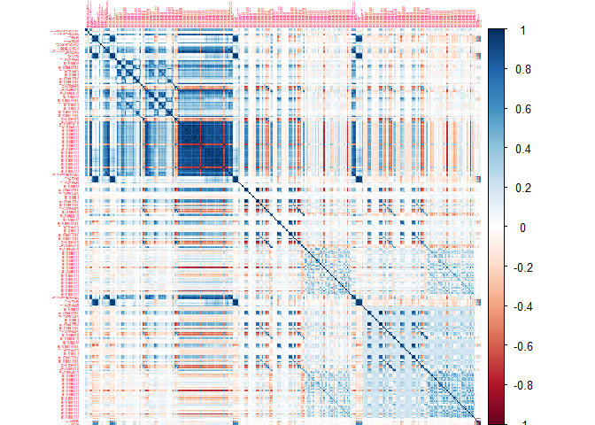<!-- -->

# Wykresy rozk³adów liczby atomów oraz elektronów

Rozklad liczby atomów


```r
ggplotly(ggplot(Data, aes(x=local_res_atom_non_h_count)) + geom_histogram(col=I("black"),bins = 30) )
```

<!--html_preserve--><div id="htmlwidget-435f92e833e5f1a9a10f" style="width:672px;height:480px;" class="plotly html-widget"></div>
<script type="application/json" data-for="htmlwidget-435f92e833e5f1a9a10f">{"x":{"data":[{"orientation":"v","width":[1.79310344827586,1.79310344827586,1.79310344827586,1.79310344827586,1.79310344827586,1.79310344827586,1.79310344827586,1.79310344827586,1.79310344827586,1.79310344827586,1.79310344827586,1.79310344827586,1.79310344827586,1.79310344827586,1.79310344827586,1.79310344827586,1.79310344827586,1.79310344827586,1.79310344827587,1.79310344827586,1.79310344827587,1.79310344827587,1.79310344827586,1.79310344827587,1.79310344827587,1.79310344827586,1.79310344827587,1.79310344827587,1.79310344827586,1.79310344827587],"base":[0,0,0,0,0,0,0,0,0,0,0,0,0,0,0,0,0,0,0,0,0,0,0,0,0,0,0,0,0,0],"x":[1.79310344827586,3.58620689655172,5.37931034482759,7.17241379310345,8.96551724137931,10.7586206896552,12.551724137931,14.3448275862069,16.1379310344828,17.9310344827586,19.7241379310345,21.5172413793103,23.3103448275862,25.1034482758621,26.8965517241379,28.6896551724138,30.4827586206897,32.2758620689655,34.0689655172414,35.8620689655172,37.6551724137931,39.448275862069,41.2413793103448,43.0344827586207,44.8275862068966,46.6206896551724,48.4137931034483,50.2068965517241,52,53.7931034482759],"y":[565,209,635,49,0,34,76,192,6,0,10,0,0,0,24,10,21,6,0,0,0,0,1,144,25,0,32,0,0,20],"text":["count: 565<br />local_res_atom_non_h_count:  1.793103","count: 209<br />local_res_atom_non_h_count:  3.586207","count: 635<br />local_res_atom_non_h_count:  5.379310","count:  49<br />local_res_atom_non_h_count:  7.172414","count:   0<br />local_res_atom_non_h_count:  8.965517","count:  34<br />local_res_atom_non_h_count: 10.758621","count:  76<br />local_res_atom_non_h_count: 12.551724","count: 192<br />local_res_atom_non_h_count: 14.344828","count:   6<br />local_res_atom_non_h_count: 16.137931","count:   0<br />local_res_atom_non_h_count: 17.931034","count:  10<br />local_res_atom_non_h_count: 19.724138","count:   0<br />local_res_atom_non_h_count: 21.517241","count:   0<br />local_res_atom_non_h_count: 23.310345","count:   0<br />local_res_atom_non_h_count: 25.103448","count:  24<br />local_res_atom_non_h_count: 26.896552","count:  10<br />local_res_atom_non_h_count: 28.689655","count:  21<br />local_res_atom_non_h_count: 30.482759","count:   6<br />local_res_atom_non_h_count: 32.275862","count:   0<br />local_res_atom_non_h_count: 34.068966","count:   0<br />local_res_atom_non_h_count: 35.862069","count:   0<br />local_res_atom_non_h_count: 37.655172","count:   0<br />local_res_atom_non_h_count: 39.448276","count:   1<br />local_res_atom_non_h_count: 41.241379","count: 144<br />local_res_atom_non_h_count: 43.034483","count:  25<br />local_res_atom_non_h_count: 44.827586","count:   0<br />local_res_atom_non_h_count: 46.620690","count:  32<br />local_res_atom_non_h_count: 48.413793","count:   0<br />local_res_atom_non_h_count: 50.206897","count:   0<br />local_res_atom_non_h_count: 52.000000","count:  20<br />local_res_atom_non_h_count: 53.793103"],"type":"bar","marker":{"autocolorscale":false,"color":"rgba(89,89,89,1)","line":{"width":1.88976377952756,"color":"rgba(0,0,0,1)"}},"showlegend":false,"xaxis":"x","yaxis":"y","hoverinfo":"text","frame":null}],"layout":{"margin":{"t":26.2283105022831,"r":7.30593607305936,"b":40.1826484018265,"l":43.1050228310502},"plot_bgcolor":"rgba(235,235,235,1)","paper_bgcolor":"rgba(255,255,255,1)","font":{"color":"rgba(0,0,0,1)","family":"","size":14.6118721461187},"xaxis":{"domain":[0,1],"automargin":true,"type":"linear","autorange":false,"range":[-1.79310344827586,57.3793103448276],"tickmode":"array","ticktext":["0","20","40"],"tickvals":[0,20,40],"categoryorder":"array","categoryarray":["0","20","40"],"nticks":null,"ticks":"outside","tickcolor":"rgba(51,51,51,1)","ticklen":3.65296803652968,"tickwidth":0.66417600664176,"showticklabels":true,"tickfont":{"color":"rgba(77,77,77,1)","family":"","size":11.689497716895},"tickangle":-0,"showline":false,"linecolor":null,"linewidth":0,"showgrid":true,"gridcolor":"rgba(255,255,255,1)","gridwidth":0.66417600664176,"zeroline":false,"anchor":"y","title":"local_res_atom_non_h_count","titlefont":{"color":"rgba(0,0,0,1)","family":"","size":14.6118721461187},"hoverformat":".2f"},"yaxis":{"domain":[0,1],"automargin":true,"type":"linear","autorange":false,"range":[-31.75,666.75],"tickmode":"array","ticktext":["0","200","400","600"],"tickvals":[0,200,400,600],"categoryorder":"array","categoryarray":["0","200","400","600"],"nticks":null,"ticks":"outside","tickcolor":"rgba(51,51,51,1)","ticklen":3.65296803652968,"tickwidth":0.66417600664176,"showticklabels":true,"tickfont":{"color":"rgba(77,77,77,1)","family":"","size":11.689497716895},"tickangle":-0,"showline":false,"linecolor":null,"linewidth":0,"showgrid":true,"gridcolor":"rgba(255,255,255,1)","gridwidth":0.66417600664176,"zeroline":false,"anchor":"x","title":"count","titlefont":{"color":"rgba(0,0,0,1)","family":"","size":14.6118721461187},"hoverformat":".2f"},"shapes":[{"type":"rect","fillcolor":null,"line":{"color":null,"width":0,"linetype":[]},"yref":"paper","xref":"paper","x0":0,"x1":1,"y0":0,"y1":1}],"showlegend":false,"legend":{"bgcolor":"rgba(255,255,255,1)","bordercolor":"transparent","borderwidth":1.88976377952756,"font":{"color":"rgba(0,0,0,1)","family":"","size":11.689497716895}},"hovermode":"closest","barmode":"relative"},"config":{"doubleClick":"reset","modeBarButtonsToAdd":[{"name":"Collaborate","icon":{"width":1000,"ascent":500,"descent":-50,"path":"M487 375c7-10 9-23 5-36l-79-259c-3-12-11-23-22-31-11-8-22-12-35-12l-263 0c-15 0-29 5-43 15-13 10-23 23-28 37-5 13-5 25-1 37 0 0 0 3 1 7 1 5 1 8 1 11 0 2 0 4-1 6 0 3-1 5-1 6 1 2 2 4 3 6 1 2 2 4 4 6 2 3 4 5 5 7 5 7 9 16 13 26 4 10 7 19 9 26 0 2 0 5 0 9-1 4-1 6 0 8 0 2 2 5 4 8 3 3 5 5 5 7 4 6 8 15 12 26 4 11 7 19 7 26 1 1 0 4 0 9-1 4-1 7 0 8 1 2 3 5 6 8 4 4 6 6 6 7 4 5 8 13 13 24 4 11 7 20 7 28 1 1 0 4 0 7-1 3-1 6-1 7 0 2 1 4 3 6 1 1 3 4 5 6 2 3 3 5 5 6 1 2 3 5 4 9 2 3 3 7 5 10 1 3 2 6 4 10 2 4 4 7 6 9 2 3 4 5 7 7 3 2 7 3 11 3 3 0 8 0 13-1l0-1c7 2 12 2 14 2l218 0c14 0 25-5 32-16 8-10 10-23 6-37l-79-259c-7-22-13-37-20-43-7-7-19-10-37-10l-248 0c-5 0-9-2-11-5-2-3-2-7 0-12 4-13 18-20 41-20l264 0c5 0 10 2 16 5 5 3 8 6 10 11l85 282c2 5 2 10 2 17 7-3 13-7 17-13z m-304 0c-1-3-1-5 0-7 1-1 3-2 6-2l174 0c2 0 4 1 7 2 2 2 4 4 5 7l6 18c0 3 0 5-1 7-1 1-3 2-6 2l-173 0c-3 0-5-1-8-2-2-2-4-4-4-7z m-24-73c-1-3-1-5 0-7 2-2 3-2 6-2l174 0c2 0 5 0 7 2 3 2 4 4 5 7l6 18c1 2 0 5-1 6-1 2-3 3-5 3l-174 0c-3 0-5-1-7-3-3-1-4-4-5-6z"},"click":"function(gd) { \n        // is this being viewed in RStudio?\n        if (location.search == '?viewer_pane=1') {\n          alert('To learn about plotly for collaboration, visit:\\n https://cpsievert.github.io/plotly_book/plot-ly-for-collaboration.html');\n        } else {\n          window.open('https://cpsievert.github.io/plotly_book/plot-ly-for-collaboration.html', '_blank');\n        }\n      }"}],"cloud":false},"source":"A","attrs":{"235455c716e0":{"x":{},"type":"bar"}},"cur_data":"235455c716e0","visdat":{"235455c716e0":["function (y) ","x"]},"highlight":{"on":"plotly_click","persistent":false,"dynamic":false,"selectize":false,"opacityDim":0.2,"selected":{"opacity":1},"debounce":0},"base_url":"https://plot.ly"},"evals":["config.modeBarButtonsToAdd.0.click"],"jsHooks":[]}</script><!--/html_preserve-->

Rozklad liczby elektronów


```r
ggplotly(ggplot(Data, aes(x=local_res_atom_non_h_electron_sum)) + geom_histogram(col=I("black"),bins = 30))
```

<!--html_preserve--><div id="htmlwidget-342daf62c57fb7fd61c7" style="width:672px;height:480px;" class="plotly html-widget"></div>
<script type="application/json" data-for="htmlwidget-342daf62c57fb7fd61c7">{"x":{"data":[{"orientation":"v","width":[12.551724137931,12.551724137931,12.551724137931,12.551724137931,12.551724137931,12.551724137931,12.551724137931,12.551724137931,12.551724137931,12.551724137931,12.551724137931,12.551724137931,12.551724137931,12.551724137931,12.551724137931,12.551724137931,12.551724137931,12.551724137931,12.551724137931,12.551724137931,12.551724137931,12.551724137931,12.551724137931,12.551724137931,12.551724137931,12.5517241379309,12.551724137931,12.551724137931,12.551724137931,12.5517241379309],"base":[0,0,0,0,0,0,0,0,0,0,0,0,0,0,0,0,0,0,0,0,0,0,0,0,0,0,0,0,0,0],"x":[12.551724137931,25.1034482758621,37.6551724137931,50.2068965517241,62.7586206896552,75.3103448275862,87.8620689655172,100.413793103448,112.965517241379,125.51724137931,138.068965517241,150.620689655172,163.172413793103,175.724137931034,188.275862068966,200.827586206897,213.379310344828,225.931034482759,238.48275862069,251.034482758621,263.586206896552,276.137931034483,288.689655172414,301.241379310345,313.793103448276,326.344827586207,338.896551724138,351.448275862069,364,376.551724137931],"y":[217,482,235,515,20,11,88,172,26,0,7,3,0,0,8,16,20,0,11,6,0,0,145,0,25,0,0,32,0,20],"text":["count: 217<br />local_res_atom_non_h_electron_sum:  12.55172","count: 482<br />local_res_atom_non_h_electron_sum:  25.10345","count: 235<br />local_res_atom_non_h_electron_sum:  37.65517","count: 515<br />local_res_atom_non_h_electron_sum:  50.20690","count:  20<br />local_res_atom_non_h_electron_sum:  62.75862","count:  11<br />local_res_atom_non_h_electron_sum:  75.31034","count:  88<br />local_res_atom_non_h_electron_sum:  87.86207","count: 172<br />local_res_atom_non_h_electron_sum: 100.41379","count:  26<br />local_res_atom_non_h_electron_sum: 112.96552","count:   0<br />local_res_atom_non_h_electron_sum: 125.51724","count:   7<br />local_res_atom_non_h_electron_sum: 138.06897","count:   3<br />local_res_atom_non_h_electron_sum: 150.62069","count:   0<br />local_res_atom_non_h_electron_sum: 163.17241","count:   0<br />local_res_atom_non_h_electron_sum: 175.72414","count:   8<br />local_res_atom_non_h_electron_sum: 188.27586","count:  16<br />local_res_atom_non_h_electron_sum: 200.82759","count:  20<br />local_res_atom_non_h_electron_sum: 213.37931","count:   0<br />local_res_atom_non_h_electron_sum: 225.93103","count:  11<br />local_res_atom_non_h_electron_sum: 238.48276","count:   6<br />local_res_atom_non_h_electron_sum: 251.03448","count:   0<br />local_res_atom_non_h_electron_sum: 263.58621","count:   0<br />local_res_atom_non_h_electron_sum: 276.13793","count: 145<br />local_res_atom_non_h_electron_sum: 288.68966","count:   0<br />local_res_atom_non_h_electron_sum: 301.24138","count:  25<br />local_res_atom_non_h_electron_sum: 313.79310","count:   0<br />local_res_atom_non_h_electron_sum: 326.34483","count:   0<br />local_res_atom_non_h_electron_sum: 338.89655","count:  32<br />local_res_atom_non_h_electron_sum: 351.44828","count:   0<br />local_res_atom_non_h_electron_sum: 364.00000","count:  20<br />local_res_atom_non_h_electron_sum: 376.55172"],"type":"bar","marker":{"autocolorscale":false,"color":"rgba(89,89,89,1)","line":{"width":1.88976377952756,"color":"rgba(0,0,0,1)"}},"showlegend":false,"xaxis":"x","yaxis":"y","hoverinfo":"text","frame":null}],"layout":{"margin":{"t":26.2283105022831,"r":7.30593607305936,"b":40.1826484018265,"l":43.1050228310502},"plot_bgcolor":"rgba(235,235,235,1)","paper_bgcolor":"rgba(255,255,255,1)","font":{"color":"rgba(0,0,0,1)","family":"","size":14.6118721461187},"xaxis":{"domain":[0,1],"automargin":true,"type":"linear","autorange":false,"range":[-12.551724137931,401.655172413793],"tickmode":"array","ticktext":["0","100","200","300","400"],"tickvals":[0,100,200,300,400],"categoryorder":"array","categoryarray":["0","100","200","300","400"],"nticks":null,"ticks":"outside","tickcolor":"rgba(51,51,51,1)","ticklen":3.65296803652968,"tickwidth":0.66417600664176,"showticklabels":true,"tickfont":{"color":"rgba(77,77,77,1)","family":"","size":11.689497716895},"tickangle":-0,"showline":false,"linecolor":null,"linewidth":0,"showgrid":true,"gridcolor":"rgba(255,255,255,1)","gridwidth":0.66417600664176,"zeroline":false,"anchor":"y","title":"local_res_atom_non_h_electron_sum","titlefont":{"color":"rgba(0,0,0,1)","family":"","size":14.6118721461187},"hoverformat":".2f"},"yaxis":{"domain":[0,1],"automargin":true,"type":"linear","autorange":false,"range":[-25.75,540.75],"tickmode":"array","ticktext":["0","100","200","300","400","500"],"tickvals":[0,100,200,300,400,500],"categoryorder":"array","categoryarray":["0","100","200","300","400","500"],"nticks":null,"ticks":"outside","tickcolor":"rgba(51,51,51,1)","ticklen":3.65296803652968,"tickwidth":0.66417600664176,"showticklabels":true,"tickfont":{"color":"rgba(77,77,77,1)","family":"","size":11.689497716895},"tickangle":-0,"showline":false,"linecolor":null,"linewidth":0,"showgrid":true,"gridcolor":"rgba(255,255,255,1)","gridwidth":0.66417600664176,"zeroline":false,"anchor":"x","title":"count","titlefont":{"color":"rgba(0,0,0,1)","family":"","size":14.6118721461187},"hoverformat":".2f"},"shapes":[{"type":"rect","fillcolor":null,"line":{"color":null,"width":0,"linetype":[]},"yref":"paper","xref":"paper","x0":0,"x1":1,"y0":0,"y1":1}],"showlegend":false,"legend":{"bgcolor":"rgba(255,255,255,1)","bordercolor":"transparent","borderwidth":1.88976377952756,"font":{"color":"rgba(0,0,0,1)","family":"","size":11.689497716895}},"hovermode":"closest","barmode":"relative"},"config":{"doubleClick":"reset","modeBarButtonsToAdd":[{"name":"Collaborate","icon":{"width":1000,"ascent":500,"descent":-50,"path":"M487 375c7-10 9-23 5-36l-79-259c-3-12-11-23-22-31-11-8-22-12-35-12l-263 0c-15 0-29 5-43 15-13 10-23 23-28 37-5 13-5 25-1 37 0 0 0 3 1 7 1 5 1 8 1 11 0 2 0 4-1 6 0 3-1 5-1 6 1 2 2 4 3 6 1 2 2 4 4 6 2 3 4 5 5 7 5 7 9 16 13 26 4 10 7 19 9 26 0 2 0 5 0 9-1 4-1 6 0 8 0 2 2 5 4 8 3 3 5 5 5 7 4 6 8 15 12 26 4 11 7 19 7 26 1 1 0 4 0 9-1 4-1 7 0 8 1 2 3 5 6 8 4 4 6 6 6 7 4 5 8 13 13 24 4 11 7 20 7 28 1 1 0 4 0 7-1 3-1 6-1 7 0 2 1 4 3 6 1 1 3 4 5 6 2 3 3 5 5 6 1 2 3 5 4 9 2 3 3 7 5 10 1 3 2 6 4 10 2 4 4 7 6 9 2 3 4 5 7 7 3 2 7 3 11 3 3 0 8 0 13-1l0-1c7 2 12 2 14 2l218 0c14 0 25-5 32-16 8-10 10-23 6-37l-79-259c-7-22-13-37-20-43-7-7-19-10-37-10l-248 0c-5 0-9-2-11-5-2-3-2-7 0-12 4-13 18-20 41-20l264 0c5 0 10 2 16 5 5 3 8 6 10 11l85 282c2 5 2 10 2 17 7-3 13-7 17-13z m-304 0c-1-3-1-5 0-7 1-1 3-2 6-2l174 0c2 0 4 1 7 2 2 2 4 4 5 7l6 18c0 3 0 5-1 7-1 1-3 2-6 2l-173 0c-3 0-5-1-8-2-2-2-4-4-4-7z m-24-73c-1-3-1-5 0-7 2-2 3-2 6-2l174 0c2 0 5 0 7 2 3 2 4 4 5 7l6 18c1 2 0 5-1 6-1 2-3 3-5 3l-174 0c-3 0-5-1-7-3-3-1-4-4-5-6z"},"click":"function(gd) { \n        // is this being viewed in RStudio?\n        if (location.search == '?viewer_pane=1') {\n          alert('To learn about plotly for collaboration, visit:\\n https://cpsievert.github.io/plotly_book/plot-ly-for-collaboration.html');\n        } else {\n          window.open('https://cpsievert.github.io/plotly_book/plot-ly-for-collaboration.html', '_blank');\n        }\n      }"}],"cloud":false},"source":"A","attrs":{"235464c79ec":{"x":{},"type":"bar"}},"cur_data":"235464c79ec","visdat":{"235464c79ec":["function (y) ","x"]},"highlight":{"on":"plotly_click","persistent":false,"dynamic":false,"selectize":false,"opacityDim":0.2,"selected":{"opacity":1},"debounce":0},"base_url":"https://plot.ly"},"evals":["config.modeBarButtonsToAdd.0.click"],"jsHooks":[]}</script><!--/html_preserve-->

# Najwiêksza niezgodnoœæ

10 klas z najwiêksz¹ niezgodnoœci¹ liczby atomów


```r
kable(head(Data%>%select(res_name, local_res_atom_non_h_count,dict_atom_non_h_count)%>%group_by(res_name)%>%summarise_all(funs(sum))%>%mutate(delta = abs(local_res_atom_non_h_count - dict_atom_non_h_count))%>%arrange(desc(delta)),10))
```


res_name    local_res_atom_non_h_count   dict_atom_non_h_count   delta
---------  ---------------------------  ----------------------  ------
SO4                               1755                   15093   13338
GOL                               1308                   10246    8938
EDO                                380                    3325    2945
PO4                                310                    2666    2356
PEG                                280                    1960    1680
ACT                                136                    1190    1054
NAG                               2408                    1376    1032
HEM                               6234                    5220    1014
ACY                                116                    1015     899
FMT                                 87                     696     609

# Rozklad wartosci kolumn 'part'

```r
part <- Data %>% select(part_01_shape_segments_count:part_01_density_Z_4_0)
for (i in 1:length(part)) {
  Bez_NA <-  part[,i][!is.na(part[,i])]
  
  avg <- mean(Bez_NA)
  
    p <- ggplot() + aes(Bez_NA) + geom_bar(col=I("black")) + xlab(names(part[i])) + geom_vline(xintercept=avg, color="red") + annotate("text", x=avg,y=-10, label=c(avg), color="red")
  
  print(p)
  
}
```

<!-- -->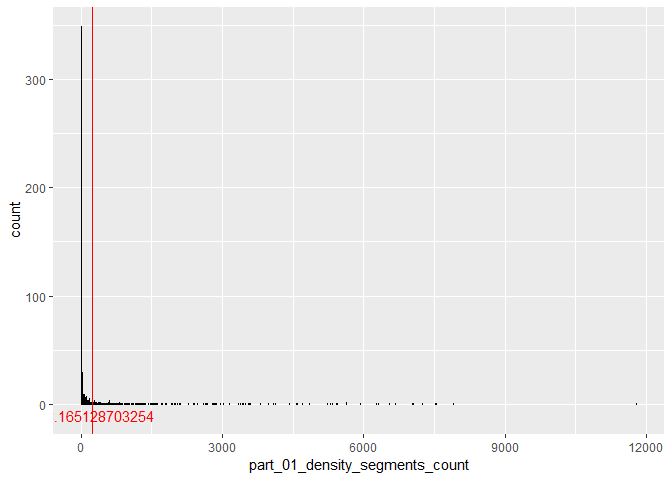<!-- -->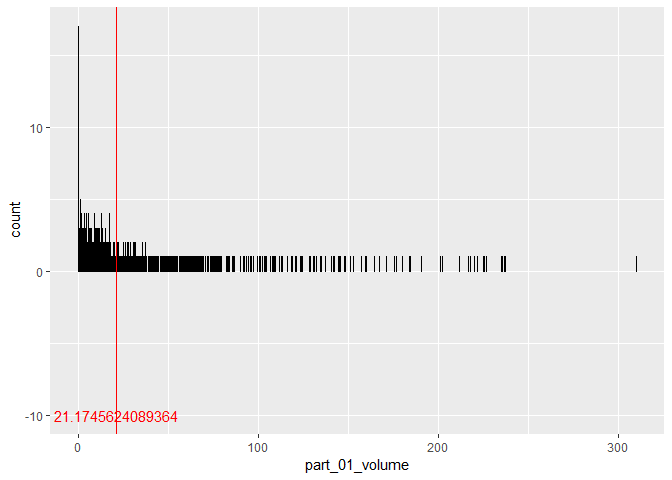<!-- -->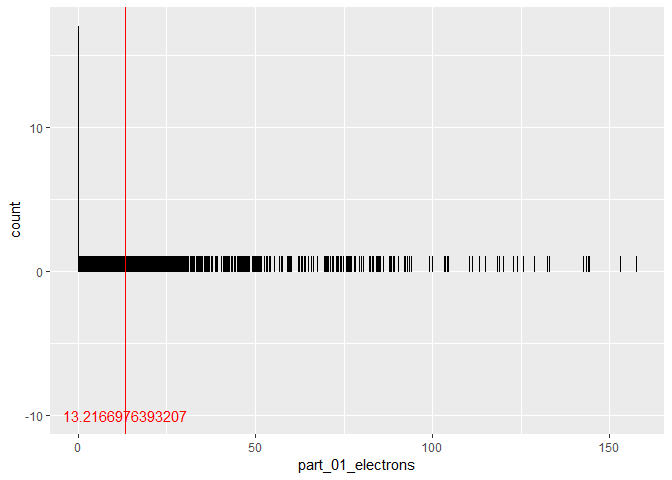<!-- -->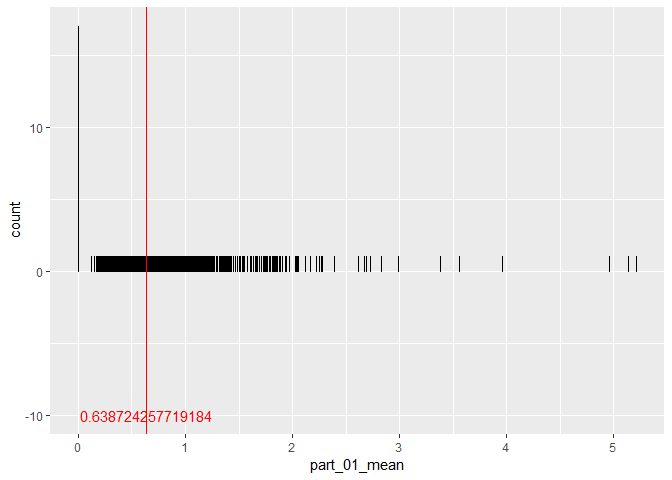<!-- -->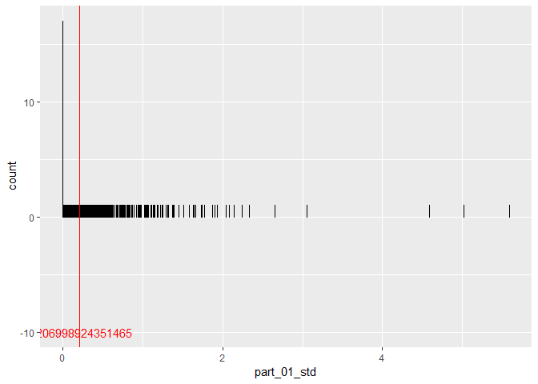<!-- -->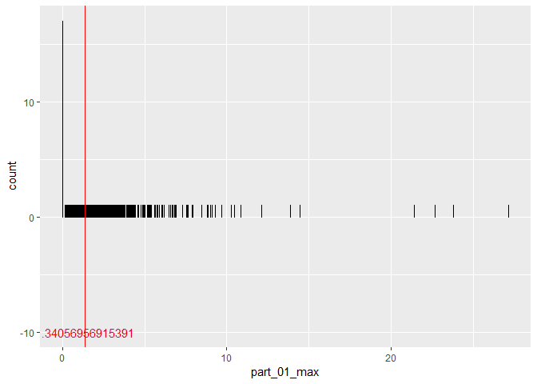<!-- -->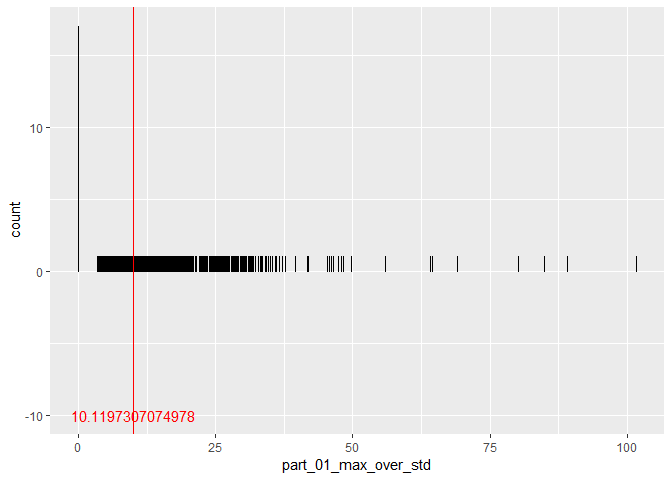<!-- -->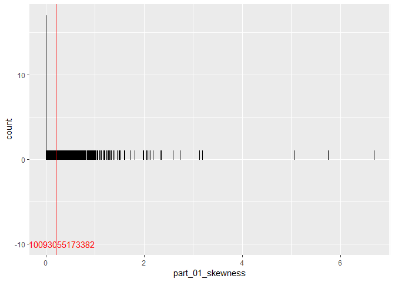<!-- -->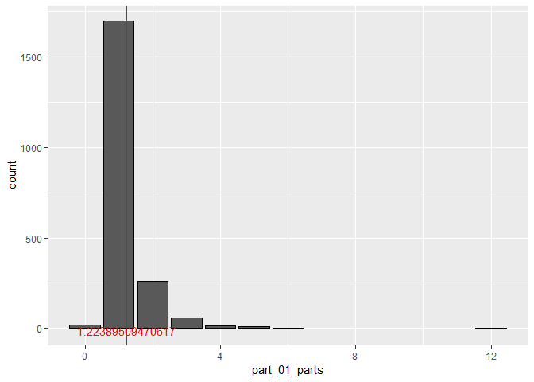<!-- --><!-- --><!-- --><!-- --><!-- --><!-- -->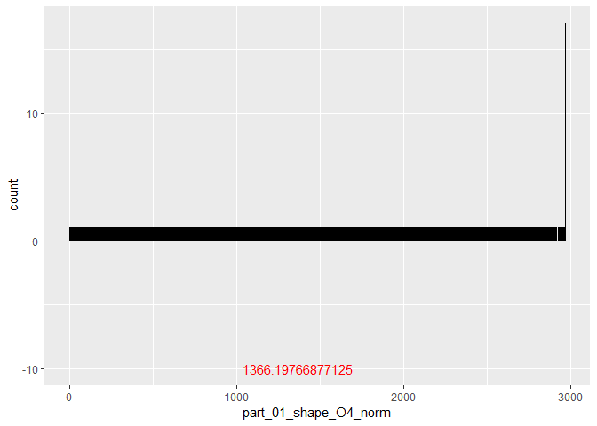<!-- --><!-- --><!-- -->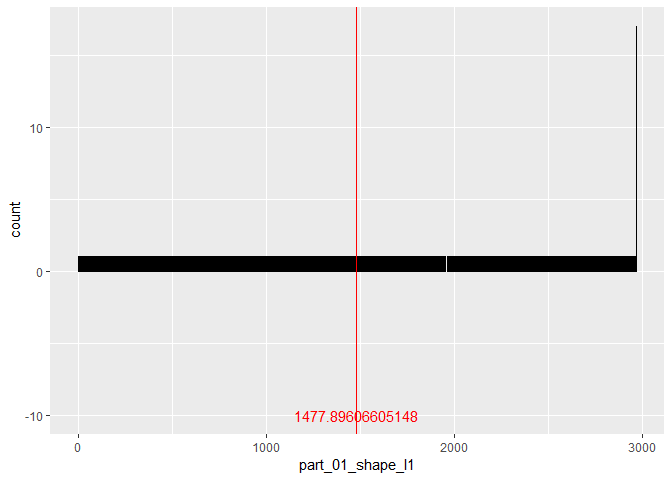<!-- --><!-- --><!-- --><!-- --><!-- --><!-- -->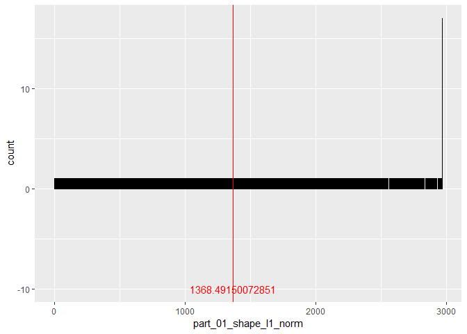<!-- -->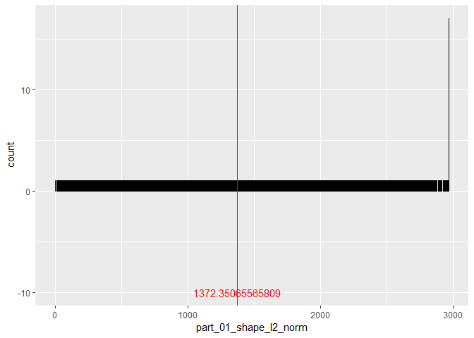<!-- -->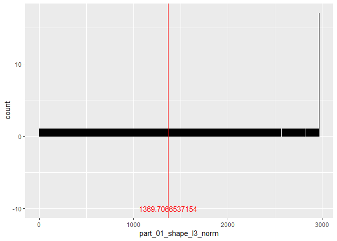<!-- --><!-- --><!-- -->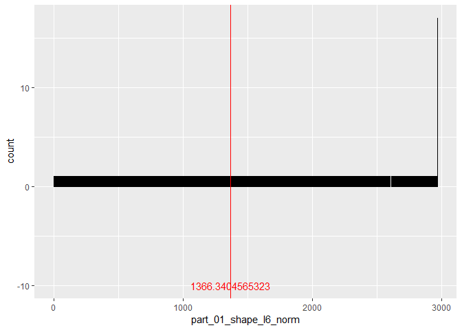<!-- -->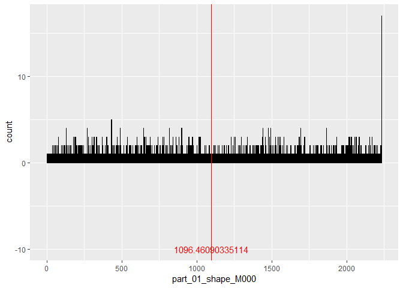<!-- -->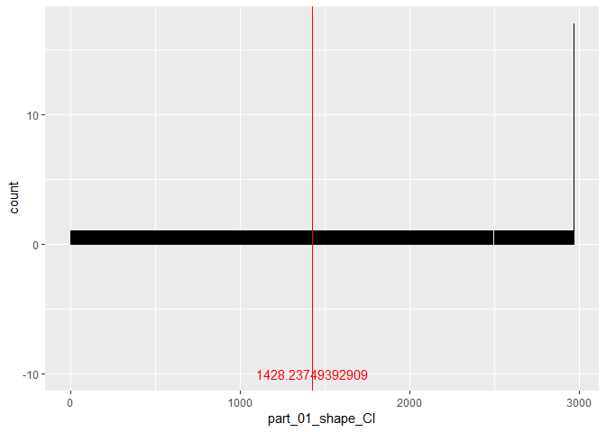<!-- --><!-- --><!-- --><!-- --><!-- --><!-- --><!-- --><!-- --><!-- --><!-- -->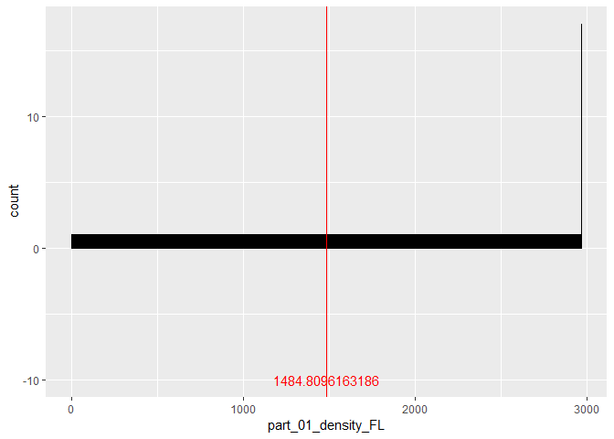<!-- -->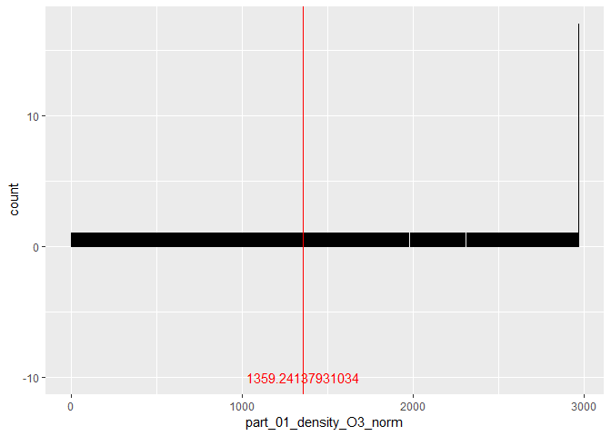<!-- -->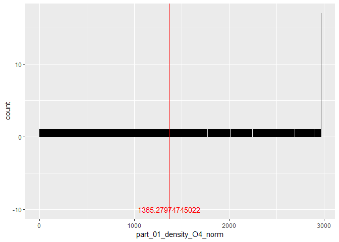<!-- -->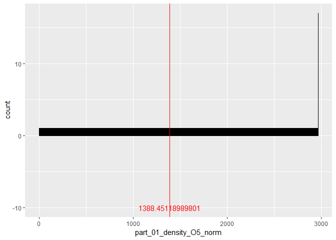<!-- -->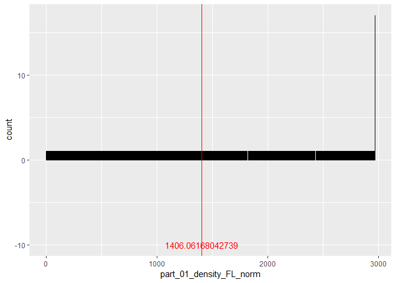<!-- --><!-- --><!-- --><!-- --><!-- --><!-- --><!-- --><!-- -->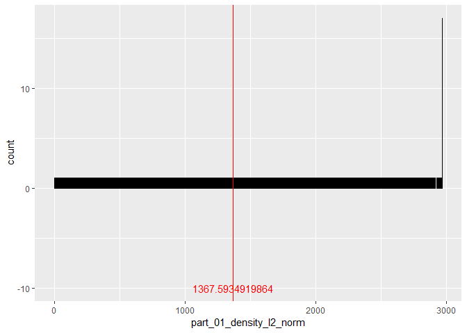<!-- -->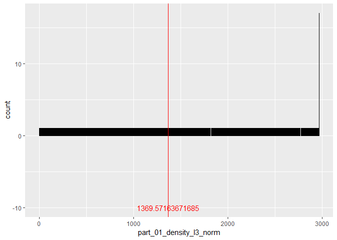<!-- --><!-- --><!-- -->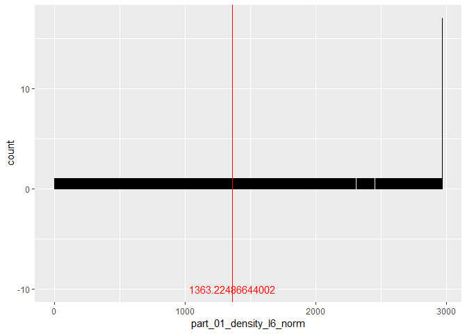<!-- --><!-- --><!-- --><!-- --><!-- --><!-- --><!-- --><!-- --><!-- --><!-- -->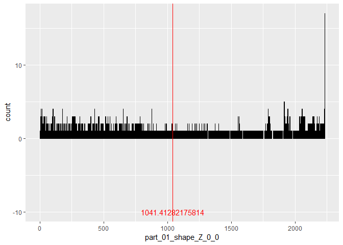<!-- -->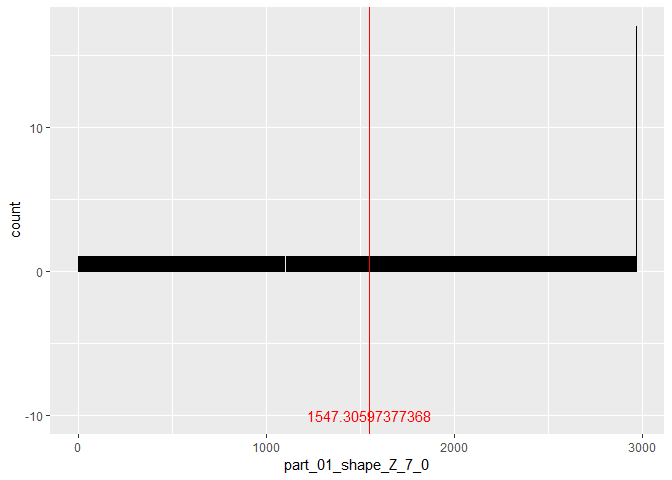<!-- --><!-- --><!-- --><!-- -->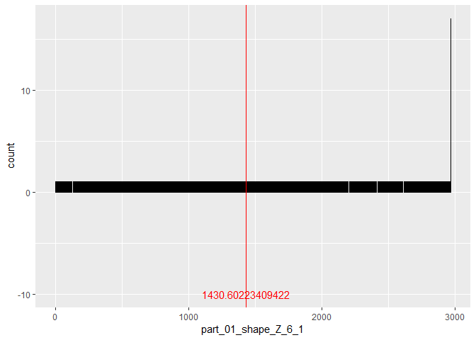<!-- --><!-- --><!-- -->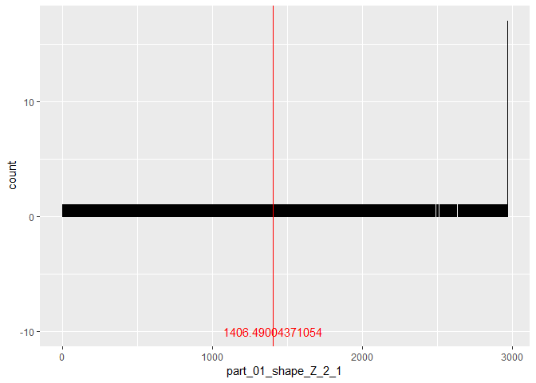<!-- --><!-- -->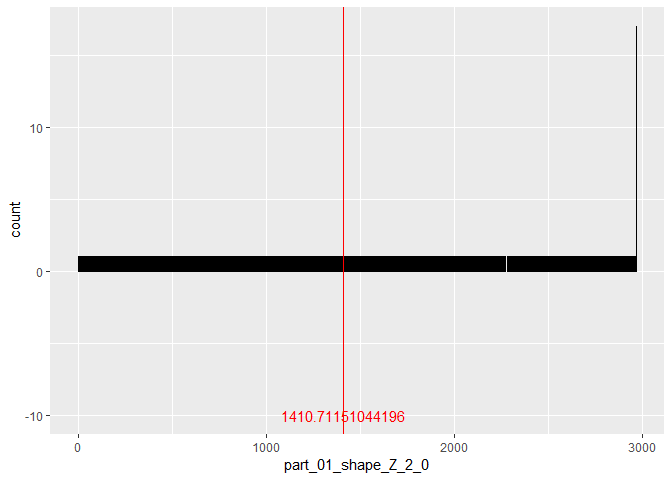<!-- --><!-- --><!-- --><!-- --><!-- --><!-- --><!-- --><!-- --><!-- --><!-- --><!-- --><!-- -->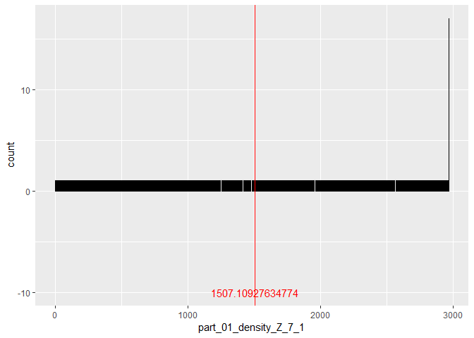<!-- --><!-- --><!-- --><!-- --><!-- --><!-- --><!-- --><!-- --><!-- --><!-- --><!-- --><!-- --><!-- --><!-- --><!-- --><!-- --><!-- -->

#Przewidywanie liczby elektronów i atomów na podstawie innych kolumn

```r
lm_data <- Data
lm_data[is.na(lm_data)] <- 0
lm_data <- lm_data[sapply(lm_data, is.numeric)]
lm_atom_model <- lm(local_res_atom_non_h_count ~ ., lm_data)
lm_atom_summary <- summary(lm_atom_model)
lm_electron_model <- lm(local_res_atom_non_h_electron_sum ~ ., lm_data)
lm_electron_summary <- summary(lm_electron_model)
```

Miary dla liczby atomów:
R^2: 0.9951683
RMSE 1.010027

Miary dla liczby elektronów:
R^2: 0.9949885
RMSE 6.9170261

#Klasyfikator Bayesa na atrybucie res_name


```r
Klasyfikator<-predict(naiveBayes(res_name ~., data=Data[-1]),Data[-1])
Klasyfikator == Data$res_name
```

```
##    [1] FALSE FALSE FALSE FALSE  TRUE FALSE FALSE FALSE FALSE FALSE FALSE
##   [12] FALSE FALSE FALSE FALSE FALSE FALSE FALSE FALSE FALSE FALSE FALSE
##   [23] FALSE FALSE FALSE FALSE  TRUE FALSE FALSE FALSE FALSE FALSE FALSE
##   [34] FALSE FALSE FALSE FALSE FALSE FALSE FALSE  TRUE  TRUE  TRUE  TRUE
##   [45]  TRUE FALSE  TRUE  TRUE  TRUE FALSE FALSE FALSE FALSE FALSE  TRUE
##   [56] FALSE  TRUE FALSE  TRUE FALSE FALSE FALSE FALSE FALSE FALSE FALSE
##   [67] FALSE FALSE FALSE FALSE FALSE  TRUE FALSE FALSE FALSE FALSE FALSE
##   [78] FALSE FALSE FALSE FALSE  TRUE FALSE  TRUE FALSE FALSE FALSE FALSE
##   [89]  TRUE  TRUE  TRUE  TRUE  TRUE FALSE FALSE FALSE FALSE FALSE FALSE
##  [100] FALSE FALSE FALSE FALSE FALSE FALSE FALSE FALSE FALSE  TRUE FALSE
##  [111]  TRUE  TRUE  TRUE FALSE  TRUE FALSE FALSE FALSE FALSE  TRUE FALSE
##  [122] FALSE  TRUE FALSE FALSE FALSE FALSE FALSE FALSE FALSE FALSE FALSE
##  [133] FALSE FALSE  TRUE  TRUE  TRUE  TRUE FALSE FALSE FALSE  TRUE  TRUE
##  [144] FALSE FALSE FALSE FALSE FALSE FALSE FALSE FALSE FALSE FALSE FALSE
##  [155] FALSE FALSE FALSE FALSE FALSE FALSE FALSE FALSE FALSE FALSE FALSE
##  [166] FALSE FALSE  TRUE FALSE FALSE FALSE FALSE FALSE FALSE FALSE FALSE
##  [177] FALSE FALSE FALSE FALSE FALSE FALSE FALSE FALSE FALSE FALSE FALSE
##  [188] FALSE FALSE FALSE FALSE FALSE FALSE FALSE FALSE FALSE FALSE FALSE
##  [199] FALSE FALSE FALSE FALSE FALSE  TRUE  TRUE FALSE FALSE  TRUE FALSE
##  [210] FALSE FALSE  TRUE  TRUE  TRUE FALSE FALSE FALSE FALSE FALSE FALSE
##  [221] FALSE FALSE FALSE FALSE FALSE FALSE FALSE FALSE FALSE FALSE FALSE
##  [232] FALSE FALSE FALSE FALSE FALSE FALSE FALSE FALSE FALSE FALSE FALSE
##  [243] FALSE FALSE FALSE FALSE FALSE FALSE FALSE  TRUE FALSE  TRUE  TRUE
##  [254] FALSE FALSE FALSE FALSE FALSE FALSE FALSE FALSE FALSE FALSE FALSE
##  [265] FALSE FALSE FALSE FALSE FALSE FALSE FALSE  TRUE  TRUE FALSE FALSE
##  [276] FALSE  TRUE FALSE FALSE FALSE FALSE FALSE  TRUE  TRUE FALSE FALSE
##  [287] FALSE FALSE FALSE FALSE FALSE  TRUE  TRUE FALSE FALSE FALSE FALSE
##  [298] FALSE FALSE FALSE FALSE FALSE FALSE FALSE FALSE FALSE  TRUE  TRUE
##  [309]  TRUE  TRUE  TRUE FALSE FALSE  TRUE  TRUE  TRUE  TRUE  TRUE  TRUE
##  [320]  TRUE  TRUE FALSE FALSE FALSE FALSE FALSE FALSE FALSE FALSE FALSE
##  [331] FALSE FALSE FALSE  TRUE  TRUE  TRUE FALSE FALSE FALSE FALSE  TRUE
##  [342]  TRUE  TRUE  TRUE FALSE FALSE FALSE FALSE FALSE FALSE FALSE FALSE
##  [353] FALSE  TRUE  TRUE FALSE FALSE FALSE FALSE FALSE FALSE FALSE  TRUE
##  [364]  TRUE  TRUE  TRUE  TRUE  TRUE  TRUE  TRUE FALSE FALSE FALSE FALSE
##  [375] FALSE FALSE FALSE FALSE  TRUE  TRUE  TRUE FALSE FALSE FALSE FALSE
##  [386]  TRUE FALSE FALSE FALSE FALSE FALSE FALSE  TRUE  TRUE FALSE FALSE
##  [397] FALSE FALSE  TRUE  TRUE FALSE  TRUE FALSE FALSE FALSE FALSE  TRUE
##  [408]  TRUE FALSE FALSE FALSE FALSE  TRUE  TRUE  TRUE  TRUE FALSE FALSE
##  [419] FALSE FALSE  TRUE FALSE  TRUE  TRUE  TRUE FALSE  TRUE FALSE FALSE
##  [430] FALSE FALSE  TRUE FALSE  TRUE FALSE FALSE FALSE FALSE FALSE FALSE
##  [441] FALSE FALSE FALSE FALSE FALSE FALSE FALSE FALSE FALSE  TRUE FALSE
##  [452] FALSE  TRUE FALSE FALSE FALSE FALSE FALSE FALSE FALSE FALSE FALSE
##  [463] FALSE FALSE FALSE FALSE FALSE FALSE FALSE FALSE FALSE FALSE FALSE
##  [474] FALSE FALSE FALSE FALSE FALSE FALSE FALSE FALSE FALSE FALSE FALSE
##  [485] FALSE FALSE FALSE FALSE FALSE FALSE FALSE FALSE FALSE  TRUE  TRUE
##  [496]  TRUE  TRUE  TRUE  TRUE  TRUE  TRUE  TRUE FALSE FALSE  TRUE FALSE
##  [507]  TRUE  TRUE  TRUE FALSE FALSE FALSE  TRUE  TRUE FALSE FALSE FALSE
##  [518]  TRUE  TRUE  TRUE FALSE FALSE  TRUE  TRUE  TRUE FALSE  TRUE  TRUE
##  [529] FALSE  TRUE FALSE  TRUE  TRUE  TRUE FALSE FALSE FALSE FALSE FALSE
##  [540] FALSE FALSE FALSE FALSE FALSE FALSE FALSE FALSE FALSE FALSE FALSE
##  [551] FALSE FALSE FALSE  TRUE  TRUE FALSE  TRUE FALSE  TRUE  TRUE  TRUE
##  [562]  TRUE FALSE FALSE FALSE FALSE FALSE  TRUE  TRUE FALSE  TRUE FALSE
##  [573] FALSE FALSE  TRUE  TRUE FALSE FALSE  TRUE FALSE  TRUE  TRUE  TRUE
##  [584]  TRUE FALSE FALSE FALSE FALSE  TRUE FALSE FALSE FALSE FALSE FALSE
##  [595] FALSE FALSE FALSE FALSE FALSE FALSE FALSE FALSE FALSE FALSE FALSE
##  [606] FALSE FALSE FALSE  TRUE  TRUE  TRUE FALSE FALSE FALSE FALSE FALSE
##  [617] FALSE FALSE FALSE FALSE  TRUE FALSE FALSE  TRUE  TRUE FALSE FALSE
##  [628] FALSE  TRUE FALSE FALSE FALSE FALSE FALSE FALSE FALSE  TRUE  TRUE
##  [639]  TRUE  TRUE  TRUE  TRUE FALSE FALSE FALSE FALSE FALSE FALSE FALSE
##  [650] FALSE FALSE FALSE FALSE FALSE FALSE FALSE FALSE FALSE FALSE FALSE
##  [661] FALSE FALSE FALSE FALSE FALSE FALSE FALSE FALSE FALSE FALSE FALSE
##  [672] FALSE FALSE FALSE  TRUE FALSE FALSE FALSE FALSE FALSE FALSE  TRUE
##  [683]  TRUE FALSE FALSE  TRUE FALSE  TRUE  TRUE FALSE  TRUE  TRUE  TRUE
##  [694]  TRUE  TRUE  TRUE  TRUE  TRUE FALSE FALSE FALSE FALSE FALSE FALSE
##  [705] FALSE FALSE FALSE  TRUE  TRUE FALSE FALSE FALSE FALSE FALSE FALSE
##  [716] FALSE FALSE FALSE FALSE FALSE FALSE FALSE FALSE FALSE FALSE FALSE
##  [727] FALSE FALSE FALSE FALSE FALSE FALSE FALSE FALSE FALSE FALSE FALSE
##  [738] FALSE FALSE FALSE FALSE FALSE FALSE FALSE FALSE FALSE FALSE  TRUE
##  [749]  TRUE FALSE  TRUE  TRUE  TRUE  TRUE FALSE FALSE FALSE FALSE FALSE
##  [760] FALSE FALSE FALSE FALSE  TRUE FALSE  TRUE FALSE FALSE  TRUE  TRUE
##  [771]  TRUE  TRUE  TRUE FALSE FALSE FALSE FALSE FALSE FALSE FALSE FALSE
##  [782] FALSE FALSE FALSE  TRUE  TRUE  TRUE  TRUE  TRUE  TRUE FALSE FALSE
##  [793] FALSE FALSE FALSE FALSE FALSE  TRUE FALSE FALSE FALSE FALSE  TRUE
##  [804]  TRUE FALSE FALSE FALSE FALSE FALSE FALSE FALSE  TRUE  TRUE FALSE
##  [815] FALSE FALSE FALSE FALSE FALSE FALSE  TRUE FALSE  TRUE FALSE FALSE
##  [826] FALSE FALSE  TRUE  TRUE FALSE  TRUE FALSE FALSE FALSE FALSE FALSE
##  [837]  TRUE  TRUE FALSE  TRUE  TRUE FALSE FALSE FALSE FALSE FALSE FALSE
##  [848]  TRUE  TRUE  TRUE  TRUE  TRUE FALSE FALSE FALSE FALSE FALSE  TRUE
##  [859] FALSE  TRUE FALSE FALSE FALSE FALSE FALSE FALSE FALSE FALSE FALSE
##  [870] FALSE FALSE FALSE FALSE FALSE FALSE FALSE FALSE FALSE  TRUE  TRUE
##  [881]  TRUE  TRUE  TRUE  TRUE  TRUE  TRUE FALSE FALSE FALSE  TRUE FALSE
##  [892] FALSE FALSE FALSE FALSE FALSE FALSE FALSE FALSE FALSE FALSE FALSE
##  [903] FALSE FALSE  TRUE FALSE FALSE FALSE FALSE FALSE FALSE FALSE FALSE
##  [914] FALSE FALSE FALSE FALSE  TRUE  TRUE  TRUE  TRUE  TRUE  TRUE  TRUE
##  [925] FALSE FALSE FALSE FALSE FALSE FALSE FALSE FALSE FALSE FALSE FALSE
##  [936] FALSE FALSE FALSE  TRUE  TRUE FALSE FALSE FALSE FALSE FALSE FALSE
##  [947] FALSE FALSE FALSE FALSE FALSE  TRUE FALSE  TRUE FALSE  TRUE  TRUE
##  [958]  TRUE  TRUE  TRUE  TRUE FALSE FALSE FALSE FALSE FALSE FALSE FALSE
##  [969] FALSE FALSE FALSE FALSE FALSE FALSE FALSE FALSE FALSE FALSE FALSE
##  [980] FALSE FALSE FALSE FALSE  TRUE FALSE FALSE FALSE FALSE FALSE FALSE
##  [991] FALSE FALSE FALSE FALSE FALSE FALSE FALSE FALSE FALSE FALSE FALSE
## [1002] FALSE FALSE FALSE  TRUE  TRUE  TRUE FALSE FALSE FALSE  TRUE FALSE
## [1013] FALSE FALSE FALSE  TRUE FALSE  TRUE FALSE FALSE  TRUE FALSE FALSE
## [1024] FALSE FALSE FALSE FALSE  TRUE  TRUE  TRUE  TRUE FALSE FALSE  TRUE
## [1035]  TRUE FALSE  TRUE FALSE  TRUE FALSE FALSE  TRUE FALSE FALSE FALSE
## [1046] FALSE FALSE FALSE  TRUE  TRUE  TRUE  TRUE FALSE FALSE  TRUE FALSE
## [1057] FALSE  TRUE  TRUE FALSE  TRUE FALSE  TRUE  TRUE FALSE FALSE  TRUE
## [1068]  TRUE FALSE FALSE FALSE FALSE FALSE FALSE FALSE FALSE FALSE FALSE
## [1079] FALSE FALSE FALSE FALSE FALSE  TRUE  TRUE  TRUE  TRUE FALSE  TRUE
## [1090] FALSE FALSE FALSE  TRUE FALSE FALSE FALSE FALSE FALSE  TRUE FALSE
## [1101] FALSE FALSE FALSE FALSE  TRUE  TRUE FALSE FALSE FALSE FALSE FALSE
## [1112] FALSE  TRUE  TRUE FALSE FALSE  TRUE  TRUE FALSE FALSE FALSE FALSE
## [1123] FALSE FALSE  TRUE  TRUE  TRUE FALSE FALSE FALSE FALSE  TRUE FALSE
## [1134] FALSE FALSE FALSE FALSE FALSE FALSE  TRUE  TRUE FALSE  TRUE FALSE
## [1145] FALSE FALSE FALSE FALSE FALSE FALSE FALSE FALSE FALSE FALSE  TRUE
## [1156] FALSE FALSE FALSE FALSE FALSE FALSE FALSE FALSE FALSE FALSE FALSE
## [1167]  TRUE  TRUE  TRUE FALSE  TRUE  TRUE FALSE FALSE FALSE  TRUE FALSE
## [1178] FALSE FALSE FALSE  TRUE FALSE FALSE  TRUE FALSE FALSE FALSE FALSE
## [1189] FALSE FALSE FALSE FALSE FALSE FALSE  TRUE FALSE FALSE FALSE FALSE
## [1200] FALSE FALSE FALSE FALSE FALSE FALSE  TRUE FALSE FALSE FALSE FALSE
## [1211] FALSE FALSE FALSE FALSE FALSE FALSE FALSE  TRUE  TRUE FALSE FALSE
## [1222]  TRUE FALSE  TRUE  TRUE  TRUE FALSE  TRUE  TRUE FALSE FALSE FALSE
## [1233] FALSE FALSE FALSE FALSE FALSE FALSE FALSE FALSE FALSE FALSE FALSE
## [1244]  TRUE FALSE  TRUE FALSE FALSE FALSE FALSE  TRUE FALSE  TRUE  TRUE
## [1255]  TRUE  TRUE  TRUE FALSE FALSE FALSE FALSE FALSE FALSE FALSE FALSE
## [1266] FALSE FALSE FALSE FALSE FALSE FALSE FALSE FALSE FALSE  TRUE FALSE
## [1277] FALSE FALSE FALSE FALSE FALSE  TRUE  TRUE  TRUE FALSE  TRUE FALSE
## [1288] FALSE  TRUE FALSE  TRUE  TRUE FALSE FALSE FALSE FALSE  TRUE FALSE
## [1299]  TRUE FALSE  TRUE  TRUE FALSE  TRUE FALSE  TRUE  TRUE FALSE FALSE
## [1310]  TRUE  TRUE  TRUE FALSE  TRUE FALSE FALSE  TRUE FALSE  TRUE FALSE
## [1321]  TRUE FALSE  TRUE FALSE FALSE FALSE FALSE FALSE  TRUE  TRUE  TRUE
## [1332]  TRUE  TRUE  TRUE  TRUE  TRUE FALSE FALSE FALSE FALSE FALSE FALSE
## [1343] FALSE FALSE FALSE FALSE FALSE FALSE FALSE FALSE  TRUE  TRUE  TRUE
## [1354]  TRUE FALSE FALSE FALSE FALSE FALSE FALSE  TRUE  TRUE FALSE FALSE
## [1365] FALSE FALSE FALSE FALSE FALSE FALSE FALSE FALSE FALSE FALSE FALSE
## [1376] FALSE FALSE FALSE FALSE FALSE FALSE FALSE FALSE FALSE FALSE FALSE
## [1387] FALSE FALSE FALSE FALSE FALSE FALSE FALSE FALSE FALSE FALSE  TRUE
## [1398] FALSE  TRUE FALSE  TRUE FALSE FALSE FALSE FALSE FALSE FALSE FALSE
## [1409] FALSE FALSE  TRUE FALSE FALSE FALSE  TRUE FALSE  TRUE FALSE  TRUE
## [1420]  TRUE FALSE FALSE  TRUE FALSE FALSE FALSE FALSE FALSE FALSE FALSE
## [1431] FALSE FALSE  TRUE  TRUE FALSE FALSE FALSE FALSE FALSE FALSE FALSE
## [1442] FALSE FALSE FALSE FALSE FALSE FALSE FALSE FALSE FALSE  TRUE FALSE
## [1453] FALSE FALSE  TRUE FALSE FALSE FALSE  TRUE FALSE FALSE FALSE FALSE
## [1464]  TRUE  TRUE  TRUE  TRUE  TRUE  TRUE  TRUE FALSE FALSE FALSE FALSE
## [1475] FALSE FALSE FALSE FALSE FALSE  TRUE FALSE FALSE FALSE FALSE FALSE
## [1486] FALSE FALSE FALSE  TRUE FALSE  TRUE FALSE FALSE FALSE FALSE FALSE
## [1497] FALSE FALSE FALSE FALSE FALSE FALSE  TRUE FALSE FALSE FALSE FALSE
## [1508] FALSE  TRUE FALSE FALSE FALSE FALSE FALSE  TRUE  TRUE FALSE FALSE
## [1519] FALSE FALSE FALSE FALSE FALSE FALSE FALSE FALSE FALSE FALSE FALSE
## [1530] FALSE FALSE FALSE FALSE FALSE FALSE FALSE FALSE FALSE  TRUE FALSE
## [1541] FALSE FALSE FALSE  TRUE FALSE FALSE FALSE FALSE FALSE FALSE FALSE
## [1552]  TRUE FALSE FALSE FALSE FALSE FALSE  TRUE FALSE  TRUE  TRUE  TRUE
## [1563]  TRUE  TRUE  TRUE  TRUE  TRUE FALSE  TRUE FALSE FALSE FALSE FALSE
## [1574] FALSE  TRUE FALSE  TRUE  TRUE FALSE FALSE  TRUE FALSE  TRUE  TRUE
## [1585] FALSE  TRUE FALSE FALSE FALSE FALSE FALSE FALSE FALSE FALSE  TRUE
## [1596]  TRUE FALSE  TRUE FALSE FALSE FALSE  TRUE  TRUE FALSE  TRUE  TRUE
## [1607]  TRUE  TRUE FALSE  TRUE FALSE FALSE FALSE  TRUE FALSE  TRUE FALSE
## [1618] FALSE FALSE  TRUE FALSE FALSE  TRUE  TRUE FALSE FALSE FALSE FALSE
## [1629] FALSE FALSE  TRUE FALSE  TRUE  TRUE FALSE FALSE FALSE FALSE FALSE
## [1640] FALSE FALSE FALSE FALSE FALSE FALSE FALSE FALSE FALSE FALSE FALSE
## [1651] FALSE FALSE FALSE FALSE FALSE FALSE FALSE  TRUE FALSE FALSE FALSE
## [1662] FALSE FALSE  TRUE FALSE FALSE FALSE FALSE  TRUE FALSE FALSE FALSE
## [1673] FALSE FALSE FALSE FALSE FALSE FALSE FALSE FALSE  TRUE  TRUE  TRUE
## [1684] FALSE FALSE FALSE FALSE FALSE  TRUE  TRUE FALSE FALSE FALSE  TRUE
## [1695]  TRUE  TRUE  TRUE  TRUE  TRUE  TRUE  TRUE FALSE  TRUE  TRUE  TRUE
## [1706]  TRUE  TRUE  TRUE FALSE  TRUE  TRUE  TRUE  TRUE  TRUE  TRUE  TRUE
## [1717]  TRUE  TRUE FALSE FALSE FALSE  TRUE  TRUE  TRUE  TRUE  TRUE  TRUE
## [1728] FALSE  TRUE FALSE FALSE FALSE  TRUE FALSE  TRUE FALSE FALSE FALSE
## [1739] FALSE FALSE FALSE FALSE  TRUE  TRUE  TRUE FALSE FALSE FALSE FALSE
## [1750]  TRUE  TRUE FALSE FALSE  TRUE  TRUE FALSE  TRUE FALSE  TRUE  TRUE
## [1761]  TRUE  TRUE  TRUE FALSE FALSE FALSE FALSE  TRUE  TRUE  TRUE  TRUE
## [1772]  TRUE FALSE FALSE FALSE FALSE FALSE FALSE FALSE FALSE FALSE FALSE
## [1783] FALSE FALSE FALSE FALSE  TRUE FALSE  TRUE FALSE FALSE FALSE FALSE
## [1794] FALSE FALSE FALSE FALSE FALSE FALSE FALSE FALSE FALSE FALSE FALSE
## [1805] FALSE  TRUE FALSE  TRUE FALSE FALSE  TRUE FALSE  TRUE  TRUE FALSE
## [1816] FALSE FALSE FALSE FALSE FALSE  TRUE  TRUE FALSE  TRUE FALSE FALSE
## [1827]  TRUE  TRUE  TRUE FALSE  TRUE FALSE  TRUE  TRUE FALSE FALSE  TRUE
## [1838]  TRUE FALSE FALSE FALSE  TRUE FALSE FALSE  TRUE  TRUE  TRUE FALSE
## [1849] FALSE FALSE  TRUE FALSE  TRUE FALSE FALSE  TRUE FALSE  TRUE  TRUE
## [1860]  TRUE  TRUE  TRUE FALSE  TRUE  TRUE  TRUE  TRUE FALSE  TRUE FALSE
## [1871] FALSE FALSE FALSE FALSE FALSE FALSE FALSE FALSE FALSE FALSE FALSE
## [1882]  TRUE  TRUE FALSE  TRUE FALSE FALSE FALSE FALSE FALSE FALSE  TRUE
## [1893] FALSE FALSE  TRUE  TRUE  TRUE  TRUE  TRUE  TRUE  TRUE  TRUE  TRUE
## [1904]  TRUE  TRUE FALSE FALSE FALSE  TRUE FALSE FALSE FALSE FALSE FALSE
## [1915] FALSE FALSE  TRUE FALSE FALSE  TRUE  TRUE  TRUE FALSE FALSE FALSE
## [1926] FALSE FALSE FALSE FALSE FALSE FALSE FALSE FALSE FALSE FALSE FALSE
## [1937] FALSE FALSE FALSE FALSE FALSE FALSE FALSE FALSE FALSE FALSE FALSE
## [1948] FALSE FALSE FALSE FALSE FALSE FALSE FALSE FALSE  TRUE  TRUE  TRUE
## [1959] FALSE  TRUE  TRUE  TRUE  TRUE FALSE FALSE FALSE  TRUE  TRUE FALSE
## [1970] FALSE FALSE FALSE FALSE FALSE FALSE FALSE FALSE FALSE FALSE  TRUE
## [1981] FALSE FALSE FALSE FALSE FALSE FALSE FALSE FALSE FALSE FALSE FALSE
## [1992] FALSE FALSE  TRUE FALSE  TRUE  TRUE FALSE FALSE FALSE FALSE FALSE
## [2003] FALSE FALSE  TRUE FALSE FALSE FALSE FALSE FALSE FALSE FALSE FALSE
## [2014] FALSE FALSE FALSE FALSE FALSE FALSE  TRUE FALSE FALSE FALSE  TRUE
## [2025] FALSE FALSE FALSE  TRUE  TRUE  TRUE  TRUE  TRUE  TRUE  TRUE  TRUE
## [2036] FALSE  TRUE  TRUE FALSE FALSE FALSE FALSE FALSE FALSE FALSE FALSE
## [2047] FALSE FALSE FALSE FALSE FALSE FALSE FALSE FALSE FALSE FALSE FALSE
## [2058] FALSE FALSE
```

Dok³adnoœæ klasyfikatora: 3.6507092
