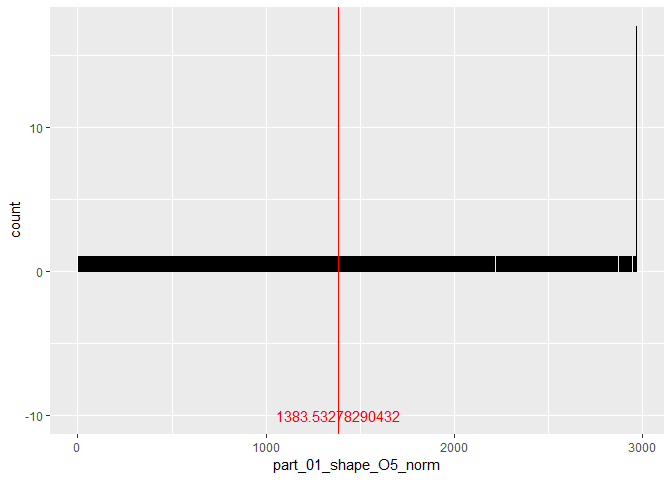
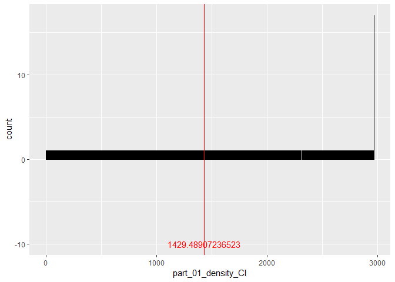

## Bbiblioteki

```r
library(dplyr)
library(knitr)
library(corrplot)
library(ggplot2)
library(plotly)
library(e1071)
```

## Ustawienie ziarna

```r
 set.seed(1); 
```

##Wczytanie wstepnie przetworzonych danych

Csv zostal przygotowany w 'Raport-czytanie i czyszczenie'


```r
#Data <- read.csv("MyData.csv",  sep=',', comment.char="", na.strings='nan', header=TRUE)
Data <- read.csv("MyData.csv",nrow=250000,  sep=',', comment.char="", na.strings='nan', header=TRUE)
```
Za³adowano 250000 wierszy, które maj¹ 343 zmiennych.

## Ograniczenie danych do najczêstszych

Wyselekcjonowanie 50 najczêstszych grup

```r
Data[!duplicated(select(Data, pdb_code, res_name)),] %>% group_by(res_name) %>%summarise(count = n()) %>% arrange(desc(count)) %>% head(50) ->unikalne
Data%>%filter(res_name %in% unikalne$res_name ) -> Data

Data[, c(3:length(Data))] <- sapply(Data[, c(3:length(Data))], as.numeric)
print.data.frame(unikalne)
```

```
##    res_name count
## 1       SO4  5930
## 2       GOL  4976
## 3        CL  3656
## 4        ZN  3243
## 5        CA  2960
## 6       EDO  2862
## 7        MG  2249
## 8        NA  2058
## 9       NAG  2038
## 10      PO4  1681
## 11      ACT  1364
## 12      HEM  1349
## 13      PEG   752
## 14        K   691
## 15      FAD   664
## 16       MN   622
## 17      ADP   604
## 18      DMS   519
## 19      MES   477
## 20      NAD   447
## 21      MPD   425
## 22      NAP   414
## 23      MAN   404
## 24      TRS   401
## 25      PG4   377
## 26      ATP   365
## 27      FMN   329
## 28       CU   320
## 29      EPE   317
## 30      GDP   310
## 31      FMT   309
## 32       NI   307
## 33      BME   306
## 34      PGE   302
## 35      SEP   302
## 36      BMA   298
## 37      CIT   289
## 38      SAH   286
## 39      PLP   272
## 40       CD   270
## 41      ACE   268
## 42      IOD   266
## 43      ACY   252
## 44      ANP   248
## 45      TPO   244
## 46       FE   241
## 47      1PE   226
## 48      NDP   226
## 49      SF4   216
## 50      NO3   208
```


##Podsumowanie danych

```r
kable(summary(Data))
```

        pdb_code         res_name     local_res_atom_non_h_count   local_res_atom_non_h_electron_sum   dict_atom_non_h_count   dict_atom_non_h_electron_sum    local_volume      local_electrons      local_mean          local_std          local_min     local_max       local_max_over_std   local_skewness    local_cut_by_mainchain_volume   local_near_cut_count_C   local_near_cut_count_other   local_near_cut_count_S   local_near_cut_count_O   local_near_cut_count_N   part_00_shape_segments_count   part_00_density_segments_count   part_00_volume     part_00_electrons    part_00_mean     part_00_std       part_00_max      part_00_max_over_std   part_00_skewness   part_00_parts    part_00_shape_O3   part_00_shape_O4   part_00_shape_O5   part_00_shape_FL   part_00_shape_O3_norm   part_00_shape_O4_norm   part_00_shape_O5_norm   part_00_shape_FL_norm   part_00_shape_I1   part_00_shape_I2   part_00_shape_I3   part_00_shape_I4   part_00_shape_I5   part_00_shape_I6   part_00_shape_I1_norm   part_00_shape_I2_norm   part_00_shape_I3_norm   part_00_shape_I4_norm   part_00_shape_I5_norm   part_00_shape_I6_norm   part_00_shape_M000   part_00_shape_CI   part_00_shape_E3_E1   part_00_shape_E2_E1   part_00_shape_E3_E2   part_00_shape_sqrt_E1   part_00_shape_sqrt_E2   part_00_shape_sqrt_E3   part_00_density_O3   part_00_density_O4   part_00_density_O5   part_00_density_FL   part_00_density_O3_norm   part_00_density_O4_norm   part_00_density_O5_norm   part_00_density_FL_norm   part_00_density_I1   part_00_density_I2   part_00_density_I3   part_00_density_I4   part_00_density_I5   part_00_density_I6   part_00_density_I1_norm   part_00_density_I2_norm   part_00_density_I3_norm   part_00_density_I4_norm   part_00_density_I5_norm   part_00_density_I6_norm   part_00_density_M000   part_00_density_CI   part_00_density_E3_E1   part_00_density_E2_E1   part_00_density_E3_E2   part_00_density_sqrt_E1   part_00_density_sqrt_E2   part_00_density_sqrt_E3   part_00_shape_Z_7_3   part_00_shape_Z_0_0   part_00_shape_Z_7_0   part_00_shape_Z_7_1   part_00_shape_Z_3_0   part_00_shape_Z_5_2   part_00_shape_Z_6_1   part_00_shape_Z_3_1   part_00_shape_Z_6_0   part_00_shape_Z_2_1   part_00_shape_Z_6_3   part_00_shape_Z_2_0   part_00_shape_Z_6_2   part_00_shape_Z_5_0   part_00_shape_Z_5_1   part_00_shape_Z_4_2   part_00_shape_Z_1_0   part_00_shape_Z_4_1   part_00_shape_Z_7_2   part_00_shape_Z_4_0   part_00_density_Z_7_3   part_00_density_Z_0_0   part_00_density_Z_7_0   part_00_density_Z_7_1   part_00_density_Z_3_0   part_00_density_Z_5_2   part_00_density_Z_6_1   part_00_density_Z_3_1   part_00_density_Z_6_0   part_00_density_Z_2_1   part_00_density_Z_6_3   part_00_density_Z_2_0   part_00_density_Z_6_2   part_00_density_Z_5_0   part_00_density_Z_5_1   part_00_density_Z_4_2   part_00_density_Z_1_0   part_00_density_Z_4_1   part_00_density_Z_7_2   part_00_density_Z_4_0   part_01_shape_segments_count   part_01_density_segments_count   part_01_volume     part_01_electrons    part_01_mean     part_01_std       part_01_max      part_01_max_over_std   part_01_skewness   part_01_parts    part_01_shape_O3   part_01_shape_O4   part_01_shape_O5   part_01_shape_FL   part_01_shape_O3_norm   part_01_shape_O4_norm   part_01_shape_O5_norm   part_01_shape_FL_norm   part_01_shape_I1   part_01_shape_I2   part_01_shape_I3   part_01_shape_I4   part_01_shape_I5   part_01_shape_I6   part_01_shape_I1_norm   part_01_shape_I2_norm   part_01_shape_I3_norm   part_01_shape_I4_norm   part_01_shape_I5_norm   part_01_shape_I6_norm   part_01_shape_M000   part_01_shape_CI   part_01_shape_E3_E1   part_01_shape_E2_E1   part_01_shape_E3_E2   part_01_shape_sqrt_E1   part_01_shape_sqrt_E2   part_01_shape_sqrt_E3   part_01_density_O3   part_01_density_O4   part_01_density_O5   part_01_density_FL   part_01_density_O3_norm   part_01_density_O4_norm   part_01_density_O5_norm   part_01_density_FL_norm   part_01_density_I1   part_01_density_I2   part_01_density_I3   part_01_density_I4   part_01_density_I5   part_01_density_I6   part_01_density_I1_norm   part_01_density_I2_norm   part_01_density_I3_norm   part_01_density_I4_norm   part_01_density_I5_norm   part_01_density_I6_norm   part_01_density_M000   part_01_density_CI   part_01_density_E3_E1   part_01_density_E2_E1   part_01_density_E3_E2   part_01_density_sqrt_E1   part_01_density_sqrt_E2   part_01_density_sqrt_E3   part_01_shape_Z_7_3   part_01_shape_Z_0_0   part_01_shape_Z_7_0   part_01_shape_Z_7_1   part_01_shape_Z_3_0   part_01_shape_Z_5_2   part_01_shape_Z_6_1   part_01_shape_Z_3_1   part_01_shape_Z_6_0   part_01_shape_Z_2_1   part_01_shape_Z_6_3   part_01_shape_Z_2_0   part_01_shape_Z_6_2   part_01_shape_Z_5_0   part_01_shape_Z_5_1   part_01_shape_Z_4_2   part_01_shape_Z_1_0   part_01_shape_Z_4_1   part_01_shape_Z_7_2   part_01_shape_Z_4_0   part_01_density_Z_7_3   part_01_density_Z_0_0   part_01_density_Z_7_0   part_01_density_Z_7_1   part_01_density_Z_3_0   part_01_density_Z_5_2   part_01_density_Z_6_1   part_01_density_Z_3_1   part_01_density_Z_6_0   part_01_density_Z_2_1   part_01_density_Z_6_3   part_01_density_Z_2_0   part_01_density_Z_6_2   part_01_density_Z_5_0   part_01_density_Z_5_1   part_01_density_Z_4_2   part_01_density_Z_1_0   part_01_density_Z_4_1   part_01_density_Z_7_2   part_01_density_Z_4_0   part_02_shape_segments_count   part_02_density_segments_count   part_02_volume    part_02_electrons    part_02_mean     part_02_std       part_02_max      part_02_max_over_std   part_02_skewness   part_02_parts    part_02_shape_O3   part_02_shape_O4   part_02_shape_O5   part_02_shape_FL   part_02_shape_O3_norm   part_02_shape_O4_norm   part_02_shape_O5_norm   part_02_shape_FL_norm   part_02_shape_I1   part_02_shape_I2   part_02_shape_I3   part_02_shape_I4   part_02_shape_I5   part_02_shape_I6   part_02_shape_I1_norm   part_02_shape_I2_norm   part_02_shape_I3_norm   part_02_shape_I4_norm   part_02_shape_I5_norm   part_02_shape_I6_norm   part_02_shape_M000   part_02_shape_CI   part_02_shape_E3_E1   part_02_shape_E2_E1   part_02_shape_E3_E2   part_02_shape_sqrt_E1   part_02_shape_sqrt_E2   part_02_shape_sqrt_E3   part_02_density_O3   part_02_density_O4   part_02_density_O5   part_02_density_FL   part_02_density_O3_norm   part_02_density_O4_norm   part_02_density_O5_norm   part_02_density_FL_norm   part_02_density_I1   part_02_density_I2   part_02_density_I3   part_02_density_I4   part_02_density_I5   part_02_density_I6   part_02_density_I1_norm   part_02_density_I2_norm   part_02_density_I3_norm   part_02_density_I4_norm   part_02_density_I5_norm   part_02_density_I6_norm   part_02_density_M000   part_02_density_CI   part_02_density_E3_E1   part_02_density_E2_E1   part_02_density_E3_E2   part_02_density_sqrt_E1   part_02_density_sqrt_E2   part_02_density_sqrt_E3   part_02_shape_Z_7_3   part_02_shape_Z_0_0   part_02_shape_Z_7_0   part_02_shape_Z_7_1   part_02_shape_Z_3_0   part_02_shape_Z_5_2   part_02_shape_Z_6_1   part_02_shape_Z_3_1   part_02_shape_Z_6_0   part_02_shape_Z_2_1   part_02_shape_Z_6_3   part_02_shape_Z_2_0   part_02_shape_Z_6_2   part_02_shape_Z_5_0   part_02_shape_Z_5_1   part_02_shape_Z_4_2   part_02_shape_Z_1_0   part_02_shape_Z_4_1   part_02_shape_Z_7_2   part_02_shape_Z_4_0   part_02_density_Z_7_3   part_02_density_Z_0_0   part_02_density_Z_7_0   part_02_density_Z_7_1   part_02_density_Z_3_0   part_02_density_Z_5_2   part_02_density_Z_6_1   part_02_density_Z_3_1   part_02_density_Z_6_0   part_02_density_Z_2_1   part_02_density_Z_6_3   part_02_density_Z_2_0   part_02_density_Z_6_2   part_02_density_Z_5_0   part_02_density_Z_5_1   part_02_density_Z_4_2   part_02_density_Z_1_0   part_02_density_Z_4_1   part_02_density_Z_7_2   part_02_density_Z_4_0     resolution       FoFc_mean          FoFc_square_std        FoFc_min           FoFc_max      
---  ---------------  --------------  ---------------------------  ----------------------------------  ----------------------  -----------------------------  -----------------  -----------------  ------------------  -----------------  ------------  ----------------  -------------------  ----------------  ------------------------------  -----------------------  ---------------------------  -----------------------  -----------------------  -----------------------  -----------------------------  -------------------------------  -----------------  ------------------  ---------------  ----------------  ----------------  ---------------------  -----------------  ---------------  -----------------  -----------------  -----------------  -----------------  ----------------------  ----------------------  ----------------------  ----------------------  -----------------  -----------------  -----------------  -----------------  -----------------  -----------------  ----------------------  ----------------------  ----------------------  ----------------------  ----------------------  ----------------------  -------------------  -----------------  --------------------  --------------------  --------------------  ----------------------  ----------------------  ----------------------  -------------------  -------------------  -------------------  -------------------  ------------------------  ------------------------  ------------------------  ------------------------  -------------------  -------------------  -------------------  -------------------  -------------------  -------------------  ------------------------  ------------------------  ------------------------  ------------------------  ------------------------  ------------------------  ---------------------  -------------------  ----------------------  ----------------------  ----------------------  ------------------------  ------------------------  ------------------------  --------------------  --------------------  --------------------  --------------------  --------------------  --------------------  --------------------  --------------------  --------------------  --------------------  --------------------  --------------------  --------------------  --------------------  --------------------  --------------------  --------------------  --------------------  --------------------  --------------------  ----------------------  ----------------------  ----------------------  ----------------------  ----------------------  ----------------------  ----------------------  ----------------------  ----------------------  ----------------------  ----------------------  ----------------------  ----------------------  ----------------------  ----------------------  ----------------------  ----------------------  ----------------------  ----------------------  ----------------------  -----------------------------  -------------------------------  -----------------  ------------------  ---------------  ----------------  ----------------  ---------------------  -----------------  ---------------  -----------------  -----------------  -----------------  -----------------  ----------------------  ----------------------  ----------------------  ----------------------  -----------------  -----------------  -----------------  -----------------  -----------------  -----------------  ----------------------  ----------------------  ----------------------  ----------------------  ----------------------  ----------------------  -------------------  -----------------  --------------------  --------------------  --------------------  ----------------------  ----------------------  ----------------------  -------------------  -------------------  -------------------  -------------------  ------------------------  ------------------------  ------------------------  ------------------------  -------------------  -------------------  -------------------  -------------------  -------------------  -------------------  ------------------------  ------------------------  ------------------------  ------------------------  ------------------------  ------------------------  ---------------------  -------------------  ----------------------  ----------------------  ----------------------  ------------------------  ------------------------  ------------------------  --------------------  --------------------  --------------------  --------------------  --------------------  --------------------  --------------------  --------------------  --------------------  --------------------  --------------------  --------------------  --------------------  --------------------  --------------------  --------------------  --------------------  --------------------  --------------------  --------------------  ----------------------  ----------------------  ----------------------  ----------------------  ----------------------  ----------------------  ----------------------  ----------------------  ----------------------  ----------------------  ----------------------  ----------------------  ----------------------  ----------------------  ----------------------  ----------------------  ----------------------  ----------------------  ----------------------  ----------------------  -----------------------------  -------------------------------  ----------------  ------------------  ---------------  ----------------  ----------------  ---------------------  -----------------  ---------------  -----------------  -----------------  -----------------  -----------------  ----------------------  ----------------------  ----------------------  ----------------------  -----------------  -----------------  -----------------  -----------------  -----------------  -----------------  ----------------------  ----------------------  ----------------------  ----------------------  ----------------------  ----------------------  -------------------  -----------------  --------------------  --------------------  --------------------  ----------------------  ----------------------  ----------------------  -------------------  -------------------  -------------------  -------------------  ------------------------  ------------------------  ------------------------  ------------------------  -------------------  -------------------  -------------------  -------------------  -------------------  -------------------  ------------------------  ------------------------  ------------------------  ------------------------  ------------------------  ------------------------  ---------------------  -------------------  ----------------------  ----------------------  ----------------------  ------------------------  ------------------------  ------------------------  --------------------  --------------------  --------------------  --------------------  --------------------  --------------------  --------------------  --------------------  --------------------  --------------------  --------------------  --------------------  --------------------  --------------------  --------------------  --------------------  --------------------  --------------------  --------------------  --------------------  ----------------------  ----------------------  ----------------------  ----------------------  ----------------------  ----------------------  ----------------------  ----------------------  ----------------------  ----------------------  ----------------------  ----------------------  ----------------------  ----------------------  ----------------------  ----------------------  ----------------------  ----------------------  ----------------------  ----------------------  ---------------  -------------------  ------------------  -----------------  -----------------
     4ji7   :   197   SO4    :24367   Min.   : 1.000               Min.   :  6.00                      Min.   : 1.00           Min.   :  5                    Min.   :   49.25   Min.   :  0.0117   Min.   :0.0002377   Min.   :0.004555   Min.   :0     Min.   : 0.0395   Min.   :  2.848      Min.   :0.01182   Min.   : 0.0000                 Min.   :  0.000          Min.   :0.00000              Min.   :0.0000           Min.   : 0.000           Min.   : 0.00            Min.   :    0.0                Min.   :    0.0                  Min.   :   0.000   Min.   :  0.000     Min.   :0.0000   Min.   :0.00000   Min.   : 0.0000   Min.   :  0.000        Min.   :     1     Min.   : 0.000   Min.   :     1     Min.   :     1     Min.   :     1     Min.   :     2     Min.   :     1          Min.   :     1          Min.   :     1          Min.   :     3          Min.   :     1     Min.   :     1     Min.   :     1     Min.   :     1     Min.   :     3     Min.   :     1     Min.   :     1          Min.   :     1          Min.   :     1          Min.   :     2          Min.   :     1          Min.   :     1          Min.   :    1        Min.   :     2     Min.   :     3        Min.   :     4        Min.   :     1        Min.   :     1          Min.   :     2          Min.   :     1          Min.   :     1       Min.   :     2       Min.   :     2       Min.   :     1       Min.   :     1            Min.   :     1            Min.   :     1            Min.   :     1            Min.   :     3       Min.   :     1       Min.   :     1       Min.   :     1       Min.   :     1       Min.   :     1       Min.   :     1            Min.   :     1            Min.   :     1            Min.   :     1            Min.   :     1            Min.   :     2            Min.   :     1         Min.   :     1       Min.   :     3          Min.   :     4          Min.   :     1          Min.   :     1            Min.   :     2            Min.   :     1            Min.   :     1        Min.   :    1         Min.   :     1        Min.   :     1        Min.   :     2        Min.   :     2        Min.   :     1        Min.   :     1        Min.   :     1        Min.   :     1        Min.   :     1        Min.   :     1        Min.   :     1        Min.   :     1        Min.   :     1        Min.   :     1        Min.   :     4        Min.   :     1        Min.   :     1        Min.   :     1        Min.   :     1          Min.   :     1          Min.   :     1          Min.   :     3          Min.   :     1          Min.   :     1          Min.   :     1          Min.   :     2          Min.   :     1          Min.   :     1          Min.   :     1          Min.   :     1          Min.   :     1          Min.   :     3          Min.   :     1          Min.   :     1          Min.   :     1          Min.   :     1          Min.   :     1          Min.   :     1          Min.   :    0.0                Min.   :    0.0                  Min.   :   0.000   Min.   :  0.000     Min.   :0.0000   Min.   :0.00000   Min.   : 0.0000   Min.   :  0.000        Min.   :     1     Min.   : 0.000   Min.   :     2     Min.   :     2     Min.   :     1     Min.   :     1     Min.   :     1          Min.   :     2          Min.   :     2          Min.   :     1          Min.   :     1     Min.   :     2     Min.   :     1     Min.   :     1     Min.   :     1     Min.   :     1     Min.   :     2          Min.   :     2          Min.   :     1          Min.   :     1          Min.   :     1          Min.   :     1          Min.   :    1        Min.   :     1     Min.   :     2        Min.   :     4        Min.   :     1        Min.   :     5          Min.   :     1          Min.   :     3          Min.   :     3       Min.   :     1       Min.   :     1       Min.   :     4       Min.   :     1            Min.   :     1            Min.   :     1            Min.   :     2            Min.   :     2       Min.   :     2       Min.   :     1       Min.   :     5       Min.   :     2       Min.   :     1       Min.   :     1            Min.   :     1            Min.   :     1            Min.   :     4            Min.   :     1            Min.   :     1            Min.   :     4         Min.   :     1       Min.   :     2          Min.   :     4          Min.   :     1          Min.   :     4            Min.   :     1            Min.   :     3            Min.   :     1        Min.   :    1         Min.   :     1        Min.   :     1        Min.   :     1        Min.   :     1        Min.   :     1        Min.   :     1        Min.   :     2        Min.   :     1        Min.   :     1        Min.   :     1        Min.   :     3        Min.   :     1        Min.   :     1        Min.   :     1        Min.   :     2        Min.   :     1        Min.   :     2        Min.   :     2        Min.   :     1          Min.   :     2          Min.   :     5          Min.   :     1          Min.   :     2          Min.   :     1          Min.   :     1          Min.   :     4          Min.   :     1          Min.   :     2          Min.   :     2          Min.   :     1          Min.   :     1          Min.   :     1          Min.   :     2          Min.   :     2          Min.   :     2          Min.   :     1          Min.   :     1          Min.   :     2          Min.   :    0.0                Min.   :    0.0                  Min.   :  0.000   Min.   :  0.000     Min.   :0.0000   Min.   :0.00000   Min.   : 0.0000   Min.   :  0.000        Min.   :     1     Min.   : 0.000   Min.   :     2     Min.   :     3     Min.   :     1     Min.   :     1     Min.   :     2          Min.   :     2          Min.   :     3          Min.   :     1          Min.   :     2     Min.   :     1     Min.   :     2     Min.   :     2     Min.   :     1     Min.   :     1     Min.   :     2          Min.   :     4          Min.   :     1          Min.   :     2          Min.   :     1          Min.   :     1          Min.   :    1        Min.   :     1     Min.   :     3        Min.   :    14        Min.   :     2        Min.   :     2          Min.   :     1          Min.   :     1          Min.   :     1       Min.   :     2       Min.   :     2       Min.   :     4       Min.   :     1            Min.   :     1            Min.   :     1            Min.   :     2            Min.   :     1       Min.   :     1       Min.   :     1       Min.   :     4       Min.   :     3       Min.   :     2       Min.   :     1            Min.   :     2            Min.   :     1            Min.   :     1            Min.   :     1            Min.   :     1            Min.   :     1         Min.   :     1       Min.   :     3          Min.   :    14          Min.   :     2          Min.   :     2            Min.   :     1            Min.   :     2            Min.   :     4        Min.   :    1         Min.   :     1        Min.   :     1        Min.   :     1        Min.   :     1        Min.   :     1        Min.   :     1        Min.   :     1        Min.   :     3        Min.   :     1        Min.   :     1        Min.   :     1        Min.   :     1        Min.   :     1        Min.   :     1        Min.   :     1        Min.   :     2        Min.   :     1        Min.   :     1        Min.   :     2          Min.   :     3          Min.   :     1          Min.   :     1          Min.   :     1          Min.   :     2          Min.   :     1          Min.   :     2          Min.   :     1          Min.   :     1          Min.   :     1          Min.   :     1          Min.   :     3          Min.   :     2          Min.   :     1          Min.   :     2          Min.   :     1          Min.   :     2          Min.   :     3          Min.   :     2          Min.   :0.4801   Min.   :-1.123e-07   Min.   :0.0001508   Min.   :-7.48341   Min.   : 0.08806 
     4ji8   :   172   GOL    :17584   1st Qu.: 1.000               1st Qu.: 28.00                      1st Qu.: 1.00           1st Qu.:112                    1st Qu.:  200.45   1st Qu.:  3.3265   1st Qu.:0.0124941   1st Qu.:0.070026   1st Qu.:0     1st Qu.: 0.5780   1st Qu.:  5.358      1st Qu.:0.12366   1st Qu.: 0.0000                 1st Qu.:  0.000          1st Qu.:0.00000              1st Qu.:0.0000           1st Qu.: 0.000           1st Qu.: 0.00            1st Qu.:    3.0                1st Qu.:    3.0                  1st Qu.:   6.392   1st Qu.:  3.310     1st Qu.:0.3714   1st Qu.:0.06709   1st Qu.: 0.5780   1st Qu.:  5.358        1st Qu.: 64782     1st Qu.: 1.000   1st Qu.: 61681     1st Qu.: 64238     1st Qu.: 62377     1st Qu.: 64305     1st Qu.: 49170          1st Qu.: 50071          1st Qu.: 53169          1st Qu.: 53791          1st Qu.: 62729     1st Qu.: 62322     1st Qu.: 62677     1st Qu.: 64362     1st Qu.: 64429     1st Qu.: 63005     1st Qu.: 49159          1st Qu.: 49919          1st Qu.: 48660          1st Qu.: 54350          1st Qu.: 61248          1st Qu.: 48809          1st Qu.: 6670        1st Qu.: 53995     1st Qu.: 81177        1st Qu.: 73728        1st Qu.: 79772        1st Qu.: 82470          1st Qu.: 64078          1st Qu.: 62962          1st Qu.: 62557       1st Qu.: 63841       1st Qu.: 62464       1st Qu.: 64106       1st Qu.: 47702            1st Qu.: 48236            1st Qu.: 49980            1st Qu.: 51906            1st Qu.: 61911       1st Qu.: 62430       1st Qu.: 62863       1st Qu.: 64019       1st Qu.: 64381       1st Qu.: 63653       1st Qu.: 47804            1st Qu.: 48391            1st Qu.: 47938            1st Qu.: 52728            1st Qu.: 58081            1st Qu.: 47585            1st Qu.: 59089         1st Qu.: 54265       1st Qu.: 81690          1st Qu.: 74112          1st Qu.: 80647          1st Qu.: 77304            1st Qu.: 62764            1st Qu.: 62319            1st Qu.: 62736        1st Qu.: 1138         1st Qu.: 61562        1st Qu.: 53452        1st Qu.: 59354        1st Qu.: 59435        1st Qu.: 53814        1st Qu.: 54365        1st Qu.: 60705        1st Qu.: 59104        1st Qu.: 65348        1st Qu.: 56087        1st Qu.: 61346        1st Qu.: 58384        1st Qu.: 55539        1st Qu.: 61535        1st Qu.: 83520        1st Qu.: 57777        1st Qu.: 59516        1st Qu.: 56647        1st Qu.: 55735          1st Qu.: 52593          1st Qu.: 67234          1st Qu.: 54403          1st Qu.: 68494          1st Qu.: 53806          1st Qu.: 55023          1st Qu.: 53545          1st Qu.: 62560          1st Qu.: 54722          1st Qu.: 56172          1st Qu.: 53307          1st Qu.: 55335          1st Qu.: 62313          1st Qu.: 53403          1st Qu.: 55649          1st Qu.: 83007          1st Qu.: 54344          1st Qu.: 54544          1st Qu.: 56838          1st Qu.:    3.0                1st Qu.:    3.0                  1st Qu.:   4.048   1st Qu.:  2.262     1st Qu.:0.4069   1st Qu.:0.05493   1st Qu.: 0.5773   1st Qu.:  5.358        1st Qu.: 62705     1st Qu.: 1.000   1st Qu.: 61991     1st Qu.: 63856     1st Qu.: 62470     1st Qu.: 63948     1st Qu.: 49206          1st Qu.: 50234          1st Qu.: 54222          1st Qu.: 53928          1st Qu.: 62449     1st Qu.: 62592     1st Qu.: 62506     1st Qu.: 64140     1st Qu.: 64050     1st Qu.: 63663     1st Qu.: 49253          1st Qu.: 50089          1st Qu.: 48714          1st Qu.: 54095          1st Qu.: 62777          1st Qu.: 48866          1st Qu.: 6152        1st Qu.: 53549     1st Qu.: 80550        1st Qu.: 73391        1st Qu.: 81143        1st Qu.: 80096          1st Qu.: 64926          1st Qu.: 63476          1st Qu.: 62423       1st Qu.: 63796       1st Qu.: 62733       1st Qu.: 63755       1st Qu.: 47885            1st Qu.: 48374            1st Qu.: 49966            1st Qu.: 52555            1st Qu.: 61665       1st Qu.: 62719       1st Qu.: 63083       1st Qu.: 63854       1st Qu.: 63899       1st Qu.: 63998       1st Qu.: 47968            1st Qu.: 48510            1st Qu.: 48090            1st Qu.: 53300            1st Qu.: 58678            1st Qu.: 47763            1st Qu.: 59453         1st Qu.: 53725       1st Qu.: 81074          1st Qu.: 73902          1st Qu.: 81809          1st Qu.: 79276            1st Qu.: 62309            1st Qu.: 63162            1st Qu.: 59265        1st Qu.:  794         1st Qu.: 69071        1st Qu.: 52177        1st Qu.: 64144        1st Qu.: 55042        1st Qu.: 52151        1st Qu.: 52374        1st Qu.: 63765        1st Qu.: 55902        1st Qu.: 60371        1st Qu.: 53538        1st Qu.: 57018        1st Qu.: 62003        1st Qu.: 52917        1st Qu.: 57517        1st Qu.: 84964        1st Qu.: 54754        1st Qu.: 55806        1st Qu.: 58542        1st Qu.: 54360          1st Qu.: 52745          1st Qu.: 74614          1st Qu.: 55736          1st Qu.: 73040          1st Qu.: 52851          1st Qu.: 56980          1st Qu.: 54841          1st Qu.: 62827          1st Qu.: 52687          1st Qu.: 54419          1st Qu.: 53393          1st Qu.: 54474          1st Qu.: 68374          1st Qu.: 53780          1st Qu.: 53843          1st Qu.: 84461          1st Qu.: 53814          1st Qu.: 53804          1st Qu.: 58459          1st Qu.:    1.0                1st Qu.:    1.0                  1st Qu.:  2.368   1st Qu.:  1.406     1st Qu.:0.4233   1st Qu.:0.04225   1st Qu.: 0.5635   1st Qu.:  5.358        1st Qu.: 48193     1st Qu.: 1.000   1st Qu.: 61487     1st Qu.: 62951     1st Qu.: 62212     1st Qu.: 63065     1st Qu.: 48262          1st Qu.: 49363          1st Qu.: 53142          1st Qu.: 52705          1st Qu.: 61576     1st Qu.: 62457     1st Qu.: 62517     1st Qu.: 62888     1st Qu.: 62771     1st Qu.: 63072     1st Qu.: 48581          1st Qu.: 49273          1st Qu.: 48065          1st Qu.: 53317          1st Qu.: 65382          1st Qu.: 48201          1st Qu.: 5783        1st Qu.: 52152     1st Qu.: 81592        1st Qu.: 74279        1st Qu.: 82320        1st Qu.: 78255          1st Qu.: 58828          1st Qu.: 61327          1st Qu.: 62416       1st Qu.: 62552       1st Qu.: 62472       1st Qu.: 62801       1st Qu.: 48016            1st Qu.: 48465            1st Qu.: 49853            1st Qu.: 51747            1st Qu.: 61048       1st Qu.: 62774       1st Qu.: 62654       1st Qu.: 62926       1st Qu.: 63199       1st Qu.: 62905       1st Qu.: 48131            1st Qu.: 48639            1st Qu.: 48267            1st Qu.: 52142            1st Qu.: 59545            1st Qu.: 47940            1st Qu.: 59149         1st Qu.: 52293       1st Qu.: 82092          1st Qu.: 74817          1st Qu.: 82708          1st Qu.: 77656            1st Qu.: 58516            1st Qu.: 61094            1st Qu.: 56835        1st Qu.:  693         1st Qu.: 79597        1st Qu.: 52830        1st Qu.: 72939        1st Qu.: 52570        1st Qu.: 51967        1st Qu.: 52209        1st Qu.: 63833        1st Qu.: 53165        1st Qu.: 56051        1st Qu.: 52513        1st Qu.: 53683        1st Qu.: 71203        1st Qu.: 52935        1st Qu.: 53868        1st Qu.: 85132        1st Qu.: 52805        1st Qu.: 53975        1st Qu.: 60413        1st Qu.: 54154          1st Qu.: 53496          1st Qu.: 80393          1st Qu.: 59089          1st Qu.: 77645          1st Qu.: 53050          1st Qu.: 58565          1st Qu.: 58172          1st Qu.: 59829          1st Qu.: 51762          1st Qu.: 53302          1st Qu.: 54076          1st Qu.: 54386          1st Qu.: 73623          1st Qu.: 56315          1st Qu.: 52791          1st Qu.: 84777          1st Qu.: 53871          1st Qu.: 54495          1st Qu.: 57539          1st Qu.:1.7963   1st Qu.:-5.158e-11   1st Qu.:0.0083730   1st Qu.:-0.85428   1st Qu.: 1.19132 
     1w2z   :   170   EDO    :13620   Median : 5.000               Median : 42.00                      Median :40.00           Median :223                    Median :  297.00   Median :  6.6659   Median :0.0191020   Median :0.100572   Median :0     Median : 0.9034   Median :  7.301      Median :0.17803   Median : 0.0000                 Median :  2.000          Median :0.00000              Median :0.0000           Median : 1.000           Median : 1.00            Median :   15.0                Median :   15.0                  Median :  12.080   Median :  6.617     Median :0.5252   Median :0.12596   Median : 0.9034   Median :  7.301        Median :128011     Median : 1.000   Median :125212     Median :128182     Median :125031     Median :125586     Median :103498          Median :104481          Median :107719          Median :111232          Median :124736     Median :124824     Median :124907     Median :125984     Median :126082     Median :124982     Median :103923          Median :104427          Median :103928          Median :115070          Median :130443          Median :103706          Median :14415        Median :124113     Median :146745        Median :139183        Median :143089        Median :135707          Median :116444          Median :119019          Median :125955       Median :127736       Median :125324       Median :126141       Median :102971            Median :103803            Median :108439            Median :110229            Median :123950       Median :124763       Median :125592       Median :126586       Median :126512       Median :125501       Median :103476            Median :104324            Median :104485            Median :112838            Median :124902            Median :103199            Median :121384         Median :124122       Median :147616          Median :140009          Median :143724          Median :134058            Median :115053            Median :118202            Median :115640        Median : 1980         Median :137680        Median :110042        Median :128175        Median :111492        Median :107856        Median :108081        Median :128343        Median :112028        Median :117374        Median :109403        Median :113088        Median :130511        Median :109728        Median :114664        Median :143911        Median :111027        Median :111813        Median :122395        Median :109858          Median :107371          Median :138780          Median :128114          Median :137588          Median :109355          Median :114763          Median :124938          Median :127966          Median :106652          Median :110100          Median :108433          Median :110415          Median :135049          Median :115100          Median :108146          Median :143644          Median :107346          Median :110982          Median :120859          Median :    9.0                Median :    9.0                  Median :   8.824   Median :  5.302     Median :0.5754   Median :0.11287   Median : 0.9034   Median :  7.301        Median :125240     Median : 1.000   Median :125411     Median :127771     Median :124857     Median :126091     Median :103427          Median :104373          Median :107205          Median :111128          Median :124466     Median :124965     Median :124806     Median :126503     Median :126417     Median :125473     Median :103793          Median :104346          Median :103660          Median :117188          Median :136222          Median :103514          Median :12208        Median :123978     Median :146867        Median :139939        Median :143448        Median :135671          Median :116907          Median :119457          Median :125837       Median :127013       Median :124978       Median :126277       Median :102435            Median :103297            Median :107572            Median :109804            Median :123685       Median :124825       Median :125288       Median :126850       Median :127106       Median :126074       Median :102848            Median :103883            Median :103727            Median :113053            Median :129254            Median :102494            Median :121914         Median :124032       Median :147502          Median :140580          Median :143748          Median :134452            Median :115894            Median :118871            Median :110957        Median : 1742         Median :138857        Median :118321        Median :132084        Median :107851        Median :110448        Median :110748        Median :130688        Median :107437        Median :111654        Median :108016        Median :108647        Median :129972        Median :112465        Median :109562        Median :141956        Median :108641        Median :108767        Median :126200        Median :111118          Median :111582          Median :136403          Median :134483          Median :134887          Median :114995          Median :118994          Median :133207          Median :127332          Median :105738          Median :111348          Median :112349          Median :113362          Median :132647          Median :129834          Median :108172          Median :141922          Median :109022          Median :119392          Median :122776          Median :    5.0                Median :    5.0                  Median :  6.336   Median :  4.148     Median :0.6176   Median :0.09950   Median : 0.9014   Median :  7.301        Median :110021     Median : 1.000   Median :124082     Median :125663     Median :123983     Median :125719     Median :100698          Median :102137          Median :104779          Median :110552          Median :123112     Median :124068     Median :124093     Median :126050     Median :125938     Median :125058     Median :101671          Median :102110          Median :101542          Median :121340          Median :139422          Median :101439          Median :10918        Median :121286     Median :145536        Median :139712        Median :141747        Median :132377          Median :114054          Median :117041          Median :125160       Median :124915       Median :124321       Median :126006       Median :101297            Median :102289            Median :106222            Median :107835            Median :122797       Median :124764       Median :124535       Median :126131       Median :126156       Median :125365       Median :101345            Median :102562            Median :101976            Median :113065            Median :136751            Median :101014            Median :121932         Median :121425       Median :145832          Median :140162          Median :141942          Median :131290            Median :113281            Median :116428            Median :108284        Median : 1994         Median :136368        Median :134689        Median :133809        Median :111217        Median :114826        Median :124498        Median :129027        Median :104906        Median :108009        Median :111883        Median :108487        Median :133119        Median :125280        Median :106893        Median :139169        Median :110261        Median :110314        Median :126683        Median :117495          Median :118086          Median :135730          Median :136600          Median :133026          Median :130934          Median :124815          Median :132843          Median :125033          Median :106789          Median :113248          Median :117161          Median :116005          Median :133348          Median :129318          Median :110203          Median :139202          Median :112628          Median :133524          Median :122531          Median :2.0297   Median : 7.000e-13   Median :0.0152761   Median :-0.67274   Median : 1.93356 
     4ttg   :   159   NAG    :11560   Mean   : 8.576               Mean   : 68.28                      Mean   :30.18           Mean   :232                    Mean   :  679.76   Mean   : 14.6135   Mean   :0.0247306   Mean   :0.128190   Mean   :0     Mean   : 1.3796   Mean   :  9.904      Mean   :0.23250   Mean   : 0.3652                 Mean   :  3.886          Mean   :0.01076              Mean   :0.1332           Mean   : 1.998           Mean   : 2.02            Mean   :  251.8                Mean   :  251.8                  Mean   :  26.681   Mean   : 14.413     Mean   :0.6213   Mean   :0.22371   Mean   : 1.3796   Mean   :  9.904        Mean   :127832     Mean   : 1.064   Mean   :124971     Mean   :126960     Mean   :124931     Mean   :126180     Mean   :109380          Mean   :109901          Mean   :112184          Mean   :117297          Mean   :125007     Mean   :124935     Mean   :125018     Mean   :126402     Mean   :126674     Mean   :125197     Mean   :109691          Mean   :109975          Mean   :109797          Mean   :120816          Mean   :129034          Mean   :109589          Mean   :13186        Mean   :119072     Mean   :140166        Mean   :135014        Mean   :137723        Mean   :133044          Mean   :117362          Mean   :119683          Mean   :125335       Mean   :126930       Mean   :125063       Mean   :126476       Mean   :109888            Mean   :110681            Mean   :114439            Mean   :116710            Mean   :124388       Mean   :124864       Mean   :125366       Mean   :126713       Mean   :126854       Mean   :125734       Mean   :110380            Mean   :111467            Mean   :111309            Mean   :118804            Mean   :126191            Mean   :110132            Mean   :123601         Mean   :119215       Mean   :140625          Mean   :135423          Mean   :138198          Mean   :131726            Mean   :116292            Mean   :119076            Mean   :118332        Mean   : 4977         Mean   :130251        Mean   :118872        Mean   :127645        Mean   :117464        Mean   :116064        Mean   :117488        Mean   :127312        Mean   :114778        Mean   :120013        Mean   :116304        Mean   :117662        Mean   :125675        Mean   :117576        Mean   :117601        Mean   :138347        Mean   :116394        Mean   :117990        Mean   :123874        Mean   :118391          Mean   :117975          Mean   :131611          Mean   :124195          Mean   :131840          Mean   :118609          Mean   :119817          Mean   :124555          Mean   :125346          Mean   :113447          Mean   :116011          Mean   :117455          Mean   :116534          Mean   :129043          Mean   :121084          Mean   :114293          Mean   :138112          Mean   :114754          Mean   :119782          Mean   :123802          Mean   :  208.7                Mean   :  208.7                  Mean   :  20.430   Mean   : 12.428     Mean   :0.6749   Mean   :0.21268   Mean   : 1.3776   Mean   :  9.882        Mean   :125460     Mean   : 1.227   Mean   :124864     Mean   :126669     Mean   :124833     Mean   :126197     Mean   :109512          Mean   :109941          Mean   :112316          Mean   :118278          Mean   :124691     Mean   :124844     Mean   :124813     Mean   :126349     Mean   :126523     Mean   :125568     Mean   :109888          Mean   :110052          Mean   :109944          Mean   :122213          Mean   :130164          Mean   :109750          Mean   :11436        Mean   :118558     Mean   :139646        Mean   :134824        Mean   :137922        Mean   :132177          Mean   :117358          Mean   :120011          Mean   :125209       Mean   :126485       Mean   :124916       Mean   :126326       Mean   :109647            Mean   :110166            Mean   :113767            Mean   :117078            Mean   :124224       Mean   :124953       Mean   :125111       Mean   :126531       Mean   :126558       Mean   :125948       Mean   :110095            Mean   :111089            Mean   :111139            Mean   :119578            Mean   :127367            Mean   :109894            Mean   :123612         Mean   :118659       Mean   :140031          Mean   :135191          Mean   :138261          Mean   :130987            Mean   :116571            Mean   :119522            Mean   :116859        Mean   : 5580         Mean   :131206        Mean   :121463        Mean   :129390        Mean   :117185        Mean   :117555        Mean   :119582        Mean   :128167        Mean   :113869        Mean   :117326        Mean   :117577        Mean   :116035        Mean   :127386        Mean   :119214        Mean   :115599        Mean   :136705        Mean   :116299        Mean   :118072        Mean   :126014        Mean   :120103          Mean   :120656          Mean   :131532          Mean   :126414          Mean   :131629          Mean   :121002          Mean   :122702          Mean   :126905          Mean   :125551          Mean   :114628          Mean   :117019          Mean   :120214          Mean   :118412          Mean   :129613          Mean   :123731          Mean   :115439          Mean   :136566          Mean   :116539          Mean   :122095          Mean   :124683          Mean   :  174.1                Mean   :  174.1                  Mean   : 15.752   Mean   : 10.669     Mean   :0.7060   Mean   :0.20092   Mean   : 1.3553   Mean   :  9.691        Mean   :111065     Mean   : 1.229   Mean   :123171     Mean   :125070     Mean   :123432     Mean   :124763     Mean   :108247          Mean   :108964          Mean   :111052          Mean   :117904          Mean   :122996     Mean   :123568     Mean   :123605     Mean   :124931     Mean   :124996     Mean   :124261     Mean   :109033          Mean   :109090          Mean   :109043          Mean   :122293          Mean   :129510          Mean   :108910          Mean   :10314        Mean   :116908     Mean   :137397        Mean   :133157        Mean   :136017        Mean   :128132          Mean   :115321          Mean   :118185          Mean   :123931       Mean   :124729       Mean   :123773       Mean   :124915       Mean   :109024            Mean   :109404            Mean   :112695            Mean   :116064            Mean   :122774       Mean   :124040       Mean   :123808       Mean   :125169       Mean   :125273       Mean   :124341       Mean   :109297            Mean   :110244            Mean   :110267            Mean   :118784            Mean   :126906            Mean   :109161            Mean   :122445         Mean   :117037       Mean   :137681          Mean   :133459          Mean   :136231          Mean   :127151            Mean   :114824            Mean   :117795            Mean   :116218        Mean   : 6174         Mean   :130509        Mean   :123493        Mean   :128845        Mean   :118434        Mean   :118937        Mean   :121637        Mean   :125836        Mean   :114102        Mean   :115757        Mean   :118687        Mean   :115531        Mean   :127567        Mean   :121509        Mean   :114799        Mean   :134543        Mean   :117053        Mean   :118975        Mean   :125445        Mean   :121176          Mean   :121387          Mean   :130607          Mean   :127100          Mean   :129435          Mean   :122382          Mean   :122838          Mean   :127174          Mean   :122879          Mean   :115677          Mean   :117410          Mean   :121097          Mean   :118789          Mean   :128813          Mean   :124843          Mean   :116322          Mean   :134470          Mean   :117484          Mean   :123390          Mean   :122620          Mean   :2.1193   Mean   : 2.728e-11   Mean   :0.0194943   Mean   :-0.70518   Mean   : 2.72882 
     3i3d   :   158   CL     :10018   3rd Qu.: 7.000               3rd Qu.: 53.00                      3rd Qu.:51.00           3rd Qu.:383                    3rd Qu.:  507.90   3rd Qu.: 14.2004   3rd Qu.:0.0298915   3rd Qu.:0.149072   3rd Qu.:0     3rd Qu.: 1.5508   3rd Qu.: 11.615      3rd Qu.:0.26661   3rd Qu.: 0.0240                 3rd Qu.:  5.000          3rd Qu.:0.00000              3rd Qu.:0.0000           3rd Qu.: 3.000           3rd Qu.: 3.00            3rd Qu.:   59.0                3rd Qu.:   59.0                  3rd Qu.:  23.336   3rd Qu.: 13.886     3rd Qu.:0.7370   3rd Qu.:0.25203   3rd Qu.: 1.5508   3rd Qu.: 11.615        3rd Qu.:191874     3rd Qu.: 1.000   3rd Qu.:187967     3rd Qu.:188366     3rd Qu.:187395     3rd Qu.:188615     3rd Qu.:165018          3rd Qu.:165008          3rd Qu.:167544          3rd Qu.:177864          3rd Qu.:187168     3rd Qu.:187484     3rd Qu.:187335     3rd Qu.:188466     3rd Qu.:188304     3rd Qu.:188040     3rd Qu.:165603          3rd Qu.:165356          3rd Qu.:166456          3rd Qu.:187416          3rd Qu.:197693          3rd Qu.:165873          3rd Qu.:19409        3rd Qu.:178428     3rd Qu.:202438        3rd Qu.:198510        3rd Qu.:198990        3rd Qu.:187375          3rd Qu.:168642          3rd Qu.:174216          3rd Qu.:187965       3rd Qu.:188108       3rd Qu.:187665       3rd Qu.:188221       3rd Qu.:167938            3rd Qu.:169400            3rd Qu.:175784            3rd Qu.:179350            3rd Qu.:186762       3rd Qu.:187476       3rd Qu.:187904       3rd Qu.:188652       3rd Qu.:188418       3rd Qu.:188404       3rd Qu.:169100            3rd Qu.:170985            3rd Qu.:170984            3rd Qu.:183576            3rd Qu.:197686            3rd Qu.:168832            3rd Qu.:188528         3rd Qu.:178616       3rd Qu.:202623          3rd Qu.:198849          3rd Qu.:199341          3rd Qu.:185998            3rd Qu.:167452            3rd Qu.:173222            3rd Qu.:170991        3rd Qu.: 4390         3rd Qu.:194730        3rd Qu.:188129        3rd Qu.:195207        3rd Qu.:173557        3rd Qu.:177369        3rd Qu.:183395        3rd Qu.:193957        3rd Qu.:165965        3rd Qu.:172806        3rd Qu.:172798        3rd Qu.:172409        3rd Qu.:189594        3rd Qu.:182442        3rd Qu.:170239        3rd Qu.:197037        3rd Qu.:173172        3rd Qu.:175077        3rd Qu.:192783        3rd Qu.:186524          3rd Qu.:190072          3rd Qu.:194475          3rd Qu.:193440          3rd Qu.:194491          3rd Qu.:186062          3rd Qu.:182002          3rd Qu.:195089          3rd Qu.:188994          3rd Qu.:164376          3rd Qu.:173147          3rd Qu.:187067          3rd Qu.:174571          3rd Qu.:192805          3rd Qu.:189753          3rd Qu.:167960          3rd Qu.:196988          3rd Qu.:170313          3rd Qu.:188514          3rd Qu.:192121          3rd Qu.:   38.0                3rd Qu.:   38.0                  3rd Qu.:  17.792   3rd Qu.: 12.088     3rd Qu.:0.8048   3rd Qu.:0.24057   3rd Qu.: 1.5508   3rd Qu.: 11.615        3rd Qu.:189350     3rd Qu.: 1.000   3rd Qu.:187370     3rd Qu.:187605     3rd Qu.:187261     3rd Qu.:187812     3rd Qu.:165003          3rd Qu.:164587          3rd Qu.:166477          3rd Qu.:181987          3rd Qu.:186752     3rd Qu.:187242     3rd Qu.:187239     3rd Qu.:187797     3rd Qu.:187790     3rd Qu.:187947     3rd Qu.:165872          3rd Qu.:165000          3rd Qu.:166804          3rd Qu.:195415          3rd Qu.:196209          3rd Qu.:166080          3rd Qu.:16560        3rd Qu.:177552     3rd Qu.:201648        3rd Qu.:198172        3rd Qu.:198574        3rd Qu.:186503          3rd Qu.:168264          3rd Qu.:174481          3rd Qu.:187975       3rd Qu.:187369       3rd Qu.:187336       3rd Qu.:187746       3rd Qu.:167022            3rd Qu.:167750            3rd Qu.:173977            3rd Qu.:180904            3rd Qu.:186752       3rd Qu.:187534       3rd Qu.:187557       3rd Qu.:187922       3rd Qu.:187635       3rd Qu.:187837       3rd Qu.:168124            3rd Qu.:169684            3rd Qu.:170659            3rd Qu.:187002            3rd Qu.:195803            3rd Qu.:167980            3rd Qu.:188227         3rd Qu.:177600       3rd Qu.:201789          3rd Qu.:198415          3rd Qu.:198821          3rd Qu.:185306            3rd Qu.:167253            3rd Qu.:173543            3rd Qu.:171182        3rd Qu.: 9423         3rd Qu.:192801        3rd Qu.:188596        3rd Qu.:194297        3rd Qu.:184416        3rd Qu.:185280        3rd Qu.:190312        3rd Qu.:193091        3rd Qu.:166334        3rd Qu.:173167        3rd Qu.:184285        3rd Qu.:174062        3rd Qu.:188755        3rd Qu.:184376        3rd Qu.:171546        3rd Qu.:192766        3rd Qu.:176111        3rd Qu.:187142        3rd Qu.:194811        3rd Qu.:190259          3rd Qu.:192830          3rd Qu.:190179          3rd Qu.:191208          3rd Qu.:193253          3rd Qu.:190077          3rd Qu.:189613          3rd Qu.:195827          3rd Qu.:187535          3rd Qu.:175181          3rd Qu.:180837          3rd Qu.:190577          3rd Qu.:183109          3rd Qu.:190511          3rd Qu.:190574          3rd Qu.:175127          3rd Qu.:192753          3rd Qu.:178699          3rd Qu.:187819          3rd Qu.:192355          3rd Qu.:   24.0                3rd Qu.:   24.0                  3rd Qu.: 13.824   3rd Qu.: 10.521     3rd Qu.:0.8690   3rd Qu.:0.22900   3rd Qu.: 1.5505   3rd Qu.: 11.615        3rd Qu.:174359     3rd Qu.: 1.000   3rd Qu.:185554     3rd Qu.:186495     3rd Qu.:185417     3rd Qu.:186522     3rd Qu.:163745          3rd Qu.:163561          3rd Qu.:164819          3rd Qu.:189322          3rd Qu.:185185     3rd Qu.:185677     3rd Qu.:185694     3rd Qu.:186786     3rd Qu.:187098     3rd Qu.:186073     3rd Qu.:165263          3rd Qu.:164167          3rd Qu.:166012          3rd Qu.:192017          3rd Qu.:192549          3rd Qu.:165503          3rd Qu.:14770        3rd Qu.:174976     3rd Qu.:197320        3rd Qu.:194807        3rd Qu.:194917        3rd Qu.:182375          3rd Qu.:165459          3rd Qu.:172537          3rd Qu.:186365       3rd Qu.:186401       3rd Qu.:185779       3rd Qu.:186727       3rd Qu.:165942            3rd Qu.:166025            3rd Qu.:172531            3rd Qu.:184045            3rd Qu.:185255       3rd Qu.:185993       3rd Qu.:185410       3rd Qu.:187162       3rd Qu.:187246       3rd Qu.:185934       3rd Qu.:167024            3rd Qu.:168629            3rd Qu.:169925            3rd Qu.:189164            3rd Qu.:191877            3rd Qu.:166915            3rd Qu.:186737         3rd Qu.:174989       3rd Qu.:197390          3rd Qu.:195015          3rd Qu.:195061          3rd Qu.:181366            3rd Qu.:164638            3rd Qu.:171516            3rd Qu.:183437        3rd Qu.:13746         3rd Qu.:188551        3rd Qu.:189355        3rd Qu.:190387        3rd Qu.:184537        3rd Qu.:185022        3rd Qu.:189715        3rd Qu.:189561        3rd Qu.:176865        3rd Qu.:176838        3rd Qu.:189040        3rd Qu.:178247        3rd Qu.:187309        3rd Qu.:187755        3rd Qu.:177643        3rd Qu.:188430        3rd Qu.:182236        3rd Qu.:186523        3rd Qu.:191228        3rd Qu.:187863          3rd Qu.:191214          3rd Qu.:187050          3rd Qu.:189474          3rd Qu.:188787          3rd Qu.:188542          3rd Qu.:187751          3rd Qu.:192392          3rd Qu.:184140          3rd Qu.:185850          3rd Qu.:179247          3rd Qu.:191060          3rd Qu.:181417          3rd Qu.:187501          3rd Qu.:189862          3rd Qu.:181181          3rd Qu.:188447          3rd Qu.:184945          3rd Qu.:188326          3rd Qu.:188650          3rd Qu.:2.4003   3rd Qu.: 5.260e-11   3rd Qu.:0.0254368   3rd Qu.:-0.50497   3rd Qu.: 3.27288 
     3a68   :   150   CA     : 8606   Max.   :53.000               Max.   :375.00                      Max.   :81.00           Max.   :483                    Max.   :36410.37   Max.   :338.4980   Max.   :0.2441510   Max.   :1.877660   Max.   :0     Max.   :33.7786   Max.   :133.748      Max.   :4.03515   Max.   :29.2000                 Max.   :101.000          Max.   :7.00000              Max.   :9.0000           Max.   :36.000           Max.   :33.00            Max.   :31426.0                Max.   :31426.0                  Max.   :2092.320   Max.   :338.498     Max.   :8.5969   Max.   :7.23422   Max.   :33.7786   Max.   :133.748        Max.   :249909     Max.   :28.000   Max.   :249912     Max.   :249913     Max.   :249912     Max.   :249913     Max.   :249904          Max.   :249906          Max.   :249904          Max.   :249910          Max.   :249911     Max.   :249911     Max.   :249912     Max.   :249912     Max.   :249913     Max.   :249913     Max.   :249908          Max.   :249912          Max.   :249911          Max.   :249912          Max.   :249911          Max.   :249910          Max.   :24611        Max.   :249912     Max.   :249910        Max.   :249908        Max.   :249911        Max.   :249909          Max.   :249906          Max.   :249903          Max.   :249911       Max.   :249911       Max.   :249913       Max.   :249913       Max.   :249911            Max.   :249909            Max.   :249910            Max.   :249912            Max.   :249909       Max.   :249913       Max.   :249912       Max.   :249913       Max.   :249912       Max.   :249913       Max.   :249908            Max.   :249910            Max.   :249911            Max.   :249913            Max.   :249911            Max.   :249912            Max.   :249911         Max.   :249913       Max.   :249909          Max.   :249910          Max.   :249911          Max.   :249908            Max.   :249908            Max.   :249908            Max.   :249904        Max.   :24611         Max.   :249908        Max.   :249911        Max.   :249907        Max.   :249905        Max.   :249909        Max.   :249901        Max.   :249912        Max.   :249909        Max.   :249906        Max.   :249909        Max.   :249906        Max.   :249911        Max.   :249910        Max.   :249907        Max.   :249878        Max.   :249909        Max.   :249912        Max.   :249910        Max.   :249910          Max.   :249906          Max.   :249905          Max.   :249910          Max.   :249912          Max.   :249911          Max.   :249908          Max.   :249906          Max.   :249910          Max.   :249905          Max.   :249911          Max.   :249907          Max.   :249909          Max.   :249911          Max.   :249906          Max.   :249908          Max.   :249876          Max.   :249909          Max.   :249908          Max.   :249909          Max.   :24589.0                Max.   :24589.0                  Max.   :1152.608   Max.   :219.864     Max.   :8.8575   Max.   :7.21429   Max.   :33.7786   Max.   :133.748        Max.   :247747     Max.   :24.000   Max.   :247661     Max.   :247749     Max.   :247750     Max.   :247749     Max.   :247676          Max.   :247740          Max.   :247736          Max.   :247748          Max.   :247751     Max.   :247750     Max.   :247751     Max.   :247749     Max.   :247749     Max.   :247751     Max.   :247749          Max.   :247745          Max.   :247751          Max.   :247747          Max.   :247749          Max.   :247745          Max.   :21498        Max.   :247748     Max.   :247743        Max.   :247747        Max.   :247745        Max.   :247746          Max.   :247748          Max.   :247742          Max.   :247753       Max.   :247753       Max.   :247753       Max.   :247752       Max.   :247750            Max.   :247751            Max.   :247752            Max.   :247753            Max.   :247753       Max.   :247752       Max.   :247753       Max.   :247753       Max.   :247752       Max.   :247752       Max.   :247748            Max.   :247752            Max.   :247752            Max.   :247752            Max.   :247752            Max.   :247751            Max.   :247752         Max.   :247751       Max.   :247745          Max.   :247750          Max.   :247751          Max.   :247748            Max.   :247745            Max.   :247741            Max.   :247744        Max.   :21498         Max.   :247750        Max.   :247745        Max.   :247749        Max.   :247749        Max.   :247749        Max.   :247749        Max.   :247747        Max.   :247743        Max.   :247749        Max.   :247745        Max.   :247747        Max.   :247750        Max.   :247741        Max.   :247747        Max.   :247733        Max.   :247748        Max.   :247746        Max.   :247747        Max.   :247748          Max.   :247747          Max.   :247751          Max.   :247750          Max.   :247746          Max.   :247747          Max.   :247750          Max.   :247749          Max.   :247748          Max.   :247751          Max.   :247746          Max.   :247745          Max.   :247752          Max.   :247750          Max.   :247750          Max.   :247752          Max.   :247725          Max.   :247750          Max.   :247752          Max.   :247749          Max.   :22058.0                Max.   :22058.0                  Max.   :693.432   Max.   :202.574     Max.   :8.9728   Max.   :7.20430   Max.   :33.7786   Max.   :133.748        Max.   :233080     Max.   :26.000   Max.   :232277     Max.   :233062     Max.   :233068     Max.   :233078     Max.   :232374          Max.   :233051          Max.   :233058          Max.   :233080          Max.   :233080     Max.   :233089     Max.   :233081     Max.   :233080     Max.   :233074     Max.   :233081     Max.   :233080          Max.   :233087          Max.   :233076          Max.   :233080          Max.   :233074          Max.   :233080          Max.   :18658        Max.   :233071     Max.   :233077        Max.   :233073        Max.   :233080        Max.   :233075          Max.   :233068          Max.   :233072          Max.   :233097       Max.   :233097       Max.   :233096       Max.   :233097       Max.   :233095            Max.   :233093            Max.   :233095            Max.   :233097            Max.   :233096       Max.   :233096       Max.   :233097       Max.   :233097       Max.   :233097       Max.   :233097       Max.   :233097            Max.   :233096            Max.   :233096            Max.   :233097            Max.   :233097            Max.   :233096            Max.   :233093         Max.   :233095       Max.   :233094          Max.   :233091          Max.   :233091          Max.   :233092            Max.   :233094            Max.   :233089            Max.   :233085        Max.   :18658         Max.   :233090        Max.   :233092        Max.   :233092        Max.   :233088        Max.   :233085        Max.   :233091        Max.   :233077        Max.   :233084        Max.   :233088        Max.   :233060        Max.   :233086        Max.   :233090        Max.   :233090        Max.   :233088        Max.   :233067        Max.   :233084        Max.   :233092        Max.   :233080        Max.   :233090          Max.   :233091          Max.   :233093          Max.   :233092          Max.   :233092          Max.   :233093          Max.   :233092          Max.   :233095          Max.   :233095          Max.   :233093          Max.   :233094          Max.   :233094          Max.   :233097          Max.   :233094          Max.   :233095          Max.   :233093          Max.   :233074          Max.   :233094          Max.   :233097          Max.   :233091          Max.   :7.6017   Max.   : 2.551e-07   Max.   :0.6359637   Max.   :-0.07017   Max.   :43.35182 
     (Other):159462   (Other):74713   NA                           NA                                  NA                      NA                             NA                 NA                 NA                  NA                 NA            NA                NA                   NA                NA                              NA                       NA                           NA                       NA                       NA                       NA                             NA                               NA                 NA                  NA               NA                NA                NA                     NA                 NA               NA                 NA                 NA                 NA                 NA                      NA                      NA                      NA                      NA                 NA                 NA                 NA                 NA                 NA                 NA                      NA                      NA                      NA                      NA                      NA                      NA                   NA                 NA                    NA                    NA                    NA                      NA                      NA                      NA                   NA                   NA                   NA                   NA                        NA                        NA                        NA                        NA                   NA                   NA                   NA                   NA                   NA                   NA                        NA                        NA                        NA                        NA                        NA                        NA                     NA                   NA                      NA                      NA                      NA                        NA                        NA                        NA                    NA                    NA                    NA                    NA                    NA                    NA                    NA                    NA                    NA                    NA                    NA                    NA                    NA                    NA                    NA                    NA                    NA                    NA                    NA                    NA                      NA                      NA                      NA                      NA                      NA                      NA                      NA                      NA                      NA                      NA                      NA                      NA                      NA                      NA                      NA                      NA                      NA                      NA                      NA                      NA                             NA                               NA                 NA                  NA               NA                NA                NA                     NA                 NA               NA                 NA                 NA                 NA                 NA                      NA                      NA                      NA                      NA                 NA                 NA                 NA                 NA                 NA                 NA                      NA                      NA                      NA                      NA                      NA                      NA                   NA                 NA                    NA                    NA                    NA                      NA                      NA                      NA                   NA                   NA                   NA                   NA                        NA                        NA                        NA                        NA                   NA                   NA                   NA                   NA                   NA                   NA                        NA                        NA                        NA                        NA                        NA                        NA                     NA                   NA                      NA                      NA                      NA                        NA                        NA                        NA                    NA                    NA                    NA                    NA                    NA                    NA                    NA                    NA                    NA                    NA                    NA                    NA                    NA                    NA                    NA                    NA                    NA                    NA                    NA                    NA                      NA                      NA                      NA                      NA                      NA                      NA                      NA                      NA                      NA                      NA                      NA                      NA                      NA                      NA                      NA                      NA                      NA                      NA                      NA                      NA                             NA                               NA                NA                  NA               NA                NA                NA                     NA                 NA               NA                 NA                 NA                 NA                 NA                      NA                      NA                      NA                      NA                 NA                 NA                 NA                 NA                 NA                 NA                      NA                      NA                      NA                      NA                      NA                      NA                   NA                 NA                    NA                    NA                    NA                      NA                      NA                      NA                   NA                   NA                   NA                   NA                        NA                        NA                        NA                        NA                   NA                   NA                   NA                   NA                   NA                   NA                        NA                        NA                        NA                        NA                        NA                        NA                     NA                   NA                      NA                      NA                      NA                        NA                        NA                        NA                    NA                    NA                    NA                    NA                    NA                    NA                    NA                    NA                    NA                    NA                    NA                    NA                    NA                    NA                    NA                    NA                    NA                    NA                    NA                    NA                      NA                      NA                      NA                      NA                      NA                      NA                      NA                      NA                      NA                      NA                      NA                      NA                      NA                      NA                      NA                      NA                      NA                      NA                      NA                      NA               NA                   NA                  NA                 NA               

# Korelacje miedzy zmiennymi
Korelacje miedzy zmiennymi. 


```r
corrplot(cor(Data %>% select(local_res_atom_non_h_count:local_std,local_max:FoFc_max)),method="color", tl.cex = 0.1)
```

<!-- -->

# Wykresy rozk³adów liczby atomów oraz elektronów

Rozklad liczby atomów


```r
ggplotly(ggplot(Data, aes(x=local_res_atom_non_h_count)) + geom_histogram(col=I("black"),bins = 30) )
```

<!--html_preserve--><div id="htmlwidget-435f92e833e5f1a9a10f" style="width:672px;height:480px;" class="plotly html-widget"></div>
<script type="application/json" data-for="htmlwidget-435f92e833e5f1a9a10f">{"x":{"data":[{"orientation":"v","width":[1.79310344827586,1.79310344827586,1.79310344827586,1.79310344827586,1.79310344827586,1.79310344827586,1.79310344827586,1.79310344827586,1.79310344827586,1.79310344827586,1.79310344827586,1.79310344827586,1.79310344827586,1.79310344827586,1.79310344827586,1.79310344827586,1.79310344827586,1.79310344827586,1.79310344827587,1.79310344827586,1.79310344827587,1.79310344827587,1.79310344827586,1.79310344827587,1.79310344827587,1.79310344827586,1.79310344827587,1.79310344827587,1.79310344827586,1.79310344827587],"base":[0,0,0,0,0,0,0,0,0,0,0,0,0,0,0,0,0,0,0,0,0,0,0,0,0,0,0,0,0,0],"x":[1.79310344827586,3.58620689655172,5.37931034482759,7.17241379310345,8.96551724137931,10.7586206896552,12.551724137931,14.3448275862069,16.1379310344828,17.9310344827586,19.7241379310345,21.5172413793103,23.3103448275862,25.1034482758621,26.8965517241379,28.6896551724138,30.4827586206897,32.2758620689655,34.0689655172414,35.8620689655172,37.6551724137931,39.448275862069,41.2413793103448,43.0344827586207,44.8275862068966,46.6206896551724,48.4137931034483,50.2068965517241,52,53.7931034482759],"y":[48046,23598,46518,4923,73,3708,3184,12944,620,3,2,4,20,734,1719,700,2505,4,0,60,2,60,17,4584,2322,1,2139,0,7,1971],"text":["count: 48046<br />local_res_atom_non_h_count:  1.793103","count: 23598<br />local_res_atom_non_h_count:  3.586207","count: 46518<br />local_res_atom_non_h_count:  5.379310","count:  4923<br />local_res_atom_non_h_count:  7.172414","count:    73<br />local_res_atom_non_h_count:  8.965517","count:  3708<br />local_res_atom_non_h_count: 10.758621","count:  3184<br />local_res_atom_non_h_count: 12.551724","count: 12944<br />local_res_atom_non_h_count: 14.344828","count:   620<br />local_res_atom_non_h_count: 16.137931","count:     3<br />local_res_atom_non_h_count: 17.931034","count:     2<br />local_res_atom_non_h_count: 19.724138","count:     4<br />local_res_atom_non_h_count: 21.517241","count:    20<br />local_res_atom_non_h_count: 23.310345","count:   734<br />local_res_atom_non_h_count: 25.103448","count:  1719<br />local_res_atom_non_h_count: 26.896552","count:   700<br />local_res_atom_non_h_count: 28.689655","count:  2505<br />local_res_atom_non_h_count: 30.482759","count:     4<br />local_res_atom_non_h_count: 32.275862","count:     0<br />local_res_atom_non_h_count: 34.068966","count:    60<br />local_res_atom_non_h_count: 35.862069","count:     2<br />local_res_atom_non_h_count: 37.655172","count:    60<br />local_res_atom_non_h_count: 39.448276","count:    17<br />local_res_atom_non_h_count: 41.241379","count:  4584<br />local_res_atom_non_h_count: 43.034483","count:  2322<br />local_res_atom_non_h_count: 44.827586","count:     1<br />local_res_atom_non_h_count: 46.620690","count:  2139<br />local_res_atom_non_h_count: 48.413793","count:     0<br />local_res_atom_non_h_count: 50.206897","count:     7<br />local_res_atom_non_h_count: 52.000000","count:  1971<br />local_res_atom_non_h_count: 53.793103"],"type":"bar","marker":{"autocolorscale":false,"color":"rgba(89,89,89,1)","line":{"width":1.88976377952756,"color":"rgba(0,0,0,1)"}},"showlegend":false,"xaxis":"x","yaxis":"y","hoverinfo":"text","frame":null}],"layout":{"margin":{"t":26.2283105022831,"r":7.30593607305936,"b":40.1826484018265,"l":54.7945205479452},"plot_bgcolor":"rgba(235,235,235,1)","paper_bgcolor":"rgba(255,255,255,1)","font":{"color":"rgba(0,0,0,1)","family":"","size":14.6118721461187},"xaxis":{"domain":[0,1],"automargin":true,"type":"linear","autorange":false,"range":[-1.79310344827586,57.3793103448276],"tickmode":"array","ticktext":["0","20","40"],"tickvals":[0,20,40],"categoryorder":"array","categoryarray":["0","20","40"],"nticks":null,"ticks":"outside","tickcolor":"rgba(51,51,51,1)","ticklen":3.65296803652968,"tickwidth":0.66417600664176,"showticklabels":true,"tickfont":{"color":"rgba(77,77,77,1)","family":"","size":11.689497716895},"tickangle":-0,"showline":false,"linecolor":null,"linewidth":0,"showgrid":true,"gridcolor":"rgba(255,255,255,1)","gridwidth":0.66417600664176,"zeroline":false,"anchor":"y","title":"local_res_atom_non_h_count","titlefont":{"color":"rgba(0,0,0,1)","family":"","size":14.6118721461187},"hoverformat":".2f"},"yaxis":{"domain":[0,1],"automargin":true,"type":"linear","autorange":false,"range":[-2402.3,50448.3],"tickmode":"array","ticktext":["0","10000","20000","30000","40000","50000"],"tickvals":[0,10000,20000,30000,40000,50000],"categoryorder":"array","categoryarray":["0","10000","20000","30000","40000","50000"],"nticks":null,"ticks":"outside","tickcolor":"rgba(51,51,51,1)","ticklen":3.65296803652968,"tickwidth":0.66417600664176,"showticklabels":true,"tickfont":{"color":"rgba(77,77,77,1)","family":"","size":11.689497716895},"tickangle":-0,"showline":false,"linecolor":null,"linewidth":0,"showgrid":true,"gridcolor":"rgba(255,255,255,1)","gridwidth":0.66417600664176,"zeroline":false,"anchor":"x","title":"count","titlefont":{"color":"rgba(0,0,0,1)","family":"","size":14.6118721461187},"hoverformat":".2f"},"shapes":[{"type":"rect","fillcolor":null,"line":{"color":null,"width":0,"linetype":[]},"yref":"paper","xref":"paper","x0":0,"x1":1,"y0":0,"y1":1}],"showlegend":false,"legend":{"bgcolor":"rgba(255,255,255,1)","bordercolor":"transparent","borderwidth":1.88976377952756,"font":{"color":"rgba(0,0,0,1)","family":"","size":11.689497716895}},"hovermode":"closest","barmode":"relative"},"config":{"doubleClick":"reset","modeBarButtonsToAdd":[{"name":"Collaborate","icon":{"width":1000,"ascent":500,"descent":-50,"path":"M487 375c7-10 9-23 5-36l-79-259c-3-12-11-23-22-31-11-8-22-12-35-12l-263 0c-15 0-29 5-43 15-13 10-23 23-28 37-5 13-5 25-1 37 0 0 0 3 1 7 1 5 1 8 1 11 0 2 0 4-1 6 0 3-1 5-1 6 1 2 2 4 3 6 1 2 2 4 4 6 2 3 4 5 5 7 5 7 9 16 13 26 4 10 7 19 9 26 0 2 0 5 0 9-1 4-1 6 0 8 0 2 2 5 4 8 3 3 5 5 5 7 4 6 8 15 12 26 4 11 7 19 7 26 1 1 0 4 0 9-1 4-1 7 0 8 1 2 3 5 6 8 4 4 6 6 6 7 4 5 8 13 13 24 4 11 7 20 7 28 1 1 0 4 0 7-1 3-1 6-1 7 0 2 1 4 3 6 1 1 3 4 5 6 2 3 3 5 5 6 1 2 3 5 4 9 2 3 3 7 5 10 1 3 2 6 4 10 2 4 4 7 6 9 2 3 4 5 7 7 3 2 7 3 11 3 3 0 8 0 13-1l0-1c7 2 12 2 14 2l218 0c14 0 25-5 32-16 8-10 10-23 6-37l-79-259c-7-22-13-37-20-43-7-7-19-10-37-10l-248 0c-5 0-9-2-11-5-2-3-2-7 0-12 4-13 18-20 41-20l264 0c5 0 10 2 16 5 5 3 8 6 10 11l85 282c2 5 2 10 2 17 7-3 13-7 17-13z m-304 0c-1-3-1-5 0-7 1-1 3-2 6-2l174 0c2 0 4 1 7 2 2 2 4 4 5 7l6 18c0 3 0 5-1 7-1 1-3 2-6 2l-173 0c-3 0-5-1-8-2-2-2-4-4-4-7z m-24-73c-1-3-1-5 0-7 2-2 3-2 6-2l174 0c2 0 5 0 7 2 3 2 4 4 5 7l6 18c1 2 0 5-1 6-1 2-3 3-5 3l-174 0c-3 0-5-1-7-3-3-1-4-4-5-6z"},"click":"function(gd) { \n        // is this being viewed in RStudio?\n        if (location.search == '?viewer_pane=1') {\n          alert('To learn about plotly for collaboration, visit:\\n https://cpsievert.github.io/plotly_book/plot-ly-for-collaboration.html');\n        } else {\n          window.open('https://cpsievert.github.io/plotly_book/plot-ly-for-collaboration.html', '_blank');\n        }\n      }"}],"cloud":false},"source":"A","attrs":{"2a203c4f70d5":{"x":{},"type":"bar"}},"cur_data":"2a203c4f70d5","visdat":{"2a203c4f70d5":["function (y) ","x"]},"highlight":{"on":"plotly_click","persistent":false,"dynamic":false,"selectize":false,"opacityDim":0.2,"selected":{"opacity":1},"debounce":0},"base_url":"https://plot.ly"},"evals":["config.modeBarButtonsToAdd.0.click"],"jsHooks":[]}</script><!--/html_preserve-->

Rozklad liczby elektronów


```r
ggplotly(ggplot(Data, aes(x=local_res_atom_non_h_electron_sum)) + geom_histogram(col=I("black"),bins = 30))
```

<!--html_preserve--><div id="htmlwidget-342daf62c57fb7fd61c7" style="width:672px;height:480px;" class="plotly html-widget"></div>
<script type="application/json" data-for="htmlwidget-342daf62c57fb7fd61c7">{"x":{"data":[{"orientation":"v","width":[12.7241379310345,12.7241379310345,12.7241379310345,12.7241379310345,12.7241379310345,12.7241379310345,12.7241379310345,12.7241379310345,12.7241379310345,12.7241379310345,12.7241379310345,12.7241379310345,12.7241379310345,12.7241379310345,12.7241379310345,12.7241379310345,12.7241379310345,12.7241379310345,12.7241379310345,12.7241379310345,12.7241379310344,12.7241379310344,12.7241379310344,12.7241379310344,12.7241379310344,12.7241379310344,12.7241379310345,12.7241379310344,12.7241379310344,12.7241379310344],"base":[0,0,0,0,0,0,0,0,0,0,0,0,0,0,0,0,0,0,0,0,0,0,0,0,0,0,0,0,0,0],"x":[0,12.7241379310345,25.448275862069,38.1724137931034,50.8965517241379,63.6206896551724,76.3448275862069,89.0689655172414,101.793103448276,114.51724137931,127.241379310345,139.965517241379,152.689655172414,165.413793103448,178.137931034483,190.862068965517,203.586206896552,216.310344827586,229.034482758621,241.758620689655,254.48275862069,267.206896551724,279.931034482759,292.655172413793,305.379310344828,318.103448275862,330.827586206897,343.551724137931,356.275862068965,369],"y":[1,22370,41603,20989,37349,991,2399,14848,826,1456,17,8,1,779,727,10,1725,1613,3,1587,61,5,16,4627,17,2321,1,1,2139,1978],"text":["count:     1<br />local_res_atom_non_h_electron_sum:   0.00000","count: 22370<br />local_res_atom_non_h_electron_sum:  12.72414","count: 41603<br />local_res_atom_non_h_electron_sum:  25.44828","count: 20989<br />local_res_atom_non_h_electron_sum:  38.17241","count: 37349<br />local_res_atom_non_h_electron_sum:  50.89655","count:   991<br />local_res_atom_non_h_electron_sum:  63.62069","count:  2399<br />local_res_atom_non_h_electron_sum:  76.34483","count: 14848<br />local_res_atom_non_h_electron_sum:  89.06897","count:   826<br />local_res_atom_non_h_electron_sum: 101.79310","count:  1456<br />local_res_atom_non_h_electron_sum: 114.51724","count:    17<br />local_res_atom_non_h_electron_sum: 127.24138","count:     8<br />local_res_atom_non_h_electron_sum: 139.96552","count:     1<br />local_res_atom_non_h_electron_sum: 152.68966","count:   779<br />local_res_atom_non_h_electron_sum: 165.41379","count:   727<br />local_res_atom_non_h_electron_sum: 178.13793","count:    10<br />local_res_atom_non_h_electron_sum: 190.86207","count:  1725<br />local_res_atom_non_h_electron_sum: 203.58621","count:  1613<br />local_res_atom_non_h_electron_sum: 216.31034","count:     3<br />local_res_atom_non_h_electron_sum: 229.03448","count:  1587<br />local_res_atom_non_h_electron_sum: 241.75862","count:    61<br />local_res_atom_non_h_electron_sum: 254.48276","count:     5<br />local_res_atom_non_h_electron_sum: 267.20690","count:    16<br />local_res_atom_non_h_electron_sum: 279.93103","count:  4627<br />local_res_atom_non_h_electron_sum: 292.65517","count:    17<br />local_res_atom_non_h_electron_sum: 305.37931","count:  2321<br />local_res_atom_non_h_electron_sum: 318.10345","count:     1<br />local_res_atom_non_h_electron_sum: 330.82759","count:     1<br />local_res_atom_non_h_electron_sum: 343.55172","count:  2139<br />local_res_atom_non_h_electron_sum: 356.27586","count:  1978<br />local_res_atom_non_h_electron_sum: 369.00000"],"type":"bar","marker":{"autocolorscale":false,"color":"rgba(89,89,89,1)","line":{"width":1.88976377952756,"color":"rgba(0,0,0,1)"}},"showlegend":false,"xaxis":"x","yaxis":"y","hoverinfo":"text","frame":null}],"layout":{"margin":{"t":26.2283105022831,"r":7.30593607305936,"b":40.1826484018265,"l":54.7945205479452},"plot_bgcolor":"rgba(235,235,235,1)","paper_bgcolor":"rgba(255,255,255,1)","font":{"color":"rgba(0,0,0,1)","family":"","size":14.6118721461187},"xaxis":{"domain":[0,1],"automargin":true,"type":"linear","autorange":false,"range":[-25.448275862069,394.448275862069],"tickmode":"array","ticktext":["0","100","200","300"],"tickvals":[0,100,200,300],"categoryorder":"array","categoryarray":["0","100","200","300"],"nticks":null,"ticks":"outside","tickcolor":"rgba(51,51,51,1)","ticklen":3.65296803652968,"tickwidth":0.66417600664176,"showticklabels":true,"tickfont":{"color":"rgba(77,77,77,1)","family":"","size":11.689497716895},"tickangle":-0,"showline":false,"linecolor":null,"linewidth":0,"showgrid":true,"gridcolor":"rgba(255,255,255,1)","gridwidth":0.66417600664176,"zeroline":false,"anchor":"y","title":"local_res_atom_non_h_electron_sum","titlefont":{"color":"rgba(0,0,0,1)","family":"","size":14.6118721461187},"hoverformat":".2f"},"yaxis":{"domain":[0,1],"automargin":true,"type":"linear","autorange":false,"range":[-2080.15,43683.15],"tickmode":"array","ticktext":["0","10000","20000","30000","40000"],"tickvals":[0,10000,20000,30000,40000],"categoryorder":"array","categoryarray":["0","10000","20000","30000","40000"],"nticks":null,"ticks":"outside","tickcolor":"rgba(51,51,51,1)","ticklen":3.65296803652968,"tickwidth":0.66417600664176,"showticklabels":true,"tickfont":{"color":"rgba(77,77,77,1)","family":"","size":11.689497716895},"tickangle":-0,"showline":false,"linecolor":null,"linewidth":0,"showgrid":true,"gridcolor":"rgba(255,255,255,1)","gridwidth":0.66417600664176,"zeroline":false,"anchor":"x","title":"count","titlefont":{"color":"rgba(0,0,0,1)","family":"","size":14.6118721461187},"hoverformat":".2f"},"shapes":[{"type":"rect","fillcolor":null,"line":{"color":null,"width":0,"linetype":[]},"yref":"paper","xref":"paper","x0":0,"x1":1,"y0":0,"y1":1}],"showlegend":false,"legend":{"bgcolor":"rgba(255,255,255,1)","bordercolor":"transparent","borderwidth":1.88976377952756,"font":{"color":"rgba(0,0,0,1)","family":"","size":11.689497716895}},"hovermode":"closest","barmode":"relative"},"config":{"doubleClick":"reset","modeBarButtonsToAdd":[{"name":"Collaborate","icon":{"width":1000,"ascent":500,"descent":-50,"path":"M487 375c7-10 9-23 5-36l-79-259c-3-12-11-23-22-31-11-8-22-12-35-12l-263 0c-15 0-29 5-43 15-13 10-23 23-28 37-5 13-5 25-1 37 0 0 0 3 1 7 1 5 1 8 1 11 0 2 0 4-1 6 0 3-1 5-1 6 1 2 2 4 3 6 1 2 2 4 4 6 2 3 4 5 5 7 5 7 9 16 13 26 4 10 7 19 9 26 0 2 0 5 0 9-1 4-1 6 0 8 0 2 2 5 4 8 3 3 5 5 5 7 4 6 8 15 12 26 4 11 7 19 7 26 1 1 0 4 0 9-1 4-1 7 0 8 1 2 3 5 6 8 4 4 6 6 6 7 4 5 8 13 13 24 4 11 7 20 7 28 1 1 0 4 0 7-1 3-1 6-1 7 0 2 1 4 3 6 1 1 3 4 5 6 2 3 3 5 5 6 1 2 3 5 4 9 2 3 3 7 5 10 1 3 2 6 4 10 2 4 4 7 6 9 2 3 4 5 7 7 3 2 7 3 11 3 3 0 8 0 13-1l0-1c7 2 12 2 14 2l218 0c14 0 25-5 32-16 8-10 10-23 6-37l-79-259c-7-22-13-37-20-43-7-7-19-10-37-10l-248 0c-5 0-9-2-11-5-2-3-2-7 0-12 4-13 18-20 41-20l264 0c5 0 10 2 16 5 5 3 8 6 10 11l85 282c2 5 2 10 2 17 7-3 13-7 17-13z m-304 0c-1-3-1-5 0-7 1-1 3-2 6-2l174 0c2 0 4 1 7 2 2 2 4 4 5 7l6 18c0 3 0 5-1 7-1 1-3 2-6 2l-173 0c-3 0-5-1-8-2-2-2-4-4-4-7z m-24-73c-1-3-1-5 0-7 2-2 3-2 6-2l174 0c2 0 5 0 7 2 3 2 4 4 5 7l6 18c1 2 0 5-1 6-1 2-3 3-5 3l-174 0c-3 0-5-1-7-3-3-1-4-4-5-6z"},"click":"function(gd) { \n        // is this being viewed in RStudio?\n        if (location.search == '?viewer_pane=1') {\n          alert('To learn about plotly for collaboration, visit:\\n https://cpsievert.github.io/plotly_book/plot-ly-for-collaboration.html');\n        } else {\n          window.open('https://cpsievert.github.io/plotly_book/plot-ly-for-collaboration.html', '_blank');\n        }\n      }"}],"cloud":false},"source":"A","attrs":{"2a203bf36077":{"x":{},"type":"bar"}},"cur_data":"2a203bf36077","visdat":{"2a203bf36077":["function (y) ","x"]},"highlight":{"on":"plotly_click","persistent":false,"dynamic":false,"selectize":false,"opacityDim":0.2,"selected":{"opacity":1},"debounce":0},"base_url":"https://plot.ly"},"evals":["config.modeBarButtonsToAdd.0.click"],"jsHooks":[]}</script><!--/html_preserve-->

# Najwiêksza niezgodnoœæ

10 klas z najwiêksz¹ niezgodnoœci¹ liczby atomów


```r
kable(head(Data%>%select(res_name, local_res_atom_non_h_count,dict_atom_non_h_count)%>%group_by(res_name)%>%summarise_all(funs(sum))%>%mutate(delta = abs(local_res_atom_non_h_count - dict_atom_non_h_count))%>%arrange(desc(delta)),10))
```


res_name    local_res_atom_non_h_count   dict_atom_non_h_count     delta
---------  ---------------------------  ----------------------  --------
SO4                             121782                 1242717   1120935
GOL                             105468                 1090208    984740
EDO                              54474                  544800    490326
PO4                              22570                  230520    207950
PEG                              14735                  154468    139733
ACT                              13530                  135360    121830
DMS                              10752                  107520     96768
MPD                               9755                   98820     89065
SF4                               6113                   61965     55852
TRS                               5488                   55809     50321

# Rozklad wartosci kolumn 'part'

```r
part <- Data %>% select(part_01_shape_segments_count:part_01_density_Z_4_0)
for (i in 1:length(part)) {
  Bez_NA <-  part[,i][!is.na(part[,i])]
  
  avg <- mean(Bez_NA)
  
    p <- ggplot() + aes(Bez_NA) + geom_bar(col=I("black")) + xlab(names(part[i])) + geom_vline(xintercept=avg, color="red") + annotate("text", x=avg,y=-10, label=c(avg), color="red")
  
  print(p)
  
}
```

<!-- --><!-- --><!-- --><!-- --><!-- --><!-- --><!-- --><!-- --><!-- --><!-- --><!-- --><!-- --><!-- --><!-- --><!-- --><!-- --><!-- --><!-- --><!-- --><!-- --><!-- --><!-- --><!-- --><!-- --><!-- --><!-- --><!-- --><!-- --><!-- --><!-- --><!-- --><!-- --><!-- --><!-- --><!-- --><!-- --><!-- --><!-- --><!-- --><!-- --><!-- --><!-- --><!-- --><!-- --><!-- --><!-- --><!-- --><!-- --><!-- --><!-- --><!-- --><!-- --><!-- --><!-- --><!-- --><!-- --><!-- --><!-- --><!-- --><!-- --><!-- --><!-- --><!-- --><!-- --><!-- --><!-- --><!-- --><!-- --><!-- --><!-- --><!-- --><!-- --><!-- --><!-- --><!-- --><!-- --><!-- --><!-- --><!-- --><!-- --><!-- --><!-- --><!-- --><!-- --><!-- --><!-- --><!-- --><!-- --><!-- --><!-- --><!-- --><!-- --><!-- --><!-- --><!-- --><!-- --><!-- --><!-- --><!-- --><!-- --><!-- --><!-- --><!-- --><!-- --><!-- --><!-- -->

#Przewidywanie liczby elektronów i atomów na podstawie innych kolumn

```r
lm_data <- Data
lm_data[is.na(lm_data)] <- 0
lm_data <- lm_data[sapply(lm_data, is.numeric)]
lm_atom_model <- lm(local_res_atom_non_h_count ~ ., lm_data)
lm_atom_summary <- summary(lm_atom_model)
lm_electron_model <- lm(local_res_atom_non_h_electron_sum ~ ., lm_data)
lm_electron_summary <- summary(lm_electron_model)
```

Miary dla liczby atomow:
R^2: 0.9898659
RMSE 1.1878111

Miary dla liczby elektronow:
R^2: 0.989467
RMSE 8.3261531

#Klasyfikator Bayesa na atrybucie res_name


```r
Data<-Data[1:3000,]
Klasyfikator<-predict(naiveBayes(res_name ~., data=Data[-1]),Data[-1])
Klasyfikator == Data$res_name
```

```
##    [1] FALSE  TRUE  TRUE  TRUE  TRUE  TRUE  TRUE  TRUE  TRUE FALSE  TRUE
##   [12]  TRUE  TRUE  TRUE  TRUE  TRUE  TRUE  TRUE FALSE  TRUE  TRUE  TRUE
##   [23] FALSE FALSE FALSE FALSE FALSE  TRUE FALSE  TRUE FALSE  TRUE  TRUE
##   [34] FALSE  TRUE FALSE FALSE  TRUE FALSE FALSE FALSE FALSE FALSE FALSE
##   [45] FALSE FALSE FALSE FALSE FALSE FALSE  TRUE  TRUE  TRUE  TRUE  TRUE
##   [56]  TRUE  TRUE  TRUE  TRUE  TRUE  TRUE  TRUE FALSE FALSE  TRUE FALSE
##   [67]  TRUE FALSE  TRUE FALSE FALSE FALSE FALSE FALSE FALSE FALSE  TRUE
##   [78] FALSE FALSE FALSE FALSE FALSE FALSE FALSE FALSE  TRUE  TRUE  TRUE
##   [89]  TRUE FALSE FALSE  TRUE FALSE  TRUE  TRUE  TRUE  TRUE FALSE  TRUE
##  [100]  TRUE  TRUE  TRUE  TRUE  TRUE FALSE FALSE FALSE FALSE FALSE  TRUE
##  [111] FALSE FALSE  TRUE FALSE FALSE FALSE FALSE FALSE FALSE  TRUE  TRUE
##  [122] FALSE FALSE  TRUE  TRUE FALSE FALSE  TRUE FALSE FALSE  TRUE  TRUE
##  [133]  TRUE FALSE FALSE FALSE  TRUE FALSE  TRUE FALSE  TRUE  TRUE  TRUE
##  [144]  TRUE  TRUE FALSE FALSE FALSE  TRUE  TRUE  TRUE  TRUE  TRUE  TRUE
##  [155]  TRUE  TRUE  TRUE  TRUE FALSE FALSE  TRUE  TRUE FALSE FALSE FALSE
##  [166] FALSE FALSE FALSE FALSE FALSE FALSE FALSE FALSE FALSE FALSE FALSE
##  [177] FALSE FALSE FALSE FALSE FALSE FALSE FALSE FALSE FALSE FALSE FALSE
##  [188] FALSE FALSE FALSE FALSE FALSE FALSE FALSE FALSE FALSE FALSE FALSE
##  [199] FALSE FALSE  TRUE FALSE  TRUE  TRUE FALSE FALSE FALSE FALSE FALSE
##  [210] FALSE  TRUE  TRUE FALSE FALSE  TRUE  TRUE  TRUE  TRUE FALSE  TRUE
##  [221]  TRUE FALSE FALSE  TRUE FALSE FALSE  TRUE FALSE FALSE FALSE FALSE
##  [232] FALSE FALSE  TRUE FALSE  TRUE  TRUE  TRUE FALSE  TRUE FALSE  TRUE
##  [243]  TRUE FALSE FALSE FALSE FALSE FALSE FALSE FALSE FALSE FALSE FALSE
##  [254] FALSE FALSE FALSE FALSE FALSE FALSE  TRUE FALSE  TRUE  TRUE FALSE
##  [265] FALSE FALSE FALSE FALSE FALSE FALSE FALSE FALSE FALSE FALSE FALSE
##  [276] FALSE FALSE FALSE FALSE FALSE FALSE FALSE  TRUE FALSE FALSE  TRUE
##  [287]  TRUE  TRUE  TRUE FALSE  TRUE FALSE FALSE  TRUE  TRUE  TRUE FALSE
##  [298]  TRUE  TRUE FALSE FALSE FALSE FALSE  TRUE  TRUE  TRUE FALSE  TRUE
##  [309] FALSE  TRUE  TRUE  TRUE  TRUE FALSE FALSE FALSE FALSE FALSE  TRUE
##  [320]  TRUE  TRUE  TRUE  TRUE FALSE  TRUE  TRUE  TRUE  TRUE  TRUE  TRUE
##  [331]  TRUE  TRUE  TRUE FALSE FALSE  TRUE  TRUE  TRUE  TRUE  TRUE FALSE
##  [342] FALSE FALSE FALSE FALSE FALSE FALSE  TRUE  TRUE  TRUE  TRUE  TRUE
##  [353]  TRUE FALSE  TRUE  TRUE  TRUE  TRUE  TRUE FALSE FALSE FALSE FALSE
##  [364] FALSE FALSE FALSE FALSE FALSE FALSE  TRUE  TRUE FALSE FALSE  TRUE
##  [375]  TRUE FALSE  TRUE  TRUE  TRUE  TRUE FALSE  TRUE FALSE FALSE FALSE
##  [386] FALSE FALSE FALSE  TRUE  TRUE  TRUE FALSE  TRUE FALSE FALSE  TRUE
##  [397] FALSE FALSE FALSE FALSE FALSE  TRUE FALSE  TRUE  TRUE  TRUE  TRUE
##  [408] FALSE  TRUE  TRUE  TRUE  TRUE  TRUE  TRUE FALSE FALSE FALSE  TRUE
##  [419]  TRUE FALSE  TRUE  TRUE  TRUE FALSE FALSE  TRUE FALSE FALSE  TRUE
##  [430] FALSE  TRUE  TRUE  TRUE  TRUE  TRUE FALSE FALSE FALSE FALSE  TRUE
##  [441]  TRUE  TRUE  TRUE  TRUE FALSE FALSE FALSE  TRUE  TRUE  TRUE  TRUE
##  [452]  TRUE FALSE FALSE FALSE FALSE FALSE FALSE FALSE FALSE FALSE  TRUE
##  [463]  TRUE  TRUE FALSE FALSE  TRUE  TRUE  TRUE  TRUE FALSE  TRUE  TRUE
##  [474] FALSE  TRUE FALSE FALSE  TRUE  TRUE  TRUE FALSE FALSE  TRUE FALSE
##  [485]  TRUE  TRUE FALSE  TRUE  TRUE FALSE FALSE  TRUE FALSE FALSE  TRUE
##  [496] FALSE FALSE FALSE FALSE FALSE FALSE FALSE FALSE FALSE FALSE FALSE
##  [507] FALSE  TRUE  TRUE  TRUE  TRUE  TRUE  TRUE  TRUE  TRUE  TRUE FALSE
##  [518]  TRUE  TRUE FALSE  TRUE  TRUE  TRUE FALSE  TRUE FALSE  TRUE  TRUE
##  [529] FALSE FALSE FALSE  TRUE  TRUE  TRUE  TRUE FALSE  TRUE  TRUE  TRUE
##  [540] FALSE FALSE  TRUE FALSE  TRUE FALSE  TRUE  TRUE  TRUE  TRUE  TRUE
##  [551]  TRUE  TRUE  TRUE FALSE FALSE FALSE FALSE  TRUE FALSE FALSE  TRUE
##  [562] FALSE  TRUE FALSE FALSE  TRUE  TRUE FALSE  TRUE FALSE FALSE FALSE
##  [573]  TRUE  TRUE  TRUE  TRUE FALSE  TRUE FALSE FALSE  TRUE  TRUE  TRUE
##  [584] FALSE FALSE FALSE FALSE FALSE  TRUE  TRUE FALSE FALSE  TRUE  TRUE
##  [595] FALSE  TRUE  TRUE  TRUE FALSE FALSE FALSE  TRUE  TRUE FALSE FALSE
##  [606] FALSE FALSE FALSE  TRUE  TRUE  TRUE  TRUE FALSE FALSE FALSE FALSE
##  [617] FALSE  TRUE  TRUE FALSE FALSE  TRUE  TRUE  TRUE FALSE FALSE FALSE
##  [628] FALSE FALSE FALSE FALSE FALSE  TRUE  TRUE  TRUE  TRUE  TRUE FALSE
##  [639] FALSE  TRUE  TRUE FALSE FALSE  TRUE FALSE  TRUE  TRUE  TRUE  TRUE
##  [650]  TRUE  TRUE FALSE FALSE FALSE FALSE FALSE FALSE FALSE FALSE FALSE
##  [661] FALSE FALSE FALSE FALSE FALSE FALSE FALSE FALSE FALSE FALSE FALSE
##  [672] FALSE FALSE  TRUE FALSE FALSE  TRUE FALSE  TRUE FALSE FALSE  TRUE
##  [683]  TRUE  TRUE  TRUE FALSE FALSE  TRUE  TRUE FALSE FALSE FALSE FALSE
##  [694] FALSE  TRUE  TRUE  TRUE  TRUE  TRUE FALSE  TRUE  TRUE  TRUE  TRUE
##  [705]  TRUE FALSE FALSE  TRUE FALSE FALSE  TRUE FALSE  TRUE FALSE FALSE
##  [716]  TRUE FALSE FALSE  TRUE FALSE FALSE FALSE FALSE FALSE FALSE FALSE
##  [727]  TRUE  TRUE FALSE FALSE  TRUE FALSE  TRUE FALSE  TRUE FALSE FALSE
##  [738] FALSE  TRUE  TRUE FALSE  TRUE FALSE  TRUE FALSE  TRUE  TRUE  TRUE
##  [749]  TRUE  TRUE FALSE  TRUE FALSE FALSE FALSE FALSE  TRUE  TRUE  TRUE
##  [760]  TRUE  TRUE FALSE FALSE FALSE FALSE FALSE FALSE  TRUE  TRUE FALSE
##  [771]  TRUE  TRUE  TRUE  TRUE FALSE FALSE  TRUE  TRUE  TRUE  TRUE  TRUE
##  [782]  TRUE  TRUE FALSE FALSE FALSE  TRUE  TRUE FALSE  TRUE FALSE  TRUE
##  [793]  TRUE FALSE FALSE FALSE FALSE  TRUE FALSE  TRUE FALSE FALSE FALSE
##  [804] FALSE  TRUE  TRUE  TRUE  TRUE  TRUE  TRUE FALSE FALSE  TRUE  TRUE
##  [815] FALSE FALSE FALSE FALSE FALSE  TRUE  TRUE FALSE  TRUE  TRUE FALSE
##  [826] FALSE FALSE FALSE  TRUE FALSE  TRUE  TRUE FALSE FALSE FALSE  TRUE
##  [837] FALSE  TRUE  TRUE FALSE  TRUE  TRUE  TRUE  TRUE  TRUE FALSE FALSE
##  [848]  TRUE  TRUE  TRUE  TRUE  TRUE  TRUE FALSE FALSE  TRUE  TRUE  TRUE
##  [859]  TRUE  TRUE  TRUE FALSE FALSE  TRUE FALSE  TRUE FALSE FALSE FALSE
##  [870] FALSE  TRUE  TRUE  TRUE  TRUE  TRUE  TRUE  TRUE FALSE FALSE FALSE
##  [881] FALSE FALSE  TRUE  TRUE  TRUE  TRUE  TRUE  TRUE  TRUE  TRUE  TRUE
##  [892]  TRUE  TRUE FALSE FALSE FALSE FALSE FALSE FALSE FALSE FALSE  TRUE
##  [903]  TRUE  TRUE  TRUE  TRUE  TRUE FALSE FALSE FALSE FALSE FALSE  TRUE
##  [914]  TRUE FALSE  TRUE  TRUE  TRUE  TRUE  TRUE  TRUE FALSE FALSE FALSE
##  [925] FALSE FALSE FALSE FALSE FALSE FALSE FALSE  TRUE FALSE FALSE FALSE
##  [936]  TRUE  TRUE FALSE FALSE FALSE  TRUE FALSE FALSE  TRUE FALSE FALSE
##  [947]  TRUE FALSE FALSE FALSE  TRUE FALSE  TRUE FALSE  TRUE  TRUE  TRUE
##  [958]  TRUE FALSE FALSE FALSE  TRUE FALSE  TRUE  TRUE  TRUE  TRUE FALSE
##  [969]  TRUE FALSE FALSE FALSE FALSE  TRUE  TRUE FALSE FALSE FALSE FALSE
##  [980]  TRUE  TRUE  TRUE FALSE FALSE  TRUE  TRUE FALSE FALSE FALSE  TRUE
##  [991] FALSE FALSE FALSE  TRUE FALSE FALSE FALSE FALSE FALSE FALSE FALSE
## [1002]  TRUE FALSE FALSE FALSE  TRUE FALSE  TRUE FALSE FALSE  TRUE FALSE
## [1013] FALSE FALSE FALSE  TRUE  TRUE  TRUE  TRUE FALSE FALSE  TRUE  TRUE
## [1024] FALSE FALSE FALSE  TRUE  TRUE  TRUE  TRUE  TRUE  TRUE  TRUE  TRUE
## [1035]  TRUE  TRUE  TRUE  TRUE FALSE FALSE FALSE FALSE FALSE FALSE  TRUE
## [1046]  TRUE  TRUE  TRUE FALSE  TRUE  TRUE  TRUE  TRUE FALSE FALSE FALSE
## [1057]  TRUE  TRUE  TRUE FALSE  TRUE FALSE FALSE  TRUE  TRUE  TRUE  TRUE
## [1068] FALSE  TRUE  TRUE FALSE FALSE  TRUE FALSE  TRUE  TRUE FALSE FALSE
## [1079] FALSE  TRUE FALSE FALSE FALSE FALSE  TRUE  TRUE  TRUE FALSE  TRUE
## [1090]  TRUE  TRUE FALSE FALSE FALSE  TRUE FALSE  TRUE FALSE  TRUE  TRUE
## [1101] FALSE FALSE FALSE FALSE FALSE FALSE FALSE FALSE  TRUE  TRUE  TRUE
## [1112] FALSE FALSE  TRUE  TRUE  TRUE  TRUE  TRUE  TRUE  TRUE  TRUE  TRUE
## [1123]  TRUE  TRUE  TRUE FALSE FALSE  TRUE  TRUE FALSE  TRUE  TRUE  TRUE
## [1134]  TRUE FALSE FALSE  TRUE  TRUE FALSE FALSE FALSE FALSE FALSE  TRUE
## [1145] FALSE  TRUE  TRUE  TRUE FALSE FALSE  TRUE FALSE FALSE  TRUE  TRUE
## [1156] FALSE  TRUE FALSE  TRUE FALSE  TRUE  TRUE  TRUE FALSE FALSE  TRUE
## [1167] FALSE FALSE  TRUE  TRUE FALSE  TRUE FALSE FALSE FALSE  TRUE  TRUE
## [1178] FALSE  TRUE FALSE FALSE FALSE  TRUE FALSE FALSE FALSE FALSE FALSE
## [1189] FALSE FALSE FALSE FALSE FALSE  TRUE  TRUE  TRUE FALSE FALSE FALSE
## [1200] FALSE FALSE  TRUE  TRUE FALSE FALSE FALSE  TRUE  TRUE  TRUE FALSE
## [1211] FALSE FALSE FALSE FALSE  TRUE FALSE  TRUE FALSE FALSE  TRUE FALSE
## [1222] FALSE FALSE  TRUE FALSE FALSE  TRUE FALSE  TRUE  TRUE FALSE  TRUE
## [1233]  TRUE FALSE  TRUE  TRUE FALSE  TRUE FALSE FALSE FALSE FALSE  TRUE
## [1244] FALSE  TRUE  TRUE  TRUE  TRUE  TRUE FALSE  TRUE  TRUE  TRUE  TRUE
## [1255]  TRUE FALSE  TRUE  TRUE FALSE  TRUE  TRUE  TRUE FALSE  TRUE  TRUE
## [1266] FALSE  TRUE  TRUE FALSE FALSE FALSE FALSE FALSE  TRUE  TRUE FALSE
## [1277] FALSE  TRUE  TRUE FALSE FALSE FALSE FALSE  TRUE  TRUE FALSE FALSE
## [1288] FALSE  TRUE FALSE FALSE FALSE  TRUE  TRUE FALSE  TRUE FALSE  TRUE
## [1299]  TRUE  TRUE FALSE  TRUE  TRUE  TRUE FALSE FALSE FALSE  TRUE FALSE
## [1310]  TRUE FALSE  TRUE  TRUE  TRUE  TRUE  TRUE  TRUE FALSE FALSE FALSE
## [1321] FALSE FALSE  TRUE FALSE FALSE FALSE FALSE FALSE  TRUE  TRUE FALSE
## [1332] FALSE FALSE FALSE FALSE FALSE  TRUE  TRUE FALSE FALSE  TRUE  TRUE
## [1343]  TRUE  TRUE FALSE FALSE FALSE FALSE  TRUE FALSE FALSE FALSE FALSE
## [1354] FALSE FALSE FALSE  TRUE  TRUE  TRUE FALSE FALSE FALSE  TRUE  TRUE
## [1365] FALSE FALSE FALSE  TRUE FALSE FALSE FALSE FALSE FALSE FALSE FALSE
## [1376] FALSE FALSE FALSE FALSE  TRUE  TRUE FALSE  TRUE FALSE FALSE  TRUE
## [1387]  TRUE FALSE  TRUE  TRUE  TRUE  TRUE FALSE FALSE FALSE FALSE  TRUE
## [1398] FALSE  TRUE FALSE  TRUE  TRUE  TRUE FALSE FALSE  TRUE FALSE  TRUE
## [1409]  TRUE  TRUE  TRUE  TRUE  TRUE  TRUE  TRUE  TRUE FALSE FALSE  TRUE
## [1420] FALSE FALSE FALSE FALSE FALSE  TRUE FALSE FALSE FALSE FALSE FALSE
## [1431] FALSE FALSE FALSE FALSE FALSE FALSE FALSE FALSE FALSE  TRUE  TRUE
## [1442] FALSE  TRUE  TRUE FALSE FALSE  TRUE  TRUE FALSE FALSE FALSE  TRUE
## [1453]  TRUE  TRUE  TRUE  TRUE FALSE  TRUE FALSE FALSE FALSE FALSE FALSE
## [1464] FALSE  TRUE  TRUE  TRUE  TRUE  TRUE  TRUE FALSE  TRUE  TRUE FALSE
## [1475]  TRUE FALSE  TRUE  TRUE  TRUE  TRUE  TRUE  TRUE  TRUE  TRUE FALSE
## [1486] FALSE FALSE  TRUE  TRUE FALSE  TRUE FALSE FALSE FALSE FALSE FALSE
## [1497] FALSE FALSE FALSE FALSE  TRUE  TRUE  TRUE FALSE FALSE FALSE FALSE
## [1508]  TRUE  TRUE  TRUE  TRUE  TRUE  TRUE  TRUE  TRUE  TRUE  TRUE  TRUE
## [1519]  TRUE  TRUE  TRUE FALSE  TRUE  TRUE  TRUE  TRUE FALSE FALSE FALSE
## [1530] FALSE  TRUE  TRUE  TRUE FALSE FALSE FALSE FALSE FALSE  TRUE  TRUE
## [1541]  TRUE FALSE FALSE FALSE  TRUE FALSE  TRUE  TRUE  TRUE  TRUE  TRUE
## [1552] FALSE  TRUE  TRUE FALSE FALSE FALSE FALSE FALSE FALSE FALSE  TRUE
## [1563]  TRUE  TRUE FALSE  TRUE  TRUE FALSE  TRUE  TRUE  TRUE  TRUE  TRUE
## [1574]  TRUE  TRUE FALSE  TRUE  TRUE FALSE  TRUE  TRUE FALSE  TRUE FALSE
## [1585] FALSE FALSE FALSE  TRUE FALSE  TRUE FALSE FALSE FALSE  TRUE  TRUE
## [1596]  TRUE FALSE FALSE  TRUE FALSE  TRUE  TRUE  TRUE  TRUE  TRUE  TRUE
## [1607]  TRUE FALSE FALSE  TRUE FALSE  TRUE FALSE FALSE FALSE  TRUE  TRUE
## [1618] FALSE  TRUE  TRUE  TRUE  TRUE  TRUE  TRUE  TRUE FALSE FALSE FALSE
## [1629]  TRUE  TRUE FALSE FALSE FALSE FALSE FALSE FALSE FALSE FALSE FALSE
## [1640] FALSE FALSE FALSE FALSE FALSE FALSE FALSE FALSE  TRUE  TRUE FALSE
## [1651] FALSE FALSE  TRUE  TRUE  TRUE  TRUE  TRUE  TRUE  TRUE  TRUE  TRUE
## [1662] FALSE FALSE  TRUE FALSE FALSE FALSE FALSE  TRUE  TRUE FALSE  TRUE
## [1673] FALSE FALSE  TRUE FALSE  TRUE FALSE  TRUE  TRUE  TRUE  TRUE FALSE
## [1684] FALSE  TRUE  TRUE FALSE FALSE FALSE  TRUE  TRUE  TRUE  TRUE  TRUE
## [1695]  TRUE  TRUE  TRUE  TRUE  TRUE FALSE  TRUE  TRUE  TRUE FALSE  TRUE
## [1706]  TRUE  TRUE  TRUE  TRUE FALSE FALSE FALSE FALSE  TRUE FALSE  TRUE
## [1717]  TRUE  TRUE FALSE  TRUE FALSE FALSE FALSE FALSE FALSE FALSE  TRUE
## [1728]  TRUE  TRUE  TRUE FALSE FALSE  TRUE  TRUE  TRUE FALSE FALSE FALSE
## [1739] FALSE  TRUE  TRUE  TRUE  TRUE FALSE  TRUE FALSE FALSE  TRUE  TRUE
## [1750]  TRUE  TRUE FALSE  TRUE FALSE FALSE  TRUE  TRUE  TRUE  TRUE  TRUE
## [1761]  TRUE  TRUE  TRUE  TRUE FALSE FALSE FALSE  TRUE FALSE  TRUE  TRUE
## [1772]  TRUE FALSE FALSE  TRUE FALSE  TRUE FALSE  TRUE  TRUE  TRUE  TRUE
## [1783]  TRUE  TRUE  TRUE  TRUE  TRUE  TRUE  TRUE  TRUE  TRUE FALSE FALSE
## [1794]  TRUE FALSE  TRUE FALSE FALSE  TRUE  TRUE  TRUE FALSE FALSE FALSE
## [1805] FALSE FALSE FALSE FALSE  TRUE  TRUE  TRUE  TRUE FALSE FALSE  TRUE
## [1816]  TRUE  TRUE FALSE  TRUE  TRUE  TRUE  TRUE FALSE FALSE  TRUE  TRUE
## [1827]  TRUE FALSE  TRUE  TRUE  TRUE FALSE  TRUE  TRUE  TRUE FALSE FALSE
## [1838] FALSE  TRUE FALSE FALSE FALSE FALSE  TRUE  TRUE  TRUE  TRUE  TRUE
## [1849]  TRUE  TRUE FALSE  TRUE  TRUE  TRUE  TRUE FALSE  TRUE  TRUE FALSE
## [1860]  TRUE  TRUE FALSE FALSE FALSE FALSE FALSE FALSE FALSE  TRUE  TRUE
## [1871]  TRUE  TRUE  TRUE FALSE FALSE FALSE FALSE FALSE FALSE FALSE  TRUE
## [1882]  TRUE  TRUE  TRUE  TRUE  TRUE  TRUE  TRUE  TRUE  TRUE  TRUE FALSE
## [1893] FALSE  TRUE FALSE  TRUE  TRUE  TRUE  TRUE  TRUE  TRUE FALSE FALSE
## [1904]  TRUE  TRUE  TRUE  TRUE  TRUE  TRUE  TRUE  TRUE FALSE FALSE FALSE
## [1915] FALSE  TRUE FALSE FALSE FALSE FALSE FALSE  TRUE  TRUE  TRUE FALSE
## [1926]  TRUE FALSE FALSE FALSE FALSE FALSE FALSE FALSE FALSE FALSE FALSE
## [1937] FALSE FALSE  TRUE FALSE  TRUE  TRUE  TRUE  TRUE  TRUE  TRUE  TRUE
## [1948]  TRUE  TRUE  TRUE FALSE  TRUE  TRUE FALSE  TRUE  TRUE FALSE FALSE
## [1959] FALSE FALSE FALSE FALSE FALSE FALSE  TRUE  TRUE  TRUE  TRUE  TRUE
## [1970] FALSE FALSE FALSE  TRUE  TRUE  TRUE FALSE FALSE FALSE FALSE FALSE
## [1981] FALSE FALSE  TRUE  TRUE  TRUE FALSE  TRUE  TRUE  TRUE  TRUE  TRUE
## [1992]  TRUE  TRUE FALSE  TRUE  TRUE  TRUE  TRUE FALSE  TRUE  TRUE  TRUE
## [2003]  TRUE  TRUE  TRUE  TRUE  TRUE  TRUE  TRUE  TRUE  TRUE FALSE  TRUE
## [2014] FALSE  TRUE FALSE  TRUE  TRUE FALSE  TRUE  TRUE  TRUE  TRUE  TRUE
## [2025]  TRUE  TRUE  TRUE  TRUE  TRUE FALSE FALSE FALSE FALSE  TRUE  TRUE
## [2036]  TRUE  TRUE FALSE FALSE  TRUE FALSE  TRUE  TRUE  TRUE FALSE  TRUE
## [2047] FALSE FALSE  TRUE  TRUE FALSE  TRUE  TRUE FALSE  TRUE  TRUE  TRUE
## [2058]  TRUE  TRUE FALSE FALSE FALSE FALSE FALSE  TRUE FALSE  TRUE  TRUE
## [2069] FALSE FALSE FALSE FALSE FALSE FALSE FALSE  TRUE FALSE  TRUE  TRUE
## [2080]  TRUE FALSE FALSE FALSE FALSE  TRUE FALSE FALSE FALSE  TRUE  TRUE
## [2091]  TRUE FALSE FALSE  TRUE  TRUE  TRUE FALSE FALSE FALSE FALSE  TRUE
## [2102]  TRUE  TRUE  TRUE FALSE FALSE FALSE  TRUE FALSE FALSE FALSE FALSE
## [2113] FALSE FALSE FALSE FALSE FALSE FALSE  TRUE  TRUE FALSE  TRUE  TRUE
## [2124] FALSE FALSE FALSE FALSE FALSE FALSE FALSE FALSE FALSE  TRUE FALSE
## [2135] FALSE  TRUE  TRUE  TRUE  TRUE  TRUE  TRUE  TRUE  TRUE  TRUE FALSE
## [2146] FALSE FALSE FALSE FALSE FALSE FALSE  TRUE FALSE  TRUE FALSE FALSE
## [2157]  TRUE  TRUE  TRUE FALSE  TRUE  TRUE  TRUE  TRUE FALSE  TRUE FALSE
## [2168]  TRUE FALSE  TRUE  TRUE  TRUE FALSE  TRUE FALSE  TRUE FALSE FALSE
## [2179] FALSE FALSE  TRUE  TRUE FALSE FALSE FALSE FALSE FALSE FALSE FALSE
## [2190]  TRUE FALSE FALSE  TRUE FALSE  TRUE  TRUE  TRUE  TRUE  TRUE  TRUE
## [2201]  TRUE  TRUE FALSE FALSE FALSE  TRUE  TRUE  TRUE  TRUE  TRUE  TRUE
## [2212]  TRUE FALSE FALSE  TRUE  TRUE  TRUE  TRUE  TRUE FALSE FALSE FALSE
## [2223] FALSE FALSE FALSE  TRUE  TRUE FALSE  TRUE FALSE  TRUE FALSE  TRUE
## [2234]  TRUE FALSE  TRUE  TRUE  TRUE FALSE FALSE FALSE FALSE FALSE FALSE
## [2245] FALSE FALSE  TRUE  TRUE  TRUE  TRUE  TRUE  TRUE  TRUE  TRUE FALSE
## [2256] FALSE FALSE FALSE FALSE FALSE  TRUE FALSE  TRUE FALSE  TRUE  TRUE
## [2267]  TRUE  TRUE FALSE  TRUE  TRUE  TRUE  TRUE  TRUE  TRUE  TRUE  TRUE
## [2278]  TRUE FALSE  TRUE FALSE FALSE FALSE FALSE FALSE FALSE FALSE FALSE
## [2289] FALSE FALSE  TRUE  TRUE FALSE  TRUE  TRUE FALSE  TRUE FALSE FALSE
## [2300]  TRUE  TRUE FALSE  TRUE FALSE  TRUE  TRUE FALSE FALSE FALSE FALSE
## [2311] FALSE FALSE FALSE  TRUE FALSE FALSE  TRUE  TRUE FALSE FALSE FALSE
## [2322]  TRUE  TRUE FALSE  TRUE FALSE FALSE  TRUE  TRUE  TRUE  TRUE FALSE
## [2333] FALSE FALSE FALSE  TRUE  TRUE FALSE FALSE FALSE FALSE  TRUE  TRUE
## [2344] FALSE FALSE  TRUE FALSE FALSE FALSE  TRUE FALSE  TRUE FALSE  TRUE
## [2355]  TRUE  TRUE  TRUE  TRUE  TRUE  TRUE  TRUE  TRUE FALSE FALSE FALSE
## [2366] FALSE FALSE FALSE FALSE FALSE FALSE FALSE FALSE FALSE FALSE FALSE
## [2377] FALSE  TRUE  TRUE FALSE  TRUE  TRUE FALSE FALSE FALSE FALSE FALSE
## [2388] FALSE  TRUE  TRUE FALSE FALSE FALSE FALSE  TRUE FALSE FALSE FALSE
## [2399]  TRUE FALSE FALSE FALSE  TRUE FALSE  TRUE  TRUE FALSE  TRUE  TRUE
## [2410]  TRUE  TRUE  TRUE  TRUE  TRUE  TRUE  TRUE  TRUE  TRUE FALSE FALSE
## [2421] FALSE FALSE  TRUE FALSE FALSE FALSE FALSE  TRUE FALSE  TRUE FALSE
## [2432] FALSE  TRUE  TRUE  TRUE FALSE  TRUE FALSE FALSE FALSE FALSE FALSE
## [2443] FALSE FALSE  TRUE FALSE FALSE FALSE FALSE FALSE FALSE  TRUE  TRUE
## [2454]  TRUE  TRUE FALSE  TRUE  TRUE  TRUE  TRUE  TRUE  TRUE FALSE  TRUE
## [2465]  TRUE  TRUE FALSE FALSE  TRUE  TRUE  TRUE FALSE  TRUE FALSE FALSE
## [2476] FALSE  TRUE  TRUE FALSE FALSE  TRUE  TRUE  TRUE FALSE FALSE  TRUE
## [2487]  TRUE  TRUE FALSE FALSE FALSE  TRUE FALSE FALSE  TRUE  TRUE FALSE
## [2498] FALSE FALSE FALSE FALSE FALSE FALSE  TRUE FALSE FALSE FALSE FALSE
## [2509] FALSE FALSE FALSE FALSE FALSE FALSE FALSE FALSE FALSE FALSE  TRUE
## [2520] FALSE  TRUE FALSE  TRUE  TRUE  TRUE  TRUE  TRUE  TRUE FALSE FALSE
## [2531] FALSE FALSE FALSE FALSE FALSE FALSE  TRUE FALSE  TRUE FALSE  TRUE
## [2542]  TRUE FALSE FALSE FALSE FALSE  TRUE FALSE  TRUE  TRUE  TRUE  TRUE
## [2553] FALSE FALSE FALSE  TRUE  TRUE  TRUE  TRUE  TRUE FALSE FALSE FALSE
## [2564]  TRUE  TRUE FALSE FALSE  TRUE FALSE FALSE  TRUE FALSE  TRUE FALSE
## [2575] FALSE  TRUE  TRUE FALSE FALSE  TRUE  TRUE  TRUE FALSE FALSE FALSE
## [2586] FALSE FALSE FALSE  TRUE  TRUE FALSE FALSE FALSE FALSE FALSE FALSE
## [2597] FALSE FALSE FALSE FALSE FALSE  TRUE FALSE  TRUE FALSE FALSE FALSE
## [2608] FALSE FALSE  TRUE FALSE FALSE FALSE FALSE FALSE FALSE  TRUE FALSE
## [2619] FALSE FALSE FALSE FALSE FALSE FALSE FALSE  TRUE  TRUE  TRUE FALSE
## [2630] FALSE FALSE  TRUE FALSE  TRUE FALSE  TRUE FALSE  TRUE FALSE FALSE
## [2641]  TRUE FALSE  TRUE  TRUE  TRUE  TRUE FALSE  TRUE FALSE  TRUE  TRUE
## [2652]  TRUE  TRUE FALSE  TRUE FALSE  TRUE  TRUE  TRUE  TRUE  TRUE  TRUE
## [2663]  TRUE FALSE FALSE FALSE FALSE FALSE FALSE  TRUE FALSE  TRUE FALSE
## [2674]  TRUE FALSE FALSE FALSE FALSE FALSE FALSE FALSE FALSE FALSE FALSE
## [2685] FALSE FALSE FALSE  TRUE  TRUE  TRUE  TRUE  TRUE  TRUE  TRUE  TRUE
## [2696]  TRUE  TRUE  TRUE FALSE  TRUE  TRUE  TRUE FALSE  TRUE FALSE  TRUE
## [2707] FALSE FALSE FALSE  TRUE  TRUE  TRUE  TRUE  TRUE  TRUE FALSE FALSE
## [2718] FALSE  TRUE  TRUE  TRUE  TRUE  TRUE  TRUE  TRUE  TRUE  TRUE  TRUE
## [2729]  TRUE  TRUE  TRUE FALSE FALSE FALSE FALSE FALSE  TRUE  TRUE  TRUE
## [2740] FALSE  TRUE  TRUE  TRUE  TRUE FALSE FALSE FALSE FALSE FALSE FALSE
## [2751]  TRUE  TRUE  TRUE  TRUE  TRUE  TRUE FALSE FALSE  TRUE  TRUE  TRUE
## [2762] FALSE FALSE FALSE FALSE  TRUE  TRUE  TRUE  TRUE  TRUE FALSE FALSE
## [2773] FALSE  TRUE  TRUE  TRUE  TRUE  TRUE  TRUE  TRUE FALSE FALSE FALSE
## [2784]  TRUE  TRUE  TRUE FALSE  TRUE  TRUE  TRUE  TRUE  TRUE  TRUE  TRUE
## [2795] FALSE FALSE FALSE  TRUE FALSE FALSE  TRUE  TRUE  TRUE FALSE  TRUE
## [2806] FALSE  TRUE FALSE FALSE FALSE  TRUE FALSE  TRUE  TRUE  TRUE  TRUE
## [2817]  TRUE  TRUE  TRUE  TRUE  TRUE  TRUE FALSE FALSE  TRUE  TRUE FALSE
## [2828]  TRUE FALSE  TRUE  TRUE  TRUE  TRUE  TRUE FALSE  TRUE FALSE  TRUE
## [2839] FALSE FALSE  TRUE FALSE FALSE FALSE  TRUE  TRUE FALSE FALSE  TRUE
## [2850]  TRUE  TRUE FALSE  TRUE  TRUE  TRUE FALSE  TRUE FALSE  TRUE  TRUE
## [2861]  TRUE  TRUE  TRUE  TRUE  TRUE  TRUE  TRUE FALSE FALSE FALSE  TRUE
## [2872]  TRUE FALSE FALSE FALSE  TRUE  TRUE  TRUE FALSE  TRUE  TRUE FALSE
## [2883]  TRUE FALSE FALSE FALSE  TRUE  TRUE FALSE  TRUE  TRUE  TRUE  TRUE
## [2894]  TRUE  TRUE  TRUE FALSE FALSE FALSE FALSE FALSE  TRUE  TRUE FALSE
## [2905] FALSE FALSE FALSE FALSE  TRUE  TRUE  TRUE  TRUE FALSE FALSE  TRUE
## [2916]  TRUE  TRUE FALSE  TRUE  TRUE  TRUE FALSE  TRUE  TRUE  TRUE  TRUE
## [2927]  TRUE  TRUE  TRUE  TRUE  TRUE  TRUE  TRUE  TRUE  TRUE FALSE FALSE
## [2938] FALSE FALSE  TRUE FALSE FALSE  TRUE  TRUE  TRUE FALSE FALSE FALSE
## [2949] FALSE  TRUE FALSE FALSE FALSE FALSE FALSE FALSE FALSE  TRUE FALSE
## [2960]  TRUE FALSE FALSE FALSE FALSE  TRUE FALSE FALSE  TRUE  TRUE FALSE
## [2971]  TRUE  TRUE FALSE  TRUE FALSE  TRUE  TRUE  TRUE  TRUE  TRUE FALSE
## [2982]  TRUE  TRUE  TRUE  TRUE  TRUE FALSE  TRUE FALSE  TRUE  TRUE  TRUE
## [2993]  TRUE  TRUE FALSE FALSE FALSE  TRUE FALSE FALSE
```

Dok³adnoœæ klasyfikatora: 2.0215633
